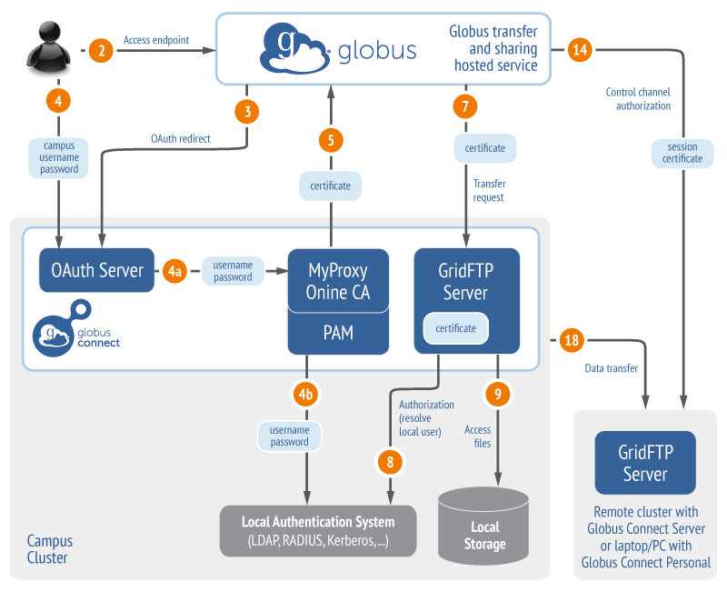

= Globus Authorization/Authentication Guide
:revnumber: 1.0.0
:toc:
:toc-placement: manual
:toclevels: 1

[doc-info]*Last Updated: {docdate}*

This document provides a detailed description of the interactions between various components that manage authentication/authorization when a user transfers or shares files using Globus.

'''
toc::[]

== Definitions
* Globus or Globus service
** The Globus software as a service, operated by University of Chicago, hosted on Amazon Web Service.
* OAuth:
** http://oauth.net/
* Globus Connect Server
** Administrator installed multi-user server that has a data movement, and identity service components
* GridFTP server
** Data movement component of Globus Connect Server that uses the high performance GridFTP protocol.
* MyProxy
** Identity component of Globus Connect Server that issues a X.509 certificate to any authenticated user
* MyProxy OAuth 
** Identity component of Globus Connect Server that issues a X.509 certificate to any authorized OAuth client on user authentication
* Endpoint
** Storage connected to the Globus service via Globus Connect Server or Globus Connect Personal. An endpoint has a logical name that points to the physical data movement servers and is associated with identity service.
* Activation
** Delegation of credentials to Globus for access of an endpoint on behalf of a user
* Data Channel Security Context (DCSC)
** http://toolkit.globus.org/toolkit/docs/6.0/gridftp/developer/#gridftp-developer-dcsc-spec 

== Transfer to/from an endpoint using MyProxy

=== Configuration:

* GridFTP Server trusts user credentials issued by MyProxy server. 
* GridFTP Server server maps user’s credentials issued by the MyProxy server to a local account.
* CA that issued host credentials for GridFTP Server and MyProxy server is trusted by Globus.

[role="img-responsive center-block"]

==== Scenario 1: User uses the Globus website interface to select some file/folder(s) to transfer to another endpoint.

. User accesses Globus at globus.org using a browser
.. A TLS connection is established with Globus
.. User is prompted to authenticate to Globus with 
... Globus account, username/password (or)
... Alternate identity provider, e.g. InCommon via CILogon, Google OpenID
. User chooses an endpoint to initiate a transfer, the source endpoint. To choose a file/folder to transfer the user requests a directory listing.
. User is prompted to authenticate to the endpoint, and is prompted for username and password and optionally OTP to activate the endpoint.
. Globus establishes a TLS connection to the MyProxy server configured for the endpoint and presents the user’s username and password (and optionally OTP). Globus does not save the user’s username and password.
. MyProxy server validates the credentials against the local authentication system via PAM module.
. If successful, a X.509 certificate with lifetime configured by the administrator of the endpoint is returned to Globus using the following delegation handshake protocol to ensure private keys are not sent over the wire:
.. Globus generates a new key pair and sends the public key to MyProxy server
.. MyProxy server returns a signed certificate for the user to Globus
.. The credential is cached by Globus
. Globus authenticates to the GridFTP server configured for the endpoint using the user’s X.509 certificate and establishes a control channel with the source endpoint
. GridFTP server uses the identity in the certificate to determine a local account that the identity is mapped to. This is done using configurable callouts such as gridmap file, LDAP, local account information in the certificate, etc.
. GridFTP server does a setuid to that local account to access the local files as the user. 
. The directory listing is returned to Globus for display to the user
. User selects the file/folder(s) to transfer
. User then chooses another endpoint for destination of the transfer
. Steps 3 to 6 are repeated for the second endpoint to activate that endpoint.
. Globus authenticates to the GridFTP server configured for the destination endpoint using the user’s destination X.509 certificate and establishes a control channel with the destination endpoint.
. The user chooses the destination folder for transfer and submits a transfer task to Globus
. Globus stores the requested transfer to its database
. Later, a separate Globus process connects to the source and destination endpoints, as in steps 7 and 14
. Data channel connection is established between the source and destination endpoint
.. Using DCSC a session credential is established, and the channel is secured using those credentials
.. The data channel is authenticated via TLS mutual authentication, ensuring integrity of the data.
.. If encryption is requested by the user or endpoint administrator, the file contents are transferred over the TLS data channel using normal TLS message protection. Else, the file contents is transferred over the the data channel without TLS message protection.
. Steps 17 and 18 are repeated as long as necessary to transfer the data.
.. If an X.509 certificate times out, the user is notified, and prompted to re-perform authentication steps 3-6.

==== Scenario 2: User uses the Globus CLI to transfer files between endpoints

. User accesses Globus at globus.org using a browser
.. A TLS connection is established with Globus
.. User is prompted to authenticates to Globus with 
... Globus account, username/password (or)
... Alternate identity provider (InCommon login via CILogon, Google OpenID)
. User links a SSH public key to his Globus account, but adding his public key
. User logs into cli.globusonline.org using SSH
. Using the CLI command to transfer, user provides source and path, and destination and path.
. For each endpoint the user is prompted for credentials, and the flows described in Scenario 1 are used to activate the endpoint and transfer the files.

==== Scenario 3: User uses the Globus API transfer files between endpoints

* Client authenticates to the Globus Nexus resource using Globus username/password, TLS with X.509 certificate or SSH key, using OAuth 1.0a protocol
* An access token is returned to the client which is then used as part of authorization header to authenticate to Globus service to submit a transfer request with source, endpoint and path, and destination endpoint and path.
* Flows described in Scenario 1 are used to activate the endpoint and transfer the files.
* In addition to the activation flows described above, the API also supports using certificate delegation protocol to delegate a short term certificate to Globus for use with an endpoint.

[NOTE]
====
* If for an endpoint there is a valid credential (that is, the credential has not expired), then it is reused and the user is not prompted to activate.
* If during the transfer, the credential expires, the transfer is paused and the user is sent an email to prompt for activation.
====

== Transfer to/from an endpoint using MyProxy OAuth

=== Configuration:

* GridFTP server trusts user credentials issued by MyProxy OAuth server. 
* GridFTP server maps user’s credentials issued by the MyProxy OAuth server to a local account.
* CA that issued host credentials for GridFTP and MyProxy OAuth server trusted by Globus.
* Globus is registered as a trusted OAuth client to the MyProxy OAuth server.

[role="img-responsive center-block"]

==== Scenario 1: User uses the Globus website interface to select some file/folder(s) to transfer to another endpoint.

. User accesses Globus at globus.org using a browser
.. A TLS connection is established with Globus
.. User is prompted to authenticates to Globus with 
... Globus account, username/password (or)
... Alternate identity provider (InCommon login via CILogon, Google OpenID)
. User chooses an endpoint to initiate a transfer, the source endpoint. To choose a file/folder to transfer the user requests a directory listing.
. User is redirected to the MyProxy OAuth server associated with the endpoint, using OAuth 1.0a protocol.
. User provides the needed credentials at the MyProxy OAuth interface hosted by the site:
.. MyProxy server may validate the credentials against the local authentication system via PAM module or other means.
. If successful, a X.509 certificate with lifetime configured by the administrator of the endpoint is returned to Globus using the MyProxy OAuth delegation handshake protocol:
.. Globus generates a new key pair and sends the public key to MyProxy server
.. MyProxy server returns a signed certificate for the user to Globus
.. The credential is cached by Globus
. Rest of the flow is same as other scenarios.

==== Scenario 2: User uses the Globus CLI to transfer files between endpoints

. User accesses Globus at globus.org using a browser
.. A TLS connection is established with Globus
.. User is prompted to authenticates to Globus with 
... Globus account, username/password (or)
... Alternate identity provider (InCommon login via CILogon, Google OpenID)
. User links a SSH public key to his Globus account, but adding his public key
. User logs into cli.globusonline.org using SSH
. Using the CLI command to transfer, user provides source and path, and destination and path.
. User activates the source endpoint, and is provided a link to the Globus website to activate the endpoint. That follows the same flow from Scenario 1 to use the MyProxy OAuth server. 

==== Scenario 3: User uses the Globus API transfer files between endpoints

In this case, the user uses the web interface to activate the endpoint using MyProxy OAuth server.

== Transfer to/from an endpoint using CILogon

==== Scenario 1: User uses the Globus website interface to select some file/folder(s) to transfer to another endpoint.

[role="img-responsive center-block"]

. User accesses Globus at globus.org using a browser
.. A TLS connection is established with Globus
.. User is prompted to authenticates to Globus with 
... Globus account, username/password (or)
... Alternate identity provider (InCommon login via CILogon, Google OpenID)
. User chooses an endpoint to initiate a transfer, the source endpoint. To choose a file/folder to transfer the user requests a directory listing.
. User is redirected to the CILogon server, using OAuth 1.0a protocol.
. User chooses the site identity provider to authenticate to CILogon and directed there
. User provides the needed credentials at the site identity provider interface. 
. If successful, an identity assertion is returned to CILogon
. CILogon issues X.509 certificate with lifetime determined by CILogon is returned to Globus using the MyProxy OAuth delegation handshake protocol:
.. Globus generates a new key pair and sends the public key to MyProxy server
.. MyProxy server returns a signed certificate for the user to Globus
.. The credential is cached by Globus
. Globus authenticates to the GridFTP server configured for the endpoint using the user’s X.509 certificate and establishes a control channel with the source endpoint
. GridFTP server uses the identity in the certificate to determine a local account that the identity is mapped to. This is done using configurable callouts such as gridmap file, LDAP, local account information in the certificate, etc.
. GridFTP server does a setuid to that local account to access the local files as the user. 
. The directory listing is returned to Globus for display to the user and the user selects the file/folder(s) to transfer
. User then chooses another endpoint for destination of the transfer and all the steps described above is repeated to establish a control channel with destination, and directory listings are returned for the user to select a folder.
. The user chooses the destination folder for transfer and submits a transfer task to Globus. Globus stores the requested transfer to its database. Later, a separate Globus process connects to the source and destination endpoints, and issues a transfer request
. Data channel connection is established between the source and destination endpoint and data flows on that channel.

== Share files/folders 

Slides with detailed walk through is here: https://www.globusworld.org/files/2014/20-globus-security-deep-dive-tuecke.pdf 

=== Configuration:

* GridFTP server trusts user credentials issued by MyProxy/MyProxy OAuth server. 
* GridFTP server maps user’s credentials issued by the MyProxy/MyProxy OAuth server to a local account.
* CA that issued host credentials for GridFTP and MyProxy/MyProxy OAuth server trusted by Globus.
* GridFTP server is enabled for sharing, which includes authorizing Globus service identity to use the GridFTP SITE command for sharing.
** configure paths on the system from which sharing is allowed
** read only or read/write shares
** whitelist of users allowed to share
** blacklist of users not allowed to share

==== Scenario 1: User A shares a folder with User B

. User A accesses Globus at globus.org using a browser
. Selects an endpoint to create share from and activates the endpoint
. Chooses a folder to share.
. User creates a shared endpoint with a logical name.
.. Globus creates a unique id for the share (a UUID)
.. Globus stores the shared endpoint definition, UUID, user A’s credential, and path
. Globus authenticates to the GridFTP server using it’s credential and requests for a share to be created on the GridFTP server.
.. server checks if user is allowed to share (whitelist checks)
.. server checks if that folder can be shared (share restricted path configuration)
.. share is created and local configuration is stored to tie the shared endpoint to the user’s account including a unique identifier for the share (UUID) and path to the share.
. User A sets read permission for User B and that is stored in Globus

==== Scenario 2: User B accesses the shared folder

. User B accesses Globus at globus.org using a browser
. User B does a directory listing on the shared endpoint
. Globus authenticates to the GridFTP server using it’s credential and sends the following information:
.. any available ACLs for User B for the endpoint to the server
.. unique identifier for the share (UUID)
.. certificate of the user who created the share (User A)
. GridFTP server checks to see if sharing is enabled and if Globus identity is allowed to use sharing capability
.. GridFTP server uses user A’s certficate to ascertain the local account that is mapped to and does a setuid to the local account.
.. Enforce sharing restricted path combined with the User B’s ACLs and returns the listing to the user