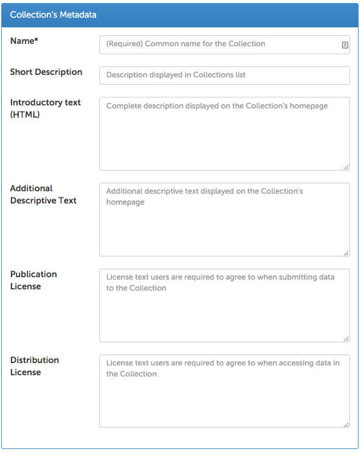
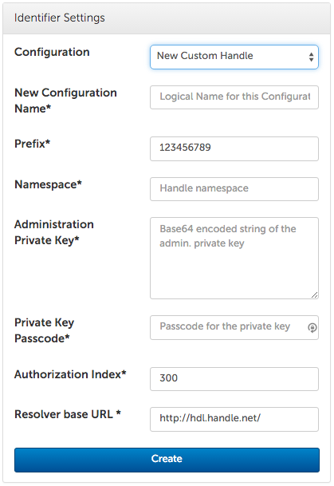

:toc:
:toc-placement: manual
:toclevels: 3
:imagesdir: .
:revdate: May 12, 2016

= Setting Up and Administering Globus Data Publication

// Define some attributes to reuse in-line
:publication_webpage_url: http://www.globus.org/data-publication
:production_publish_url: https://publish.globus.org
:production_publish: publish.globus.org
:trial_publish_url: https://trial.publish.globus.org
:trial_publish: trial.publish.globus.org
:publish_admin_guide_url: https://docs.globus.org/data-publication-admin-guide
:publish_user_guide_url: https://docs.globus.org/data-publication-user-guide
:how_to_sign_up_url: http://www.globus.org/researchers/getting-started
:sign_up_url: http://www.globus.org/SignUp

[doc-info]*Last Updated: {revdate}*

[float]
=== About This Document

This document provides information for an organization's
administrators on configuring Globus Data Publication. The operations
described here must be carried out before any users can submit data to
the service. Users only interested in submitting data for publication
need not familiarize themselves with the content of this document. The
companion
link:{publish_user_guide_url}[User's Guide]
provides the information they need.

:numbered:
'''
toc::[]

[[pre-requisites]]
== Pre-requisites

When access to Globus Data Publication is setup for an organization a
new community will be created and administration rights for
that community will be granted to members of a Globus group. From that
point forward, members of this administrative group will perform all
management and configuration operations. These administrators are able
to create and update collections within the community and assign
different Globus groups to different roles within a collection or
community.

Prior to working with Globus Data Publication, a number of setup
operations must be performed using various Globus
capabilities. Detailed description of how to perform these functions
is outside the scope of this document, so links to related documents
are provided.

1. A suitable server for storing the publication data must be
setup. This server must have Globus Connect Server
link:../../resource-provider-guide[installed] and must have
link:../../resource-provider-guide/#sharing_section[Sharing
enabled]. Access to the necessary sharing capability requires a
https://www.globus.org/subscriptions[subscription].

1. A shared endpoint must be created and the Globus user named
`globuspublish` must be
https://www.globus.org/blog/access-manager-role-shared-endpoints[granted
Access Manager] role on the shared endpoint. This shared endpoint will
be configured as the storage location for the collection as described
below.

1. link:../how-to/managing-groups/[Globus
groups must be created] to grant users capabilities when using the
collection. Group invitations should be sent to the appropriate users,
and for each group, the Globus user named `globuspublish` must be
invited to the group granted and administrator or manager role. The
groups to be created are as follows:
+
--
* Submit: The group of users who are allowed to create new entries in
  the collection.
* Readers: The group of users who will be able to view and search for
  entries in the collection.
* Curators: The group of users responsible for performing the
  link:{publish_user_guide_url}#the-curation-workflow[curation workflow] for the collection.

For any collection that does not wish to restrict access to any of
these capabilities, it is not necessary to create the corresponding
group. Groups may be re-used across collections in the case where the
same users will be performing the same role for multiple collections.
Assignment of the groups to the roles in the collection is described
link:#assigning-groups-to-roles[below]. 
--

[[creating-and-configuring-a-collection]]
== Creating and Configuring a Collection

The process of creating a new collection starts on the home page of
the community in which the collection will reside. The community home
page can be found using the "Communities & Collections" link on the
dashboard or by entering the community name in the search bar. When an
administrator for the community accesses this page, additional options
are presented on the right side of the page.

[role="img-responsive center-block"]

The "Configure..." button allows descriptive information about the
community to be updated. Community configuration also allows Persistent
Identifier configurations to be created which may be used by all
collections within the community. Configuration of persistent
identifiers is link:#configuring-persistent-identifiers[described below]
for collections, but is the same at the community level.

The "Create collection" button launches the collection creation
interface which is a single page for configuring all aspects of a
collection. The same configuration options for a collection can be
accessed by a community or collection administrator by selecting the
"Configure..." button on the "Admin Tools" panel of the collection's
home page.

[[entering-descriptive-information]]
=== Entering descriptive information

The "Collection's Metadata" pane provides input boxes for descriptive
text regarding the collection. Of these, only the collection name is
required. This is the name which will be displayed in other interface
elements such as collection selection during submission. The "Short
Description" field will be displayed on pages that list all
collections so it can be used to provide some additional descriptive
text to help users identify the collection when browsing.  The next
two fields: Introductory text and Additional descriptive text will be
displayed on the home page of the collection. The introductory text
appears in a highlighted area along with the title of the collection
on the home page. HTML formatting tags are permitted in this text box,
so this can be used to provide more detailed and highly customized
description and presentation of the collection. The additional
description appears above the list of datasets in the collection and
is intended to provide more detailed information describing the
collection. The final two fields present license information at
different stages of interactions with the datasets in the
collection. The first field, "Publication License," is
link:{publish_user_guide_url}#accept-license[presented to the
user for approval during] the submission workflow. Anyone submitting
to the collection will be required to accept this license. The next
field, "Distribution License," will be presented to users at the time
they choose to access data stored in a dataset in the collection.

[role="img-responsive center-block"]

[[configuring-storage]]
=== Configuring Storage

In the "Dataset Storage Settings" pane, the endpoint and root path where dataset data will be placed is entered. The endpoint must be specified by providing the unique identifier (UUID) for the endpoint. The UUID can be viewed by https://www.globus.org/app/endpoints[searching for the endpoint], and expanding the desired endpoint's entry on this page. As mentioned above, the endpoint must have Administrator or Manager rights for the Globus user `globuspublish`. The "Collection Root Path" provides a path on that endpoint which is the base from which dataset folders will be created.
If this path does not exist, it will be automatically created. The "Test Setting" button will perform a test both that the `globuspublish` user has the necessary permissions on the endpoint and that directory creation works properly. If either of those operations fails, an error will be presented in this pane.

[role="img-responsive center-block"]

[[configuring-persistent-identifiers]]
=== Configuring Persistent Identifiers

A particularly important task when configuring a community or collection
is setting up the link:{publish_user_guide_url}#glossary-pid[Persistent Identifier (PID)]
configuration. PID configurations can be created on both communities and
collections. When a configuration has been set on a community, all
collections within the community have access to that configuration. This
provides a convenient method to perform these settings once and then
re-use them across many collections within the community. PID
configurations set on a collection are also saved so the collection can
be easily re-configured to re-use a previous configuration should
changes be needed during the use of the collection. PID configurations
are managed through the "Identifier Settings" pane.

[role="img-responsive center-block"]

The "Configuration" dropdown list provides options for selecting any
previously configured PID settings or for creating a new configuration
with any of the providers implemented by the service. The list of
provider configurations to select from includes those previously
configured on the collection or a parent community. If a configuration
is selected which was defined on the collection or community which is
being configured and which is not in use by any child collection, the
button "Delete Configuration" will be enabled.

The dropdown also provides options for creating new PID configurations
of any of the types supported by the service. When one of these options
is selected, the pane will expand with prompts for the PID-specific
options needed for configuration. The first field will always be a name
for the new configuration. This is the name which will be displayed in
the dropdown list in any further display of the Identifier Settings pane
for this collection or any child collections if configuration is done on
a community.

TIP: When using the Globus Data Publication Trial site, default PID
configurations for EZID and Handle are pre-populated as options for
your community and for collections created in the community. For
testing purposes, it is typically sufficient to use one of these
configurations rather than creating a new one.

[[configuring-an-ezid-pid-provider]]
==== Configuring an EZID PID Provider

The link:http://ezid.cdlib.org[EZID service] provides a method for
creating link:http://www.doi.org[Digital Object Identifiers] (DOIs)
which are intended to be permanent references to a data resource.
EZID requires creation of an account with the EZID service. It is a
good practice to use the EZID functionality to create delegated
credentials which can be entered here allowing the Globus Data
Publication service to use EZID to create DOIs on behalf of the
organization owning the collection.

[role="img-responsive center-block"]

After entering a name for the configuration, the username and password
credentials for the EZID account to be used by Globus Data Publication
are entered. The "Publisher name" will be used to identify the
publishing organization in the DOI created via EZID (formally, this
value will be stored in the `datacite.publisher` field). The "Shoulder"
is a value assigned to the account by EZID and forms part of the URL
generated for the identifier. The default value `10.5072/FK2` is for the
testing "sandbox" operated by EZID. It should be changed unless the
entire configuration including the credentials being used is intended
for use with the sandbox. The "Resolver Base URL" also forms part of the
final URL being generated for the PID and represents the root service
which will be used to resolve the identifier in the future. This is the
host which will perform the lookup of the identifier and re-direct the
client to the dataset's
link:{publish_user_guide_url}#dataset-landing-page[landing page] on
Globus Data Publication. It will 
be rare to make changes to this value, but other resolution services are
possible so the option to change it is provided.

[[configuring-a-handle-pid-provider]]
==== Configuring a Handle PID Provider

The http://handle.net[Handle System] is a general purpose identifier
resolution system which is commonly used for providing stable URLs
which can be redirected to other resources throughout their
life-cycle. Use in data publication and preservation systems is
common.  To begin using the Handle service, it is necessary to register an
account with http://handle.net/service_agreement.html[CNRI]. When
registration is complete, a handle prefix will be
assigned. Additionally, as part of configuration a key-pair will be
generated for performing administrative operations including creating
new Handle entries. Configuring a server and creating these key-pairs
is described in the
http://handle.net/tech_manual/Handle_Tech_Manual_7_v1-1-22Dec10.pdf[Handle
Documentation]. To use the handle system a handle server
which owns the assigned prefix must be running. An organization that
wishes to use Handle but which cannot operate a handle server can
mailto:support@globus.org[contact us] to discuss options for using the
Globus-operated handle server to host their prefix.

[role="img-responsive center-block"]

After providing a name for the newly created configuration, the first
field to be filled in is the prefix assigned by CNRI during
registration. The value in the "Namespace" field will be included in
every handle generated helping to identify handles generated by a
particular configuration. The "Administrative
Private Key" and the "Private Key Passcode" are generated by the
administrator of the handle prefix. The private key is typically
stored as a binary file, but it must be converted to a `Base64`
representation for upload on this form. This can be done using a
command-line utility such as `base64` to create the required
string. The data placed in this field of the form should not
contain extra characters and should not have any carriage returns
embedded or entered at the end of the form. When generated during
configuration of the handle server, these administrative keys are
assigned an "Authorization Index" which also is to be entered on the
form. Following the default configuration process, this index will be
300, so that value is provided as a default here. The "Revolver base
URL" will be part of the final URL generated for the PID.  It can
reference any handle server which operates the HTTP based resolution
service. Typically, this will use the root resolution service located
at `http://hdl.handle.net` as provided in the default, but other
values entered here will be used in the URL generated by the service
for the identifier.

[[configuring-the-forms-and-workflows]]
=== Configuring the Forms and Workflows

[role="img-responsive center-block"]

The "Workflow Settings" pane is used to define what forms and workflow
steps will be used by the collection. The "Input Form" dropdown lists
the available forms which can be configured for use during the
link:{publish_user_guide_url}#the-submission-workflow[submission workflow]. By default, the
forms listed will conform to the three levels of information defined
by https://www.datacite.org/[Datacite] for DOI registration. The three
pre-defined forms and their content are:

.`Datacite Mandatory`:
* Title
* Authors
* Publication Year: A date associated with the dataset's publication
  containing at least the year, but also month and day if desired.
* Language: The primary language of any text content.
* Publisher: The organization credited with publishing the dataset.

.`Datacite Mandatory + Recommended`:
* All of the above 
* Subject Keywords: Summarizing words primarily intended to enable
  easier discovery and search for the dataset.
* Description: Open text describing the dataset.
* Resource Type: A classification for the type of data contained in
  the dataset.
* Contributors: A group of individuals or organizations who
  contributed to the creation of the dataset. The contributors role as
  well as their identify are specified.
* Related Identifier: Identifiers of other datasets or uniquely
  identifiable entities which are related to the dataset. The relation
  type as well as the identifier text may be specified.

.`Datacite Mandatory + Recommended + Optional`:
* All of the above
* Size: An indication of the size of the dataset. Values and units
  which are appropriate for the dataset may be specified.
* Format: The technical details of the file type or other details
  about the content of the dataset.
* Version: An identifier differentiating this dataset from other
  iterations of the same dataset which may previously have been published.
* Rights: The rights associated with submission or distribution of the
  dataset. Typically referencing standard licensing terms such as
  http://creativecommons.org[Creative Commons] levels.
* Rights URI: Many standard licenses identify their license by
  specific URI representations. In combination with the `Rights`
  field, this field can uniquely identify the rights associated with a
  dataset.
* Description: Additional descriptive fields along with the type of
  description being applied. The various description types are
  selected from a controlled list.

More complex, customized forms can be created with further
consultation with the mailto:support@globus.org[Globus team]. If any
customized forms have been configured for your use, they will appear
on this list as well.

The "Submission Workflow" can also be customized to create different
ordering of the submission steps or inclusion or exclusion of desired
steps. Creation of new workflow steps or alteration of the default
workflow settings requires additional agreement with the Globus
team. Like the forms, if any such customized workflows have been
created, they will appear in this list.

The "Curation Type" sets the curation options for the collection. As
discussed in the
link:{publish_user_guide_url}#the-curation-workflow[section
on curation], curation may include simply reviewing the information
entered by the submitting user ("Accept/Reject") or may allow the
curating user to edit the information which has been entered ("Edit
Metadata").  Curation can also be omitted entirely so that when users
complete a submission it will directly enter the collection.

NOTE: If any form of curation is selected, a corresponding group must
be selected as described in the
link:#assigning-groups-to-roles[following section].

[[assigning-groups-to-roles]]
=== Assigning Groups to Roles

All user roles within a collection are mapped to user groups in
Globus.  Using this method, once groups have been configured, their
members may be changed using the
https://www.globus.org/Groups[Globus Groups Interface]. The groups to
be configured were enumerated in the
link:#pre-requisites[Pre-requisites section]. The collection specific
groups: Submitters, Access to Data and Curation are set using the
"Collection Permissions" pane. The Submitter and Access to Data group
can be set to allow "All Users." When submitters is set to all users,
any user logged in to the service will be allowed to submit to this
collection. The collection will appear on the
link:{publish_user_guide_url}#select-collection[list of available] collections for any
user who selects "Start a New Submission" on the
link:{publish_user_guide_url}#data-publication-dashboard[Dashboard].

NOTE: When all users are allowed to submit to a collection there must
be a curation type and corresponding group selected. It is not
permitted to configure a collection which allows arbitrary users to
make submissions without curation being performed.

[role="img-responsive center-block"]

When Access to Data is set to all users, then any web user, regardless
of whether they are logged in to the service will be allowed to view the
landing page for datasets in the collection and these datasets will be
visible in search and browsing results. For collections containing
publicly citeable or accessible datasets, it will be common to set
Access to Data to "All Users."

When either of the submit or access to data group are set to "Restricted
to Group..." a button will appear to "Select" (the first time) or
"Change" the group associated with this role. This button is always
present for the "Curation Group." Choosing this option will navigate to
a page where any group within Globus can be searched for and selected.
Upon choosing the group and pressing the Select button on that page, the
browser is re-directed back to the collection configuration page. The
selected group name will appear in the "Collection Permissions" pane
next to appropriate group.

TIP: Group membership may be changed directly using the Globus group
interface. There is no need to update the group role assignment when
membership of a group changes.
