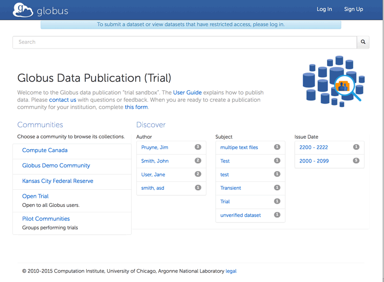
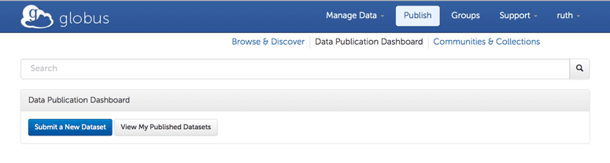
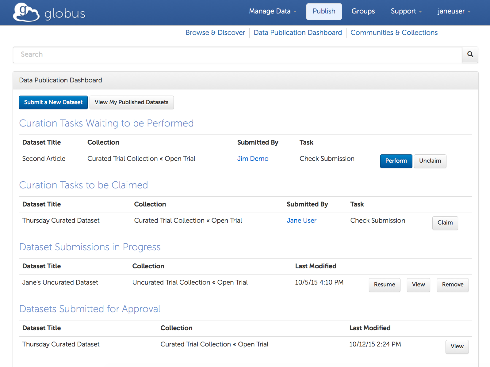

= Globus Data Publication User Guide
:revnumber: 0.0.4
:toc:
:toc-placement: manual
:toclevels: 3
:numbered:

// Define some attributes to reuse in-line
:publication_webpage_url: http://www.globus.org/data-publication
:production_publish_url: http://publish.globus.org
:production_publish: publish.globus.org
:trial_publish_url: http://trial.publish.globus.org
:trial_publish: trial.publish.globus.org
:publish_admin_guide_url: http://dev.globus.org/data-publication-admin-guide
:how_to_sign_up_url: http://www.globus.org/researchers/getting-started
:sign_up_url: http://www.globus.org/SignUp

[doc-info]*Last Updated: {docdate}*

toc::[]

[[introduction]]
== Introduction

=== Globus Data Publication Overview
The link:{publication_webpage_url}[Globus data publication] 
service makes it easy for 
link:#glossary-community[_communities_] 
to establish searchable 
link:#glossary-collection[_collections_] 
with customized 
link:#glossary-metadata[_metadata_] 
schema, 
link:#glossary-curation[_curation_] 
policies, licenses, and access controls.

To submit a 
link:#glossary-dataset[_dataset_] 
for publication, authorized users follow a 
web-based workflow that employs fillable forms for collection-specific 
metadata and the Globus transfer interface for dataset assembly. 
A dataset in the Globus data publication service is composed of
data file(s) and metadata.
The data files may be of arbitrary size and format, 
allowing virtually any type of data (e.g., text files, 
formatted documents, images, source code, executables, 
raw data from sensors, control parameters) to be associated 
and published in a single dataset.
Depending on the collection's policy, a curator may need to 
review and approve a submitted dataset before it is published.

Every published dataset is represented with its own landing page, 
which provides a description of the dataset and links to the data 
on the collection owner's storage. 
A link:#glossary-pid[_persistent identifier (PID)_] 
is generated for every landing page, facilitating citation. 
Globus provides search and browse capabilities, allowing
authorized users to discover and retrieve datasets of interest.
Globus retains a copy of the metadata to facilite the discovery 
process; another copy is kept with the data on the owner's storage.

=== Production and Trial Services
The production Globus data publication service is located at
link:{production_publish_url}[{production_publish}].
Only those datasets that are intended for long-term availability 
should be published with this service, as entries are citeable
and will be maintained indefinitely.

In addition to the production Globus publication service, 
a "trial sandbox" 
has been set up at 
link:{trial_publish_url}[{trial_publish}]
to let individuals and 
groups explore what Globus publication offers.
Any Globus user can submit datasets to both the 
"Curated Trial Collection" and the "Uncurated Trial Collection"
that are found in the "Open Trial" community on the trial service.
All data on the trial service will be removed periodically and should
not be cited elsewhere.

=== User Guide Overview
This guide is aimed at users who want to publish datasets in 
established collections (including the trial collections). 
It introduces the Globus data publication web interface
and steps through the submission and curation workflows 
that are part of the publication process.
Although this guide does not cover the publication search and 
browse features in detail, it does document access points 
to them on the publication home page and dashboard.
A link:#glossary[glossary] is included at the end of the guide.

Screen shots and links in later sections of this guide reference the 
link:{trial_publish_url}[trial Globus data publication service],
as it is open to all Globus users.
The instructions in this guide also apply to the 
link:{production_publish_url}[production Globus 
data publication service], with workflow details varying
from collection to collection.

Administrators setting up and configuring collections should consult 
the link:{publish_admin_guide_url}[Data Publication Administrator Guide]. 

[[prerequisites]]
== Prerequisites

You must have a Globus identity before you can submit datasets to 
the Globus data publication service.
Familiarity with the Globus transfer interface will also be helpful,
as it is used to assemble datasets in the submission process.

If you are new to Globus, this 
link:{how_to_sign_up_url}[how to guide] 
will help you sign up for a Globus account and become
comfortable with the Globus Transfer Files page.
For the impatient, skip the details and use the 
link:{sign_up_url}[Sign Up page] to create your Globus identity.

[[getting-started]]
== Getting Started

[[home-page]]
=== Publication Home Page 

The link:{trial_publish_url}[Globus data publication home page] 
(for the trial service) is shown here: 

.Publication Home Page
[role="img-responsive center-block"]

The publication home page is displayed when you first access 
the publication site.
It can also be reached via the `Browse & Discover` link 
that appears on most publication pages after you log in.

The publication home page is a starting point for browsing 
communities and their collections, and for discovering 
published datasets of interest through facet-based filtering 
(author, subject, and issue date).
The `Search` box located near the top of the page is 
another way to find datasets of interest--keywords 
entered in the box are used to match descriptive text of 
published datasets.

Globus makes sure you see only the communities, collections, 
facet values, and datasets that you have permission to access.

[[logging-in]]
=== Logging In

To submit a dataset for publication you must be logged in to
the publication service with your Globus identity. 

To log in, select `Log In` on the navigation bar at the top of 
the publication home page. 
If an active (unexpired) Globus session already exists, you will 
immediately be re-directed to the data publication dashboard.
If no session is active, a Sign In page will prompt for your 
Globus username and password (you may use any linked Globus identity
and credentials) before displaying the data publication dashboard.

[TIP]
=====
On occasion, you may notice that your Globus ID is displayed 
in the navagation bar (indicating that you are logged in), but
when you interact with the service you are asked to log in again.
This typically occurs when you have been inactive for awhile and
your session has timed out. 
Since your browser window is not automatically refreshed,
it continues to display your Globus ID from your previously
active session.
This behavior can be confusing when you first encounter it.
====

[[data-publication-dashboard]]
== Data Publication Dashboard

The data publication dashboard is the starting
point for most publication-related operations in Globus.

[[empty-dashboard]] 
=== Empty Dashboard 
The first time you use the Globus data publication service, 
and other times when you do not have any pending work or submissions, 
your dashboard will be empty:

.Empty Data Publication Dashboard 
[role="img-responsive center-block"]

The navigation bar at the top of the dashboard has `Publish` highlighted
to show that you are using the Globus data publication service.
Your Globus ID is displayed on the far right of the bar,
indicating that you are logged in.
The navigation bar menus and options provide quick access to many other
Globus features outside of the publication service.

Just below the navigation bar, the `Browse & Discover` option will 
take you to the data publication home page that was
link:#home-page[discussed earlier].
The `Communities & Collections` option will take you to
an alternate interface for exploring the publication service's
participants and their holdings.

The `Search` box works exactly as it did on the home 
page--keywords  
entered in the box are used to match descriptive text of 
published datasets.

With all browse, discover, explore, and search operations, 
Globus makes sure you see only the information that you have 
permission to access.

Located in the Data Publication Dashboard area of the screen,
`Submit a New Dataset` will launch a new submission workflow, and
`View My Published Datasets` will open a display showing all of 
your submitted datasets that have been accepted for publication.

[[populated-dashboard]] 
=== Populated Dashboard 
When you have pending work or submissions in the publication service, 
the dashboard will be more fully populated:

.Populated Data Publication Dashboard 
[role="img-responsive center-block"]

You can see that while the top of the screen looks the same, the
dashboard area provides updates on all of the datasets in the
curation and submission stages of the publication 
process that are relevant to the logged-in user. 
The details will be explained in later sections as you step through the 
publication process, but briefly:

* Curation Tasks Waiting to be Performed: Lists datasets you previously 
agreed to curate but have not yet approved for publication.
* Curation Tasks Waiting to be Claimed: Lists submitted datasets that 
are waiting to be claimed by a curator.
* Dataset Submissions in Progress: Lists your datasets that need further 
work before being submitted.
* Datasets Submitted for Approval: Lists your datasets that have been
submitted but not yet approved for publication.

[TIP]
====
Collections exist in communities.
Collection names must be unique within a community, but need not be
unique across communities.
To fully specify a collection for display purposes, 
the notation "Collection Name << Community Name" is used.
====

Before leaving this section, notice that the
dataset "Thursday Curated Dataset" in the 
collection "Curated Trial Collection << Open Trial"
appears in two sections of the Populated Data Publication Dashboard
figure.
Typically, a user would not be offered the option of curating their
own dataset This option is allowed for the Curated Trial Collection,
so that users can take a dataset through both the submission 
and curation stages of the publication process.

[[the-submission-workflow]]
== The Submission Workflow

[NOTE]
.Ruth's Comments on section changes
===
- Edits for more consistent use of terms (publication, submission, workflow, ...)
- QUESTION:  Why are there 2 "Describe" step boxes in the 2nd figure in this section?   I just see one in my trial submission.
- QUESTION/CHANGE REQUEST: I think the "Globus Transfer" step box should be changed to Assemble.
===

The publication process is divided into two stages: 
submission and curation.
The submission workflow, described in this section, is used to create
a new dataset.
The bottom right section of each page of the
workflow contains navigation buttons for moving forward, backward, or
leaving the current workflow.

image:images/Submit%20Nav%20Buttons.png[Navigating the Workflow]

Selecting the "Cancel/Save" button gives you the option of either
removing the dataset being created in the submission workflow
or saving the state. Saving
the state is particularly helpful if a long running operation, such as
a large transfer, is taking place and you wish to exit and
return later to check progress and continue. 
The saved submission workflow will
be displayed on your dashboard to open to continue editing or to
remove if the submission is no longer needed.

A progress bar at the top of each page shows which steps of the workflow
have been completed, and which are still to be performed. The current
step of the workflow is highlighted in dark blue and the previously
performed steps steps are in light blue. Any of the light blue step names
can be clicked to return to that step in the workflow directly.

image:images/Submit%20Workflow%20Access.png[Workflow Progress Bar]

The rest of this section describes the steps commonly found in the
submission workflow. Usually, the steps will be performed in the
sequence presented, but collections may re-order or add or remove
steps in highly customized cases.

[[selecting-a-collection]]
=== Selecting a Collection

The first step of the submission workflow is to select which
link:#glossary-collection[collection] will be used.

image:images/Submit%20Select%20Collection.png[Selecting a Collection]

The dropdown list displays all collections the current user is
permitted to submit to. In the dropdown, collection names are shown
first followed by the community containing the collection. Once
selected the collection _cannot_ be changed. Thus, a submission
targeting and incorrect collection must be removed and re-started
after selecting a different collection.

[[approving-the-license]]
=== Approving the License

Collections will typically require the submitter to grant some license
terms to the owner of the collection. These terms govern the terms
under which the data is being shared with the owner of the collection.
When such a license is present, the submitter must accept the license
during the workflow. Normally, this is done as the first step of the
workflow for the collection so that the license terms are clear prior to
proceeding with the submission.

image:images/Submit%20License%202.png[License Approval]

When the license is present, the user cannot continue with the workflow
without granting the license. Thus, the usual next and previous buttons
are not present on this page. Choosing "I Grant the License" will
advance the workflow to the next step.

[[describing-the-publication]]
=== Describing the Publication

Forms are presented to prompt for entry of
link:#glossary-metadata[metadata] describing the submission. Each
collection defines a form to be used, so all submissions to the
collection present the same form and store the same metadata, but
different collections may have different forms. The figure shows a
simple form with basic citation information.

image:images/Submit%20Describe%20More.png[Entering Metadata]

In the form, field names marked with an asterisk `(*)` are required. Some
fields, such as Authors in this example, may permit multiple values to
be entered. When that is allowed, the "Add More" button is present to
the right of the field entry. Clicking this button adds additional rows
to the interface allowing more values to be entered. Values are removed
by clicking "Remove Entry" next to the entry to be removed.

Forms containing many fields may span multiple pages. The progress bar
at the top of the page provides a hint as to how many pages the
form spans. Like other parts of the workflow, progress may be
saved and the user may return in the middle of the form. This may be
helpful, for example, if required information is not available at the
time the user starts the workflow.

[[assembling-the-data]]
=== Assembling the Data

The assemble dataset step of the workflow encapsulates the task of
moving data from the user's Globus endpoint to a storage location
allocated for this data publication. The "Assemble Dataset" button
links to the Globus Transfer interface which is used to copy data to
the submission's storage location. In the unusual case where no dataset is
considered part of a submission, dataset assembly can be skipped
with the corresponding button.

image:images/Submit%20Assemble.png[Beginning Assembly]

The Globus Transfer interface is opened in a new browser window
or tab. The right side pane of the interface is pre-populated with
the submission's storage location. This location *should not* be
changed. The left side pane is used to navigate to any endpoint and
path desired to locate desired data files. Transfers in to the dataset
are initiated using the right pointing arrow. Using this interface,
any number of transfer tasks may be initiated, starting from various
endpoints or paths, to complete assembly of the dataset. When all
transfer tasks have been initiated, the transfer interface may be closed
to return to the workflow.

image:images/Globus%20Transfer%20Window.png[Transfering Data]

Once transfers have been initiated, the assemble dataset window will
show updates on the progress of all of the transfer jobs when it is
refreshed. The page can be refreshed periodically to monitor the
progress of the transfer. The status of the task can also be monitored
by clicking the link showing the status of the transfer ("SUCCEEDED"
in the first example, "ACTIVE" in the second example). The Globus
system will also send email to the user indicating the completion or
other status of transfers.

image:images/Submit%20Assemble%20Complete.png[Transfers Complete]

image:images/Transfer%20In%20Progress.png[In Progress Transfers]

TIP: When transfers are long running, it will often be desirable to save
the current workflow and return at a later time to check progress. As
described above, the state can be saved, and the submission will be
displayed on the dashboard. The progress bar of the submission
workflow allows direct access to the assemble page which will show the
updated status of the transfers. It is recommended not to progress
past the assemble step of the workflow prior to verifying that all
transfers are complete to insure that no errors are encountered with
data movement.

[[verifying-and-finalizing-the-submission]]
=== Verifying and Finalizing the Submission

The last step of the workflow provides the opportunity to review all
data entered in previous steps. The values for all of the entered
metadata and the status of the transfer operations are displayed. This
is the last opportunity to review and potentially return to previous
steps to correct metadata or add additional files to the
dataset. After this step, access to the endpoint and folder where the
data has been assembled is also restricted so it cannot be altered
after this step.

image:images/Submit%20Verify.png[Verifying the Submission]

In addition to the normal navigation and progress buttons, the summary
information also provides buttons linking directly back to the
corresponding steps of the workflow. Upon selecting "Finalize
Submission" the submission will be entered in to the system. If the
collection is configured for link:#glossary-curation[curation] to be
performed, the submission will be queued for examination by a user
with the curator role. While the submission is waiting
to be curated, the state of the submission will be shown on the
dashboard. If the collection does not require curation,
the submission will be immediately entered in to the collection where
it can be viewed by the users configured for viewing the
collection. 

image:images/Dashboard%20in%20Workflow.png[A Submission Awaiting Curation]

[[the-curation-workflow]]
== The Curation Workflow

For users who have a curator role on one or more collections, the
dashboard will inform them if there are any pending curation tasks to be
performed.

image:images/Dashboard%20Tasks%20in%20Pool.png[Dashboard Display of
Pending Curation Tasks]

Selecting "Take Task" will display more information about the
submission to be curated and provide the option of performing the
curation ("Accept This Task") or choosing not to perform the curation
at this time ("Cancel"). The location of the data is shown, but it
cannot be accessed until the task has been accepted.

image:images/Preview%20Curation%20Task.png[Previewing a Curation Task]

Upon selecting "Accept this Task" the curating user will be presented
with a similar screen with options for performing curation activities.
At this point, the curator will be given access to the endpoint and
folder where the data is stored so the link in the "Files in This
Item" section will open the Globus Transfer interface the same as
during the link:#assembling-the-data[Assemble] step of the workflow.

image:images/Perform%20Curation.png[Performing a Curation Task]

Depending on the way curation is configured for the collection, the
curation operations will be "Approve", "Reject" and potentially "Edit
Metadata." The curator should inspect the metadata presented on this
page and use the link to examine the data. For collections that are
configured to allow the curator to edit metadata, selecting the "Edit
Metadata" link will enter the curator in to the same workflow that was
used during submission. In some cases, the form presented for entering
metadata may contain additional fields that were not presented to the
submitting user. Upon completing the workflow, the curator will be
returned to the "Perform Task" page at which point final approval or
rejection can be selected. If the curator approves the submission, a
link:#glossary-pid[persistent identifier] will be assigned to the
submission, and final information is presented displaying the
identifier which will link to the summary page for the item now stored
in the collection. The submitting user will be notified by email that
the submission has entered the collection.

If the curator rejects the submission, they will be prompted to enter
descriptive text providing feedback to the submitting user. This text
will be included in an email to the submitting user informing them
that the submission was rejected. The submission will then appear on
the user's dashboard where they can re-open it to update and re-submit
or remove it.

:numbered!:

[glossary]
[[glossary]]
== Glossary

[[glossary-collection]]Collection::
  A collection in the Globus data publication service holds a group of 
  published datasets with common characteristics: 
  metadata schema and requirements,
  access privileges, 
  publication and distribution licenses,
  curation requirements, 
  PID type, 
  and storage.
  Every collection exists in the context of a community, 
  and a combination
  of community and collection policies determine the publication
  requirements for the collection.

[[glossary-community]]Community::
  A community is the representation of an organization or
  institution in the Globus data publication service. 
  An administrative group is associated with every community,
  and members of that group have the authorization to create or 
  delete collections or sub-communities within the community.

[[glossary-curation]]Curation::
  Curation in the Globus data publication service is the process 
  of reviewing, and potentially updating or rejecting, a dataset 
  submission.
  Curation provides a degree of verification prior
  to publication of the dataset in a collection.
  Typically, curation will be performed by a group of users whose
  domain knowledge is sufficient to insure that the submitted 
  dataset is of appropriate quality for the collection.
  Collection policies control the curation requirements for a given
  dataset submission, and not all collections require curation
  of submitted datasets prior to publication.

[[glossary-dataset]]Dataset::
  A dataset is composed of data file(s) and metadata that are 
  submitted and published as a unit
  in the Globus data publiction service.
  The data files may be of arbitrary size and format, allowing 
  virtually any type of data (e.g., text files, formatted documents, 
  images, source code, executables, raw data from sensors, 
  control parameters) to be associated and published together.

[[glossary-metadata]]Metadata::
  In the context of the Globus data publication service, 
  metadata represents 
  information provided by the user to identify or describe a dataset
  they are submitting for publication.
  The metadata is entered via forms in the submission workflow and
  conforms to the schema and requirements defined by the collection 
  where the dataset will be published.
  The Globus publication service automatically includes the metadata
  in the dataset when the dataset is published.

[[glossary-pid]]Persistent Identifier (PID)::
  A reference, often a URL or DOI, to a dataset or other resource 
  that is intended to be valid for a long period of time. 
  PIDs are a good form of citation because they provide a stable 
  way to reference a resource, even if the location of the 
  resource changes.
  The Globus data publication service automatically generates
  a PID when a dataset is published to a collection. 
