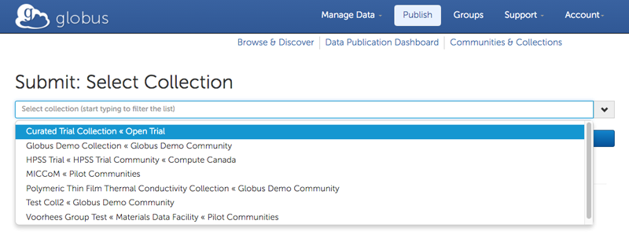
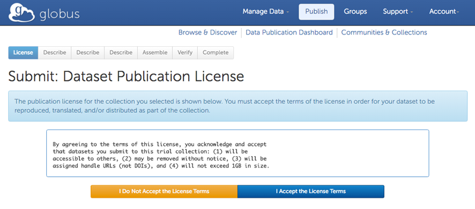
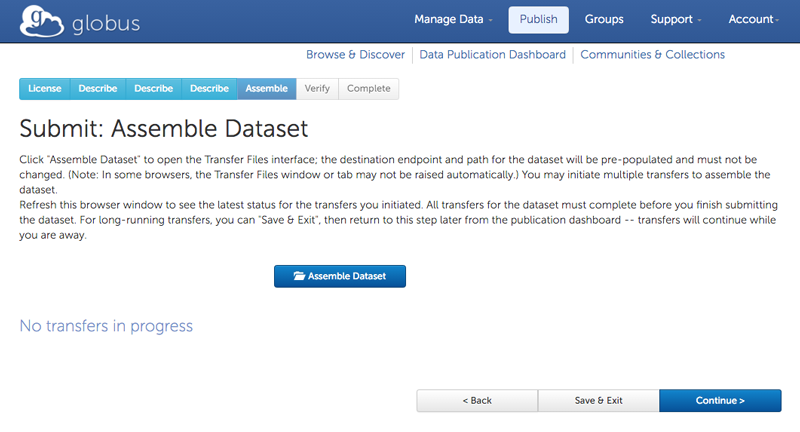
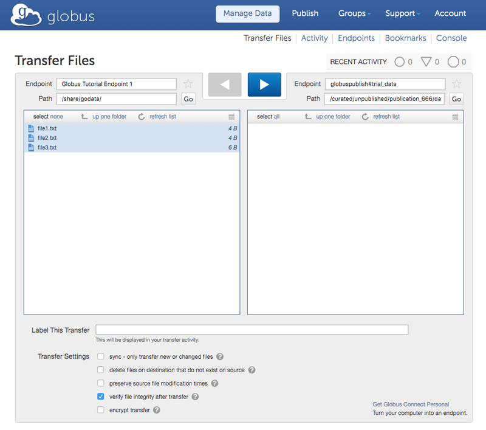
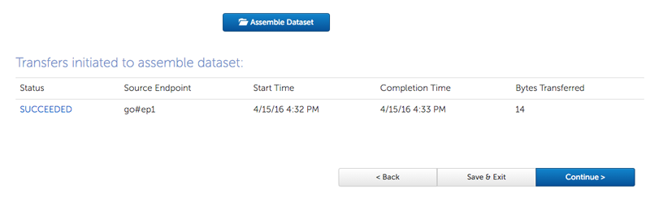
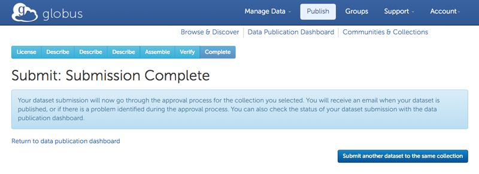
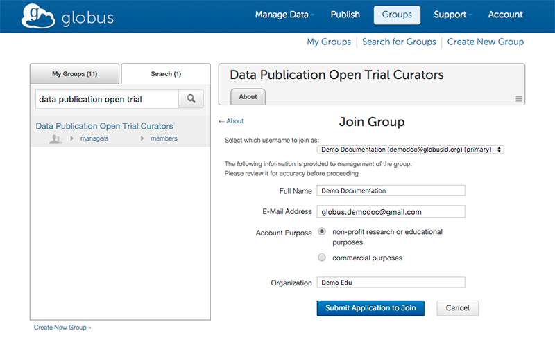
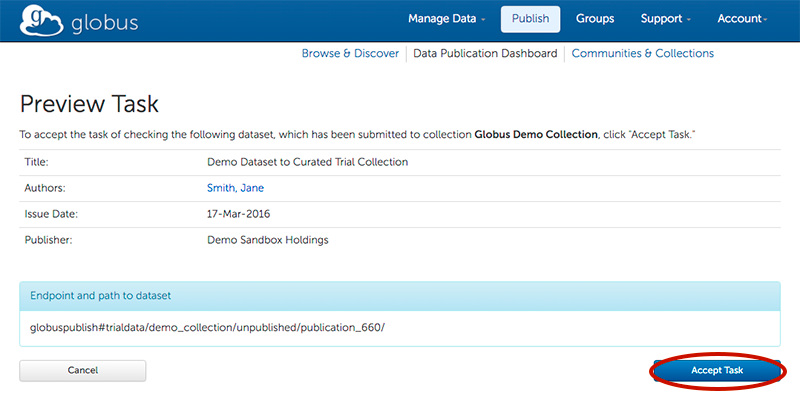

= Globus Data Publication User Guide
:toc:
:toc-placement: manual
:toclevels: 3
:imagesdir: .
:numbered:
:revdate: May 12, 2016

// Define some attributes to reuse in-line
:publication_webpage_url: http://www.globus.org/data-publication
:production_publish_url: https://publish.globus.org
:production_publish: publish.globus.org
:trial_publish_url: https://trial.publish.globus.org
:trial_publish: trial.publish.globus.org
:publish_admin_guide_url: http://docs.globus.org/data-publication-admin-guide
:how_to_sign_up_url: http://www.globus.org/researchers/getting-started
:sign_up_url: http://www.globus.org/SignUp

[doc-info]*Last Updated: {revdate}*

toc::[]

[[introduction]]
== Introduction

=== Globus Data Publication Overview
The link:{publication_webpage_url}[Globus data publication] 
service makes it easy for 
link:#glossary-community[_communities_] 
to establish searchable 
link:#glossary-collection[_collections_] 
with customized 
link:#glossary-metadata[_metadata_] 
schema, 
link:#glossary-curation[_curation_] 
policies, licenses, and access controls.

To submit a 
link:#glossary-dataset[_dataset_] 
for publication, authorized users follow a 
web-based workflow that employs fillable forms for collection-specific 
metadata and the Globus transfer interface for dataset assembly. 
A dataset in the Globus data publication service is composed of
data file(s) and metadata.
The data files may be of arbitrary size and format, 
allowing any type of data (e.g., text files, 
formatted documents, images, source code, executables, 
raw data from sensors, control parameters) to be associated 
and published in a single dataset.
Depending on the collection's policy, a curator may need to 
review and approve a submitted dataset before it is published.

Every published dataset is represented with its own landing page, 
which provides a description of the dataset and links to the data 
on the collection owner's storage. 
A link:#glossary-pid[_persistent identifier (PID)_] 
is generated for every landing page, facilitating citation. 
Globus provides search and browse capabilities, allowing
authorized users to discover and retrieve datasets of interest.
Globus retains a copy of the metadata to facilitate the discovery 
process; another copy is kept with the data on the owner's storage.

=== Production and Trial Services
The production Globus data publication service is located at
link:{production_publish_url}[{production_publish}].
Only those datasets that are intended for long-term availability 
should be published with this service, as entries are citeable
and will be maintained indefinitely.

In addition to the production Globus publication service, 
a "trial sandbox" 
has been set up at 
link:{trial_publish_url}[{trial_publish}]
to let individuals and 
groups explore what Globus publication offers.
Any Globus user can submit datasets to both the 
link:{trial_publish_url}/jspui/handle/11466/403["Curated Trial
Collection"] and the
link:{trial_publish_url}/jspui/handle/11466/393["Uncurated Trial Collection"]
that are found in the "Open Trial" community on the trial service.
All data on the trial service will be removed periodically and should
not be cited elsewhere.

=== User Guide Overview
This guide is aimed at users who want to publish datasets in 
existing collections, including the trial collections.
Administrators setting up and configuring collections should consult 
the link:{publish_admin_guide_url}[Data Publication Administrator Guide]. 

This user guide introduces the Globus data publication web interface,
and steps through the submission and curation workflows 
that make up the data publication process.
Although the publication search and browse features 
are not covered in detail, access points to them on the 
publication home page and dashboard are documented.
A link:#glossary[glossary] is included at the end of the guide.

Screen shots and links in later sections of this guide reference the 
link:{trial_publish_url}[trial Globus data publication service],
as it is open to all Globus users.
The instructions in this guide also apply to the 
link:{production_publish_url}[production Globus 
data publication service], with workflow details varying
from collection to collection.

[[prerequisites]]
== Prerequisites

You must have a Globus identity before you can submit datasets to 
the Globus data publication service.
Familiarity with the Globus transfer interface will also be helpful,
as it is used to assemble datasets in the submission process.

If you are new to Globus, 
link:{how_to_sign_up_url}[this how to guide] 
will help you sign up for a Globus account and become
comfortable with the Globus Transfer Files page.
For the impatient, skip the details and use the 
link:{sign_up_url}[Sign Up page] to create your Globus identity.

[[getting-started]]
== Getting Started

[[home-page]]
=== Publication Home Page 

The link:{trial_publish_url}[Globus data publication home page] 
(for the trial service) is shown here: 

.Publication Home Page
[role="img-responsive center-block"]

The publication home page is displayed when you first access 
the publication site.
It can also be reached via the `Browse & Discover` link 
that appears on most publication pages after you log in.

The publication home page is a starting point for browsing 
communities and their collections, and for discovering 
published datasets of interest through facet-based filtering 
(author, subject, and issue date).
The `Search` box located near the top of the page is 
another way to find datasets of interest--keywords 
entered in the box are used to match descriptive text of 
published datasets.

Globus makes sure you see only the communities, collections, 
facet values, and datasets that you have permission to access.

[[logging-in]]
=== Logging In

To submit a dataset for publication you must be logged in to
the publication service with your Globus identity. 

To log in, select `Log In` on the navigation bar at the top of 
the publication home page. 
If an active Globus session already exists, you will 
immediately be redirected to the data publication dashboard.
If no session is active, a Sign In page will prompt for your 
Globus username and password (you may use any linked Globus identity
and credentials) before displaying the data publication dashboard.

[TIP]
====
On occasion, you may notice that the `Account` menu is displayed in
the navigation bar, indicating that you are logged in, but when you
interact with the service you are asked to log in again.  This
typically occurs when you have been inactive for awhile and your
session has expired.  Since your browser window is not automatically
refreshed, the menu continues to display. This behavior can be
confusing when you first encounter it.
====

[[data-publication-dashboard]]
== Data Publication Dashboard

The data publication dashboard is the starting
point for most operations.

[[empty-dashboard]] 
=== Empty Dashboard 
The first time you use the Globus data publication service, 
and other times when you do not have any pending work or submissions, 
your dashboard will be empty:

.Empty Data Publication Dashboard 
[role="img-responsive center-block"]

The navigation bar at the top of the dashboard has `Publish` highlighted
to show that you are using the Globus data publication service.
The navigation bar menus and options provide quick access to many other
Globus features outside of the publication service.

Just below the navigation bar, the `Browse & Discover` option will 
take you to the data publication home page that was
link:#home-page[discussed earlier].
The `Data Publication Dashboard` option is not selectable while
you are on the dashboard page, but from other publication pages it will
take you to the dashboard.
The `Communities & Collections` option will take you to
an alternate interface for exploring the publication service's
participants and their holdings.

The `Search` box works exactly as on the home 
page--keywords  
entered in the box are used to match descriptive text of 
published datasets.
With all browse, discover, explore, and search operations, 
Globus makes sure you see only the information that you have 
permission to access.

Located in the Data Publication Dashboard area of the screen,
`Submit a New Dataset` will launch a new 
link:#the-submission-workflow[submission workflow], and
`View My Published Datasets` will open a display showing all of 
your submitted datasets that have been accepted for publication.

[[populated-dashboard]] 
=== Populated Dashboard 
When you have pending work or submissions, the dashboard will be more
fully populated:

.Populated Data Publication Dashboard 
[role="img-responsive center-block"]

In this figure, the
dashboard area provides updates on all of the datasets in the
curation and submission stages of the publication 
process that are relevant to the logged-in user. 
The details will be explained in later sections as you step through the 
publication process, but briefly:

* _Curation Tasks Waiting to be Performed_: Lists datasets you previously 
agreed to curate but have not yet approved for publication.
* _Curation Tasks Waiting to be Claimed_: Lists submitted datasets that 
are waiting to be claimed by a curator.
* _Dataset Submissions in Progress_: Lists your datasets that need 
further work before being submitted.
* _Datasets Submitted for Approval_: Lists your datasets that have been
submitted but not yet approved for publication.

[TIP]
====
Collections exist in communities.
Collection names must be unique within a community, but need not be
unique across communities.
To fully identify a collection, both the collection and the community are
displayed using the notation "Collection Name << Community Name". 
====

Before leaving this section, notice that the
dataset "Monday Curated Dataset" in the 
collection "Globus Demo Collection « Globus Demo Community"
appears in two sections of the Populated Data Publication Dashboard
figure.
Typically, a user would not be offered the option of curating their
own dataset. 
This option is allowed for the "Curated Trial Collection",
so that users can take a dataset through both the submission 
and curation stages of the publication process.

[[the-submission-workflow]]
== The Submission Workflow

=== Overview 
The submission workflow, described in this section, is the 
first stage of the publication process. 
The submission workflow is used to create
a new dataset and submit it for publication in a collection.

Collection administrators have the ability to customize the 
submission workflow, specifying which steps to include 
and the order in which the steps are performed.
Submission workflow steps can include _License_, _Describe_, 
_Assemble_, _Verify_, and _Complete_.
Collection administrators also control the 
license terms that must be accepted in the _License_ step and
descriptive (metadata) information that can and must be entered
in the _Describe_ step.

In this guide, a dataset will be submitted to the collection
"Curated Trial Collection" in the community "Open Trial."
The workflow steps and metadata requirements for that
collection are representative of those found in many others.
The general submission process is the same, regardless of the 
collection-specific details.

[[navigation]]
=== Navigation

Pages in the submission workflow have some common elements
that help you navigate through, and exit from, the workflow.

A progress bar at the top of the page shows the steps of the 
submission workflow:

.Submission Workflow Progress Bar
[role="img-responsive center-block"]

In the progress bar, completed steps are colored light blue, 
the current step is highlighted in dark blue,
and upcoming steps are shown in grey.
You can return directly to any completed step to
review or revise your entries by clicking on the (light blue) 
step name in the progress bar.

Many of the submission workflow pages contain navigation buttons 
at the bottom of the page:

.Submission Navigation Buttons
[role="img-responsive center-block"]

`Back` takes you to the previous step in workflow,
`Continue` takes you to the next step, and
`Save & Exit` saves the workflow and returns 
you to the publication dashboard.

The save and exit option can be particularly helpful 
if a long-running operation, such as a large transfer, 
is taking place and you want to exit and return later to 
check progress and continue.
The saved submission workflow will be displayed 
in the _Dataset Submissions in Progress_
section of your dashboard.
From there, you can resume the submission process,
view the dataset submission in its saved state,
or remove the submission from the system.

[[select-collection]]
=== Select Collection

To begin a new dataset submission, choose 
`Submit a New Dataset` from the data publication dashboard,
link:#data-publication-dashboard[discussed earlier].
You will be asked to select the 
collection where you want to publish your dataset:

.Select Collection
[role="img-responsive center-block"]

The collections that you have permission to submit (and publish)
to are shown in the dropdown list.  
After you select a collection and leave this page, the
collection cannot be changed.
If you accidentally specify the wrong collection for your
dataset and continue beyond this page, 
you must `Save & Exit` this submission
workflow, remove this dataset submission (via the dashboard), 
and begin again by choosing `Submit a New Dataset`.

In this guide, the collection "Curated Trial Collection << Open Trial" 
is selected.

[[accept-license]]
=== Accept License Terms

Collections typically require you to accept license
terms that govern the conditions under which the data is being 
shared with the owner of the collection.
When such a license is present, you must accept the license terms
during the submission workflow. 
Normally, this is done as the first step of the collection's workflow 
so that the license terms are clear early in the dataset submission
process.

.Accept License Terms
[role="img-responsive center-block"]

Since you cannot continue with the workflow until you accept 
the license terms, the usual navigation buttons are not present
on this page.

If you choose `I Do Not Accept the License Terms`, the
dataset submission will be saved and accessible via 
the _Dataset Submissions in Progress_ section of your dashboard.
This gives you the opportunity to clarify the license with 
the collection owner and then resume the submission if you 
are ready to accept the terms,
or to remove the submission if you are not.

Choose `I Accept the License Terms` to proceed to 
the next workflow step.

[[describe-dataset]]
=== Describe the Dataset

This step in the submission workflow is used to 
enter metadata that describes the dataset you are 
submitting for publication.
You will be presented with a fillable form where
you enter the metadata.
Each collection defines its own metadata and controls
the prompts that appear on the form.

If the collection's form contains many fields, it may 
span multiple 'Describe' pages. 
The submission workflow progress bar indicates
how many pages the form spans for the selected
collection (three in the example shown). 
Like other parts of the workflow, 
you may save your work at any time and resume later.
This may be helpful, for example, if you do not have all of the 
required information when you start the submission process.

The figures in this section show two of the three
pages in the metadata form defined by the administrator of the 
"Curated Trial Collection". 
Different collections may have different forms, but the general
process for entering metadata is the same across collections.

.Describe Dataset, Page 1
[role="img-responsive center-block"]

In the form, fields marked with an asterisk (+++*+++) are required. 
Some fields, such as "Authors" in this example, permit you to enter
multiple values.
When multiple values are allowed, the `Add More` button is shown to
the right of the field entry. 
Click this button to display additional rows so
more values can be entered. 
Values can be removed by clicking `Remove Entry` next to the 
entry to be removed.

.Describe Dataset, Page 2
[role="img-responsive center-block"]

The second page of the form provides an example of additional 
types of metadata.
You can see that the Globus data publication service allows for
considerable customization in terms of metadata schema and entry 
prompts and fields. 

Enter as much (or as little) descriptive metadata as you want on pages
two and three of the _Describe_ workflow step.
For the "Curated Trial Collection", none of the fields on pages two
and three are required by the collection.

[TIP]
====
In some cases, the metadata field entry prompts do not exactly match 
the labels shown on the more generic publication pages. 
For example, "Issue Date" and "Publication Date" refer to the same
metadata field, and  "Subject", "Subject Keywords", and "Keywords" are 
used interchangeably.
====

[[assemble-the-dataset]]
=== Assemble the Dataset

The assemble dataset step encapsulates the task of
copying the data files that will be included in 
your dataset to a storage location 
allocated for the submission. 

.Assemble Dataset
[role="img-responsive center-block"]

Click on the `Assemble Dataset` button to open 
the Globus Transfer Files page (also referred to
as the Globus transfer interface) in a new browser
window or tab.
You will use the transfer interface to copy your data 
from one or more Globus endpoints 
to the submission's allocated storage location.

[TIP]
====
In some browsers, if the Globus transfer interface 
is already open in another tab when you click "Assemble Dataset", 
the browser will not automatically raise and shift focus to 
that tab.
Look for the tab labeled "Transfer Files | Globus" and manually 
select it if necessary.
You may not notice this behavior the first time you assemble 
a dataset, but you may run into it later. 
====

.Globus Transfer Interface
[role="img-responsive center-block"]

The right pane of the Globus transfer interface is 
pre-populated with the submission's storage location (endpoint and path). 
*Do not* change this pre-populated location. 
Use the left pane to navigate to the Globus endpoint and path 
that has the data files you want to include in your dataset.
Transfers are initiated using the right-pointing arrow.

You can use the transfer interface to initiate multiple transfers,
starting from various endpoints or paths, to complete 
assembly of your dataset. 
The files can be of any type and size, allowing you to assemble
and publish a dataset with wide-ranging content.

In the figure above, we chose to transfer three small files
from the universally-readable "Globus Tutorial Endpoint 1" endpoint and the 
"/share/godata/" path.
The three files are copied in a single transfer task and 
they are the only
data files we will include in the submitted dataset.
You can also use one or more of these files for your trial
submission, or choose other files you have access to 
that contain artificial data--you should not publish real 
data in the trial collections.

After all transfer tasks have been initiated, you can 
close the transfer interface to return to the 
Submit: Assemble Dataset page.
Alternatively, you can leave the transfer interface open and
return to the submission workflow by selecting the
"Assemble Dataset | Globus" tab or window in your browser.

Your assemble dataset window can be refreshed periodically 
to monitor the progress of all transfer jobs 
associated with the submission:

.Assemble Dataset Transfer Status
[role="img-responsive center-block"]

You can check the details of a transfer 
task by clicking the link showing the status of 
the transfer ("SUCCEEDED" in the previous figure). 
Globus will also send you an email indicating the completion 
or other status of your transfer(s).

[TIP]
====
When transfers are long-running, it is often desirable to save
the current workflow and return later to check progress. 
As described earlier in the
link:#navigation[navigation] section, the state can be saved, 
and the dataset will be listed in 
the _Dataset Submissions in Progress_ 
section of the dashboard. 
The progress bar of the submission workflow allows 
you to access the assemble page directly to view the 
updated status of the transfers for the dataset submission. 
====

Before continuing past the assemble step of the workflow,
make sure that all of your transfers completed successfully.
You can re-open the Globus transfer interface (via the
`Assemble Dataset` button) to transfer additional files
or to confirm the contents of the dataset submission's
allocated storage location--a screen refresh may be needed.

[[verify-dataset-and-finalize-submission]]
=== Verify the Dataset and Finalize Submission

The verify step of the workflow gives you the opportunity 
to review the contents of your dataset before submitting
it for publication.
This is your last chance to correct any problems
with the metadata or data files that make up the dataset.
After you finalize your submission, metadata cannot 
be changed and access to the allocated endpoint and folder 
is restricted so assembled files cannot be altered.

.Verify Dataset
[role="img-responsive center-block"]

All of the metadata values, as well as the status of 
all transfer operations for the dataset,
are displayed on the verify screen.

If you need to make changes, you can use the 
progress bar to return to any step
in the workflow, or the `Back` navigation 
button to return to the previous step.
Alternatively, the `Edit` buttons that appear with 
each group of metadata can be used to go directly to 
the relevant _Describe_ page to make corrections.
Finally, the `Review Files` button 
will open the Globus Transfer Files page,
allowing you to review the data files that have been
assembled for the dataset and to add
(via new transfers) or delete files if necessary.

After any updates, the Globus service will 
re-create the metadata file that is included 
in the dataset--this operation must
complete before you can finalize your submission.

When you are happy with the metadata and data files in 
your dataset, select `Finalize Dataset Submission` to 
submit the dataset for publication.
You will see the following screen:

.Dataset Submission Complete
[role="img-responsive center-block"]

If the collection you submitted to requires curation 
prior to publication, your dataset submission will be 
queued for review by a user with the curator role for the
collection.
The "Curated Trial Collection", used in the example shown, 
does require curation.
While your dataset is awaiting curation, it will be shown
in the _Datasets Submitted for Approval_ section of the 
publication dashboard:

.Dashboard with Dataset Submitted for Approval 
[role="img-responsive center-block"]

If the collection does not require curation,
your submitted dataset will be published immediately 
and made available to users 
who are allowed to access the collection.

[[the-curation-workflow]]
== The Curation Workflow

=== Overview 
The curation workflow, described in this section, is the 
second stage of the publication process for those
collections that are configured to require curation. 
The curation workflow is used to review, and potentially
update or reject, a dataset submission prior to publication.

Curation for a given collection is performed by a group of 
users identified by the collection administrator.

=== Become a Curator for the Curated Trial Collection

Special provisions have been made to allow any Globus
user to join the group of curators for the 
"Curated Trial Collection" (the collection used
for demonstration purposes in this guide).
If you submitted a dataset to the "Curated Trial
Collection", and would like to try out the curation 
steps for your dataset, follow the 
instructions in this section to become a curator.

First, select the `Groups` button on the navigation bar
to move to the Globus Groups page.

.Navigate to Globus Groups
[role="img-responsive center-block"]

On the Globus Groups page, shown below, raise 
the "Search" tab on the left side of the page, and enter
`data publication open trial' in the search box
to find the group you need to join. 
The group you are looking for is 
"Data Publication Open Trial Curators".

.Search for Data Publication Open Trial Curators
[role="img-responsive center-block"]

Click on the "Data Publication Open Trial Curators" name
when it is displayed in the search 
panel to see a description of the group:

.Join Data Publication Open Trial Curators
[role="img-responsive center-block"]

Click the `Join Group` button to request membership to the group. You will be prompted to select an identity and provide identity information. Then click `Submit Application to Join`.

.Select Identity
[role="img-responsive center-block"]

You should see confirmation that your application to the group has been submitted. 
Once approved, the "My Groups" tab on the left side of the Globus Groups 
page should list "Data Publication Open Trial Curators"
(you may need to refresh your browser window):

.Member of Data Publication Open Trial Curators
[role="img-responsive center-block"]

At this point, you are finished with the Globus Groups page 
and can return to the
link:{trial_publish_url}[trial Globus data publication service].

=== Claim Curation Task

If you have a curator role for one or more collections, the
dashboard will inform you if there are any pending curation 
tasks waiting to be claimed.

.Claim Curation Task
[role="img-responsive center-block"]

In the figure above, there is one task to be claimed in "TestMDF << Materials Data Facility".
As a courtesy to those working in the "TestMDF << Materials Data Facility",
please curate the datasets you submit and not those submitted
by others. Normally you would not have the option of curating your own
datasets.

Click the `Claim` button for the dataset you want to curate.

=== Preview Curation Task

After you claim a curation task, the Preview Task page will 
open.
It displays more information about the dataset submission 
and provides the option of performing the
curation (`Accept Task`),
or deciding not to claim the task after all (`Cancel`).
The location of the dataset is shown, but it
cannot be accessed until the task has been accepted.

.Preview Curation Task
[role="img-responsive center-block"]

=== Perform Curation Task

If you chose `Accept Task` on the Preview Task page,
the Perform Task page is displayed:

.Perform Curation Task
[role="img-responsive center-block"]
image::images/publish-23.png[Perform Curation Task]

At this point, the location of the dataset in 
the "Endpoint and path to dataset" area of the screen 
is a link that will open the Globus Transfer Files page, 
giving you access to the data files that are part of the
submitted dataset.

Depending on how curation is configured for the collection, 
the curation operations 
`Approve`, `Reject`, and 
possibly `Edit Metadata` will be available to you. 
The `Do Later` button lets you save the current state of the
curation activity and resume it later via the `Perform` button
next to the dataset
in the _Curation Tasks Waiting to be Performed_ section of the
dashboard.
The `Unclaim` button lets you return the submitted dataset
to the pool of curation tasks waiting to be claimed.

As a curator, you should inspect the metadata presented on this
page and use the location link to examine the data files. 
For collections that allow curators to edit metadata, 
`Edit Metadata` will take you 
to the same workflow that was used during dataset submission. 
In some cases, the metadata entry form will contain additional 
fields that were not presented to the dataset submitter. 
After completing the workflow, you will be returned to the
Perform Task page.

If you `Approve` the dataset submission, a
persistent identifier will be assigned which links
to the landing page for the dataset. This identifier is displayed on
the confirmation page shown after approval. Additionally, the user who
submitted the dataset will be notified by email that the dataset has
been added to the collection; the email will include the
persistent identifier for the dataset.

If you `Reject` the dataset submission, you will be prompted to enter
descriptive text providing feedback to the user who submitted the
dataset.  The text you enter will be included in an email 
to the user informing them that their dataset submission was rejected. 
The rejected dataset will appear in the 
_Dataset Submissions in Progress_ section of the user's dashboard.
From their dashboard, the user can resume work on the dataset to address 
deficiencies identified in the curation process and resubmit, 
or remove the dataset submission.

[[dataset-landing-page]]
== Dataset Landing Page

Every published dataset is represented with its own landing page, 
which provides a description of the dataset and links to the data 
on the collection owner's storage. 
Authorized users can access the dataset landing page via the
persistent identifier that was assigned when the dataset
was published, or discover it through any of the 
Globus data publication search and browse features.

The landing page for the example dataset submitted and curated
in this guide is shown here:

.Dataset Landing Page
[role="img-responsive center-block"]

The landing page shows the distribution license terms for the
dataset, which are set by the collection.
A downloadable citation that includes the persistent identifier
is also provided on the page.

:numbered!:

[glossary]
[[glossary]]
== Glossary

[[glossary-collection]]Collection::
  A collection in the Globus data publication service holds a group of 
  published datasets with common characteristics: 
  metadata schema and requirements,
  access privileges, 
  publication and distribution licenses,
  curation requirements, 
  PID type, 
  and storage.
  Every collection exists in the context of a community, 
  and a combination
  of community and collection policies determine the publication
  requirements for the collection.

[[glossary-community]]Community::
  A community is the representation of an organization or
  institution in the Globus data publication service. 
  An administrative group is associated with every community,
  and members of that group have the authorization to create or 
  delete collections or sub-communities within the community.

[[glossary-curation]]Curation::
  Curation in the Globus data publication service is the process 
  of reviewing, and potentially updating or rejecting, a dataset 
  submission.
  Curation provides a degree of verification prior
  to publication of the dataset in a collection.
  Typically, curation will be performed by a group of users whose
  domain knowledge is sufficient to insure that the submitted 
  dataset is of appropriate quality for the collection.
  Collection policies control the curation requirements for a given
  dataset submission, and not all collections require curation
  of submitted datasets prior to publication.

[[glossary-dataset]]Dataset::
  A dataset is composed of data file(s) and metadata that are 
  submitted and published as a unit
  in the Globus data publication service.
  The data files may be of arbitrary size and format, allowing 
  virtually any type of data (e.g., text files, formatted documents, 
  images, source code, executables, raw data from sensors, 
  control parameters) to be associated and published together.

[[glossary-metadata]]Metadata::
  In the context of the Globus data publication service, 
  metadata represents 
  information provided by the user to identify or describe a dataset
  they are submitting for publication.
  The metadata is entered via forms in the submission workflow and
  conforms to the schema and requirements defined by the collection 
  where the dataset will be published.
  The Globus publication service automatically includes the metadata
  in the dataset when the dataset is published.

[[glossary-pid]]Persistent Identifier (PID)::
  A reference, often a URL or DOI, to a dataset or other resource 
  that is intended to be valid for a long period of time. 
  PIDs are a good form of citation because they provide a stable 
  way to reference a resource, even if the location of the 
  resource changes.
  The Globus data publication service automatically generates
  a PID when a dataset is published to a collection. 
