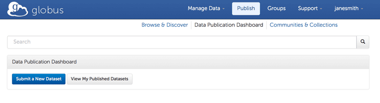

= Globus Data Publication User Guide
:revnumber: 0.0.8
:toc:
:toc-placement: manual
:toclevels: 3
:numbered:

// Define some attributes to reuse in-line
:publication_webpage_url: http://www.globus.org/data-publication
:production_publish_url: http://publish.globus.org
:production_publish: publish.globus.org
:trial_publish_url: http://trial.publish.globus.org
:trial_publish: trial.publish.globus.org
:publish_admin_guide_url: http://dev.globus.org/data-publication-admin-guide
:how_to_sign_up_url: http://www.globus.org/researchers/getting-started
:sign_up_url: http://www.globus.org/SignUp

[doc-info]*Last Updated: {docdate}*

toc::[]

[[introduction]]
== Introduction

=== Globus Data Publication Overview
The link:{publication_webpage_url}[Globus data publication] 
service makes it easy for 
link:#glossary-community[_communities_] 
to establish searchable 
link:#glossary-collection[_collections_] 
with customized 
link:#glossary-metadata[_metadata_] 
schema, 
link:#glossary-curation[_curation_] 
policies, licenses, and access controls.

To submit a 
link:#glossary-dataset[_dataset_] 
for publication, authorized users follow a 
web-based workflow that employs fillable forms for collection-specific 
metadata and the Globus transfer interface for dataset assembly. 
A dataset in the Globus data publication service is composed of
data file(s) and metadata.
The data files may be of arbitrary size and format, 
allowing virtually any type of data (e.g., text files, 
formatted documents, images, source code, executables, 
raw data from sensors, control parameters) to be associated 
and published in a single dataset.
Depending on the collection's policy, a curator may need to 
review and approve a submitted dataset before it is published.

Every published dataset is represented with its own landing page, 
which provides a description of the dataset and links to the data 
on the collection owner's storage. 
A link:#glossary-pid[_persistent identifier (PID)_] 
is generated for every landing page, facilitating citation. 
Globus provides search and browse capabilities, allowing
authorized users to discover and retrieve datasets of interest.
Globus retains a copy of the metadata to facilite the discovery 
process; another copy is kept with the data on the owner's storage.

=== Production and Trial Services
The production Globus data publication service is located at
link:{production_publish_url}[{production_publish}].
Only those datasets that are intended for long-term availability 
should be published with this service, as entries are citeable
and will be maintained indefinitely.

In addition to the production Globus publication service, 
a "trial sandbox" 
has been set up at 
link:{trial_publish_url}[{trial_publish}]
to let individuals and 
groups explore what Globus publication offers.
Any Globus user can submit datasets to both the 
"Curated Trial Collection" and the "Uncurated Trial Collection"
that are found in the "Open Trial" community on the trial service.
All data on the trial service will be removed periodically and should
not be cited elsewhere.

=== User Guide Overview
This guide is aimed at users who want to publish datasets in 
existing collections, including the trial collections.
Administrators setting up and configuring collections should consult 
the link:{publish_admin_guide_url}[Data Publication Administrator Guide]. 

This user guide introduces the Globus data publication web interface,
and steps through the submission and curation workflows 
that make up the data publication process.
Although the publication search and browse features 
are not covered in detail, access points to them on the 
publication home page and dashboard are documented.
A link:#glossary[glossary] is included at the end of the guide.

Screen shots and links in later sections of this guide reference the 
link:{trial_publish_url}[trial Globus data publication service],
as it is open to all Globus users.
The instructions in this guide also apply to the 
link:{production_publish_url}[production Globus 
data publication service], with workflow details varying
from collection to collection.

[[prerequisites]]
== Prerequisites

You must have a Globus identity before you can submit datasets to 
the Globus data publication service.
Familiarity with the Globus transfer interface will also be helpful,
as it is used to assemble datasets in the submission process.

If you are new to Globus, 
link:{how_to_sign_up_url}[this how to guide] 
will help you sign up for a Globus account and become
comfortable with the Globus Transfer Files page.
For the impatient, skip the details and use the 
link:{sign_up_url}[Sign Up page] to create your Globus identity.

[[getting-started]]
== Getting Started

[[home-page]]
=== Publication Home Page 

The link:{trial_publish_url}[Globus data publication home page] 
(for the trial service) is shown here: 

.Publication Home Page
[role="img-responsive center-block"]
image::images/publication-home-page.png[Publication Home Page]

The publication home page is displayed when you first access 
the publication site.
It can also be reached via the `Browse & Discover` link 
that appears on most publication pages after you log in.

The publication home page is a starting point for browsing 
communities and their collections, and for discovering 
published datasets of interest through facet-based filtering 
(author, subject, and issue date).
The `Search` box located near the top of the page is 
another way to find datasets of interest--keywords 
entered in the box are used to match descriptive text of 
published datasets.

Globus makes sure you see only the communities, collections, 
facet values, and datasets that you have permission to access.

[[logging-in]]
=== Logging In

To submit a dataset for publication you must be logged in to
the publication service with your Globus identity. 

To log in, select `Log In` on the navigation bar at the top of 
the publication home page. 
If an active Globus session already exists, you will 
immediately be redirected to the data publication dashboard.
If no session is active, a Sign In page will prompt for your 
Globus username and password (you may use any linked Globus identity
and credentials) before displaying the data publication dashboard.

[TIP]
=====
On occasion, you may notice that your Globus ID is displayed 
in the navagation bar (indicating that you are logged in), but
when you interact with the service you are asked to log in again.
This typically occurs when you have been inactive for awhile and
your session has expired. 
Since your browser window is not automatically refreshed,
it continues to display your Globus ID from your previously
active session.
This behavior can be confusing when you first encounter it.
====

[[data-publication-dashboard]]
== Data Publication Dashboard

The data publication dashboard is the starting
point for most publication-related operations in Globus.

[[empty-dashboard]] 
=== Empty Dashboard 
The first time you use the Globus data publication service, 
and other times when you do not have any pending work or submissions, 
your dashboard will be empty:

.Empty Data Publication Dashboard 
[role="img-responsive center-block"]

The navigation bar at the top of the dashboard has `Publish` highlighted
to show that you are using the Globus data publication service.
Your Globus ID is displayed on the far right of the bar,
indicating that you are logged in.
The navigation bar menus and options provide quick access to many other
Globus features outside of the publication service.

Just below the navigation bar, the `Browse & Discover` option will 
take you to the data publication home page that was
link:#home-page[discussed earlier].
The `Data Publication Dashboard` option is not selectable while
you are on the dashboard page, but from other publication pages it will
take you to the dashboard.
The `Communities & Collections` option will take you to
an alternate interface for exploring the publication service's
participants and their holdings.

The `Search` box works exactly as it did on the home 
page--keywords  
entered in the box are used to match descriptive text of 
published datasets.
With all browse, discover, explore, and search operations, 
Globus makes sure you see only the information that you have 
permission to access.

Located in the Data Publication Dashboard area of the screen,
`Submit a New Dataset` will launch a new 
link:#the-submission-workflow[submission workflow], and
`Submit a New Dataset` will launch a new submission workflow, and
`View My Published Datasets` will open a display showing all of 
your submitted datasets that have been accepted for publication.

[[populated-dashboard]] 
=== Populated Dashboard 
When you have pending work or submissions in the publication service, 
the dashboard will be more fully populated:

.Populated Data Publication Dashboard 
[role="img-responsive center-block"]

You can see that while the top of the screen looks the same, the
dashboard area provides updates on all of the datasets in the
curation and submission stages of the publication 
process that are relevant to the logged-in user. 
The details will be explained in later sections as you step through the 
publication process, but briefly:

* _Curation Tasks Waiting to be Performed_: Lists datasets you previously 
agreed to curate but have not yet approved for publication.
* _Curation Tasks Waiting to be Claimed_: Lists submitted datasets that 
are waiting to be claimed by a curator.
* _Dataset Submissions in Progress_: Lists your datasets that need 
further work before being submitted.
* _Datasets Submitted for Approval_: Lists your datasets that have been
submitted but not yet approved for publication.

[TIP]
====
Collections exist in communities.
Collection names must be unique within a community, but need not be
unique across communities.
To fully identify a collection, both the collection and the community are
displayed using the notation "Collection Name << Community Name". 
====

Before leaving this section, notice that the
dataset "Thursday Curated Dataset" in the 
collection "Curated Trial Collection << Open Trial"
appears in two sections of the Populated Data Publication Dashboard
figure.
Typically, a user would not be offered the option of curating their
own dataset. 
This option is allowed for the "Curated Trial Collection",
so that users can take a dataset through both the submission 
and curation stages of the publication process.

[[the-submission-workflow]]
== The Submission Workflow

=== Overview 
The submission workflow, described in this section, is the 
first stage of the publication process. 
The submission workflow is used to create
a new dataset and submit it for publication in a collection.

Collection adminstrators have the ability to customize the 
submission workflow, specifying which steps to include 
and the order in which the steps are performed.
Submission workflow steps can include _License_, _Describe_, 
_Assemble_, _Verify_, and _Complete_.
Collection administrators also control the 
license terms that must be accepted in the _License_ step and
descriptive (metadata) information that can and must be entered
in the _Describe_ step(s).

In this guide, a dataset will be submitted to the collection
"Curated Trial Collection" in the community "Open Trial".
The workflow steps and metadata requirements for that
collection are representative of those found in many others.
The general submission process is the same, regardless of the 
collection-specific details.

=== Navigation

Pages in the submission workflow have some common elements
that help you navigate through, and exit from, the workflow.

A progress bar at the top of the page shows the steps of the 
submission workflow:

.Submission Workflow Progress Bar
[role="img-responsive center-block"]
image::images/submit-workflow-progress-bar.png[Submission Workflow Progress Bar]

In the progress bar, completed steps are colored light blue, 
the current step is highlighed in dark blue,
and upcoming steps are shown in grey.
You can return directly to any completed step to
review or revise your entries by clickling on the (light blue) 
step name in the progress bar.

Many of the submission workflow pages contain navigation buttons 
at the bottom of the page:

.Submission Navigation Buttons
[role="img-responsive center-block"]
image::images/submit-nav-buttons.png[Submission Navigation Buttons]

`Back` takes you to the previous step in workflow,
`Continue` takes you to the next step, and
`Save & Exit` saves the workflow and returns 
you to the publication dashboard.

The save and exit option can be particularly helpful 
if a long-running operation, such as a large transfer, 
is taking place and you want to exit and return later to 
check progress and continue.
The saved submission workflow will be displayed 
in the _Dataset Submissions in Progress_
section of your dashboard.
From there you can resume the submission process,
view the dataset submission in its saved state,
or remove the submission from the system.

[[select-collection]]
=== Select Collection

To begin a new dataset submission, choose 
`Submit a New Dataset` from the data publication dashboard,
link:#data-publication-dashboard[discussed earlier].
You will be asked to select the 
collection where you want to publish your dataset.

.Select Collection
[role="img-responsive center-block"]
image::images/submit-select-collection.png[Select Collection]

The collections that you have permission to submit (and publish)
to are shown in the dropdown list.  
After you select a collection and leave this page, the
collection _cannot_ be changed.
If you accidentally specify the wrong collection for your
dataset and continue beyond this page, 
you must `Save & Exit` this submission
workflow, remove this submission (via the dashboard), 
and begin again by choosing `Submit a New Dataset`.

Select "Curated Trial Collection << Open Trial" to 
most closely follow the figures in this user guide. 

[[accept-license]]
=== Accept License Terms

Collections typically require you to accept license
terms that govern the conditions under which the data is being 
shared with the owner of the collection.
When such a license is present, you must accept the license terms
during the submission workflow. 
Normally, this is done as the first step of the collection's workflow 
so that the license terms are clear early in the dataset submission
process.

.Accept License Terms
[role="img-responsive center-block"]
image::images/submit-license.png[Accept License Terms]

Since you cannot continue with the workflow until you accept 
the license terms, the usual navigation buttons are not present
on this page.

If you choose `I Do Not Accept the License Terms`, the
dataset submission will be saved and accessible via 
the _Dataset Submission in Progress_ section of your dashboard.
This gives you the option to clarify the license with 
the collection owner and then resume the submission if you 
are ready to accept the terms,
or to remove the submission if you are not.

Choose `I Accept the License Terms` to proceed to 
the next workflow step.

[[describe-dataset]]
=== Describe the Dataset

The next step in the submission workflow is to 
enter metadata to describe the dataset you are 
submitting for publication.
You will be presented with a fillable form where
you can enter your metadata.
Each collection defines its own metadata and controls
the prompts that appear on the form.

If the collection's form contains many fields, it may 
span multiple 'Describe' pages. 
The progress bar at the top of the page provides a hint as to 
how many pages the form spans. 
Like other parts of the workflow, 
you may save your work at any time and resume it later.
This may be helpful, for example, if you do not have all of the 
required information when you start the submission process.

The figures in this section show two of the three
pages in the metadata form defined by the administrator of the 
"Curated Trial Collection". 
Different collections will have different forms, but the general
process for entering metadata is the same across collections.

.Describe Dataset Page 1
[role="img-responsive center-block"]
image::images/submit-describe-dataset.png[Describe Dataset Page 1]

In the form, field names marked with an asterisk (*) are required. 
Some fields, such as "Authors" in this example, permit you to enter
multiple values.
When multiple values are allowed, the `Add More` button is shown to
the right of the field entry. 
Click this button to display additional rows so
more values can be entered. 
Values can be removed by clicking `Remove Entry` next to the 
entry to be removed.

.Describe Dataset Page 2
[role="img-responsive center-block"]
image::images/submit-describe2-dataset.png[Describe Dataset Page 2]

The second page of the form gives you an idea of additional metadata.
You can see that the Globus data publication service allows for
considerable customization in terms of metadata schema and entry 
prompts and fields, allowing collection administrators to tailor
the system for their needs without a substantial burden to lay out
forms and verify entries.

Enter as much (or as little) descriptive metadata as you want on pages
two and three of the _Describe_ workflow step.
For the "Curated Trial Collection", none of the fields on those two
pages are required.

[TIP]
=====
In some cases, the metadata field entry prompts do not exactly match 
the labels shown on the more generic publication pages. 
For example, _Issue Date_ and _Publication Date_ refer to the same
value and  _Subject_, _Subject Keywords_, and _Keywords_ are 
used interchangeably.
=====

[[assemble-the-dataset]]
=== Assemble the Dataset

The assemble dataset workflow step encapsulates the task of
copying the data files that will be included in the dataset 
you are submitting to a storage location 
allocated for the submission. 

.Assemble Dataset
[role="img-responsive center-block"]
image::images/submit-assemble.png[Assemble Dataset]

The `Assemble Dataset` button
links to the Globus Transfer Files page, also referred to
as the transfer interface. 
You will use this interface to copy your data 
from one or more Globus endpoints where you have 
read-access to the submission's storage location.

Click `Assemble Dataset` now to open the Globus transfer 
interface in a new browser window or tab.

[TIP]
=====
In some browsers, if the Globus Transfer Files page 
is already open in another tab when you click "Assemble Dataset", 
the browser will not automatically raise and shift focus to the tab.
Look for the tab labeled "Transfer Files | Globus" and manually 
select it if you see this behavior with your browser.
You may not notice the behavior the first time you assemble 
a dataset, but you may run into it with later operations.
====

.Globus Transfer Files Page
[role="img-responsive center-block"]
image::images/submit-transfer-files.png[Globus Transfer Files Page]

The right pane of the Globus transfer interface is 
pre-populated with the submission's storage location. 
*Do not* change that location. 
Use the left pane to navigate to the Globus endpoint and path 
with data files you want to include in your dataset.
Transfers are initiated using the right-pointing arrow.

You can use the transfer inteface to initiate any number of transfers,
starting from various endpoints or paths, to complete 
assembly of your dataset. 

In the figure above, we chose to transfer three small files
from the universally-readable "go#ep1" endpoint and the 
"/share/godata/" path.
These files are copied in a single transfer and are the only
data files we will include in the submitted dataset.
You can also use one or more of these files for your trial
submission, or choose others you create that contain fake data.

After all transfer tasks have been initiated, the transfer 
interface can be closed to return to the workflow.
Alternatively, you can leave the transfer interface open and
return to the submission workflow by selecting the
"Assemble Dataset | Globus" tab or window.

Your assemble dataset window can be refreshed periodically 
to monitor the progress of all transfer jobs 
associated with the submission. 
You can also check the details of each transfer 
task by clicking the link showing the status of 
the transfer ("SUCCEEDED" in the next figure). 

.Assemble Dataset Transfer Status
[role="img-responsive center-block"]
image::images/submit-assemble-status.png[Assemble Dataset Transfer Status]

RUTH STOPPING HERE FOR NIGHT.

The Globus system will also send email to the user indicating the completion or
other status of transfers.

image:images/Submit%20Assemble%20Complete.png[Transfers Complete]

image:images/Transfer%20In%20Progress.png[In Progress Transfers]

TIP: When transfers are long running, it will often be desirable to save
the current workflow and return at a later time to check progress. As
described above, the state can be saved, and the submission will be
displayed on the dashboard. The progress bar of the submission
workflow allows direct access to the assemble page which will show the
updated status of the transfers. It is recommended not to progress
past the assemble step of the workflow prior to verifying that all
transfers are complete to insure that no errors are encountered with
data movement.

[[verifying-and-finalizing-the-submission]]
=== Verifying and Finalizing the Submission

The last step of the workflow provides the opportunity to review all
data entered in previous steps. The values for all of the entered
metadata and the status of the transfer operations are displayed. This
is the last opportunity to review and potentially return to previous
steps to correct metadata or add additional files to the
dataset. After this step, access to the endpoint and folder where the
data has been assembled is also restricted so it cannot be altered
after this step.

image:images/Submit%20Verify.png[Verifying the Submission]

In addition to the normal navigation and progress buttons, the summary
information also provides buttons linking directly back to the
corresponding steps of the workflow. Upon selecting "Finalize
Submission" the submission will be entered in to the system. If the
collection is configured for link:#glossary-curation[curation] to be
performed, the submission will be queued for examination by a user
with the curator role. While the submission is waiting
to be curated, the state of the submission will be shown on the
dashboard. If the collection does not require curation,
the submission will be immediately entered in to the collection where
it can be viewed by the users configured for viewing the
collection. 

image:images/Dashboard%20in%20Workflow.png[A Submission Awaiting Curation]

[[the-curation-workflow]]
== The Curation Workflow

For users who have a curator role on one or more collections, the
dashboard will inform them if there are any pending curation tasks to be
performed.

image:images/Dashboard%20Tasks%20in%20Pool.png[Dashboard Display of
Pending Curation Tasks]

Selecting "Take Task" will display more information about the
submission to be curated and provide the option of performing the
curation ("Accept This Task") or choosing not to perform the curation
at this time ("Cancel"). The location of the data is shown, but it
cannot be accessed until the task has been accepted.

image:images/Preview%20Curation%20Task.png[Previewing a Curation Task]

Upon selecting "Accept this Task" the curating user will be presented
with a similar screen with options for performing curation activities.
At this point, the curator will be given access to the endpoint and
folder where the data is stored so the link in the "Files in This
Item" section will open the Globus Transfer interface the same as
during the link:#assembling-the-data[Assemble] step of the workflow.

image:images/Perform%20Curation.png[Performing a Curation Task]

Depending on the way curation is configured for the collection, the
curation operations will be "Approve", "Reject" and potentially "Edit
Metadata." The curator should inspect the metadata presented on this
page and use the link to examine the data. For collections that are
configured to allow the curator to edit metadata, selecting the "Edit
Metadata" link will enter the curator in to the same workflow that was
used during submission. In some cases, the form presented for entering
metadata may contain additional fields that were not presented to the
submitting user. Upon completing the workflow, the curator will be
returned to the "Perform Task" page at which point final approval or
rejection can be selected. If the curator approves the submission, a
link:#glossary-pid[persistent identifier] will be assigned to the
submission, and final information is presented displaying the
identifier which will link to the summary page for the item now stored
in the collection. The submitting user will be notified by email that
the submission has entered the collection.

If the curator rejects the submission, they will be prompted to enter
descriptive text providing feedback to the submitting user. This text
will be included in an email to the submitting user informing them
that the submission was rejected. The submission will then appear on
the user's dashboard where they can re-open it to update and re-submit
or remove it.

:numbered!:

[glossary]
[[glossary]]
== Glossary

[[glossary-collection]]Collection::
  A collection in the Globus data publication service holds a group of 
  published datasets with common characteristics: 
  metadata schema and requirements,
  access privileges, 
  publication and distribution licenses,
  curation requirements, 
  PID type, 
  and storage.
  Every collection exists in the context of a community, 
  and a combination
  of community and collection policies determine the publication
  requirements for the collection.

[[glossary-community]]Community::
  A community is the representation of an organization or
  institution in the Globus data publication service. 
  An administrative group is associated with every community,
  and members of that group have the authorization to create or 
  delete collections or sub-communities within the community.

[[glossary-curation]]Curation::
  Curation in the Globus data publication service is the process 
  of reviewing, and potentially updating or rejecting, a dataset 
  submission.
  Curation provides a degree of verification prior
  to publication of the dataset in a collection.
  Typically, curation will be performed by a group of users whose
  domain knowledge is sufficient to insure that the submitted 
  dataset is of appropriate quality for the collection.
  Collection policies control the curation requirements for a given
  dataset submission, and not all collections require curation
  of submitted datasets prior to publication.

[[glossary-dataset]]Dataset::
  A dataset is composed of data file(s) and metadata that are 
  submitted and published as a unit
  in the Globus data publiction service.
  The data files may be of arbitrary size and format, allowing 
  virtually any type of data (e.g., text files, formatted documents, 
  images, source code, executables, raw data from sensors, 
  control parameters) to be associated and published together.

[[glossary-metadata]]Metadata::
  In the context of the Globus data publication service, 
  metadata represents 
  information provided by the user to identify or describe a dataset
  they are submitting for publication.
  The metadata is entered via forms in the submission workflow and
  conforms to the schema and requirements defined by the collection 
  where the dataset will be published.
  The Globus publication service automatically includes the metadata
  in the dataset when the dataset is published.

[[glossary-pid]]Persistent Identifier (PID)::
  A reference, often a URL or DOI, to a dataset or other resource 
  that is intended to be valid for a long period of time. 
  PIDs are a good form of citation because they provide a stable 
  way to reference a resource, even if the location of the 
  resource changes.
  The Globus data publication service automatically generates
  a PID when a dataset is published to a collection. 
