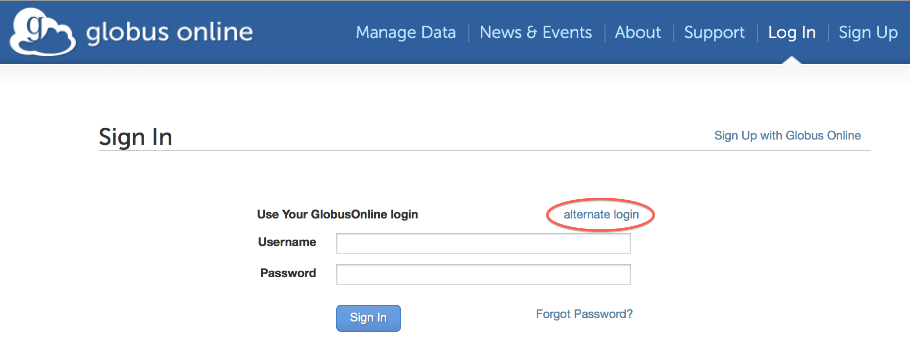

:toc:
:toc-placement: manual
:toclevels: 1
:toc-title:

= FAQs: Globus Accounts

toc::[]

== How do I sign up and transfer files with Globus?
To sign up and transfer files with Globus, please follow this link:../../how-to/signup-transfer/[How-To Guide].

== What’s the difference between Globus and GridFTP?
Globus is software-as-a-service (SaaS) for file transfer. It is a hosted service, operated by the Globus development team, that acts as a third-party mediator/facilitator of file transfers between endpoints that are owned and managed by their respective end users. GridFTP is user-installable software that is part of the Globus Toolkit and is used by grid installers and developers building large-scale data movement solutions. Globus uses the GridFTP protocol for transferring files and currently requires that a GridFTP server be installed on both source and destination endpoints, although HTTP support is planned for a future release. Many HPC resources worldwide already have a GridFTP server installed and can hence be used as Globus endpoints. For individual users, Globus Connect Personal provides a point-and-click way to install a pre-configured GridFTP on your local laptop or desktop. If you are an owner or administrator of a campus cluster or other shared HPC resource, link:https://www.globus.org/globus-connect-server[click here to see how you can turn your resource into a Globus endpoint].

== Does Globus need credentials when accessing my system? Does it store these permanently?
Globus uses only temporary credentials to act on your behalf when making a transfer request, and never keeps your password nor long-term credentials to access a site.

== How does Globus use my Google account?
We provide the option of mapping your Google identity to your Globus account, enabling you to sign on to Globus using your Google credentials instead of your Globus username/password. To add your Google identity to your account follow the "Add External Identity" link on the link:https://www.globus.org/account/ManageIdentities[Manage Identities page] and select the "Google" account provider.

Once your Google identity is mapped to your Globus account you will allow you to log in to Globus as described link:#how_to_use_a_third_party_login_e_g_incommon_xsede_to_access_globus[here].

To remove the association between my Google account and Globus click the "Delete" button next to the Google identity you wish to remove.

== How do I stop Globus from automatically authenticating using my Google account?
Visit link:http://www.google.com/accounts/IssuedAuthSubTokens?hl=en[this link on Google] (you may be prompted to login using your Google account). You will see a list of websites for which you have authorized access to your Google account. Click the "Revoke Access" link next to Globus.org. Your Google account will no longer be used by Globus. If you try to login to Globus with your Google account, you will be asked to re-confirm that Globus may use your Google account.

== How to use a third-party login (e.g. InCommon, XSEDE) to access Globus
Use the following steps to use a third-party login to access Globus:

. Go to the Sign In page and click on "alternate login" link
+
[role="img-responsive center-block"]

. Click on the third-party login you wish to use. (login providers with a box/arrow icon next to them will redirect to their own log in page, just click the *Proceed* button)
. Enter your username/pass associated with the third party if prompted
. On your first use of a third-party login, you will be prompted to *Make a Connection* to link that login with your Globus account - this is a one-time process (if you don't already have a Globus account you will be prompted to create one)
. Your accounts are now linked, click *Let's Go»* to enter the site.

== How do I remove a MyProxy account from Globus?
Sign in to Globus and go to the link:https://www.globus.org/account/ManageIdentities[Manage Identities page]. Click the "Delete" button next to the MyProxy identity you wish to remove.

== What authentication methods does Globus support?
Globus supports multiple authentication methods, including username/password (our default method), MyProxy, MyProxy with OAuth, OpenID (using a Google account) and InCommon. In all instances, you are first required to set up a Globus account (username/password) and then can link:https://www.globus.org/account/ManageIdentities[associate additional identities with your Globus account]. You will subsequently be able to sign in to Globus using any of the identities mapped to your account.

== Which method should I use to sign in to Globus?
The method you use is based on personal preference, but may be influenced by the types of endpoints you use. For example, if you plan to use Globus routinely to transfer files to/from NERSC (or ALCF or other resources with a third-party identity server supported by Globus) then you can link:#how_to_use_a_third_party_login_e_g_incommon_xsede_to_access_globus[use that same identity to log into Globus].

You can also map multiple identities to your Globus account — just sign on with your Globus username/password and add your other identities using the appropriate links on the link:https://www.globus.org/account/ManageIdentities[Manage Identities page].

== How does Globus work with XSEDE security infrastructure?
From the perspective of XSEDE, Globus looks like a science gateway that uses user-specific credentials to access resources on behalf of the user, instead of using community credentials. Globus uses the MyProxy OAuth server provided by XSEDE to get a user’s short term X.509 certificate, without requiring the user’s password to flow through Globus.

When a user chooses to activate an XSEDE endpoint, they are redirected to the XSEDE MyProxy OAuth server, where they are prompted to log in using their XSEDE credential (username/password). Once they have authenticated, they are automatically redirected to the Globus page and the activation is completed. Globus only receives a short-term X.509 certificate from the MyProxy server, and never sees the user’s username and password.

If the user is using the Globus command line interface, the activation of an XSEDE endpoint prints a URL for them to use to complete the activation. Once the user browses to the URL, the flow is similar to the one described when using the Globus website.

== How can I delete my Globus account?
Please sign in to Globus and submit a support request to delete your account here: https://support.globus.org/tickets/new. In order to complete the deletion process you should ensure that:

- you have no active file transfers (if you do, you should cancel them or wait for them to complete)
- all endpoints that you created have been deleted (e.g. the endpoint on your local machine created by installing Globus Connect Personal)
- all shared endpoints that you created have been deleted (note that users that were granted access to the shared endpoint will no longer be able to access the files shared on that endpoint)

== Can I disable email notifications?
Currently, users can, through the Command Line Interface (CLI) only, turn off email notifications by running the following command:

----terminal
$ profile -n off
----terminal

NOTE: this will also disable alert emails, such as notification that your credentials have expired, requiring you to keep a slightly closer watch on long-running transfer requests.

== What happened to my Globus Plus subscription and credit card info?
We recently changed policies for accessing certain Globus features, including file sharing and transfers between Globus Connect Personal endpoints. Details are provided link:https://www.globus.org/blog/globus-policies-they-are-changin[in this blog post].

As a result of these changes, we no longer offer Globus Plus subscriptions for purchase using a credit card. Current Globus Plus subscriptions that were purchased using a credit card were cancelled and the credit card information was deleted from our records. We will continue to support Globus Plus for currently subscribed accounts until September 30, 2015.

To continue to use features available under your Globus Plus subscription, please contact your institution's research computing manager to upgrade your account to Globus Plus. Globus Plus is available as part of link:https://www.globus.org/provider-plans[Globus Provider plans].

If you have any questions or concerns regarding this policy change, please contact our support team.