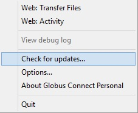
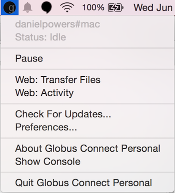
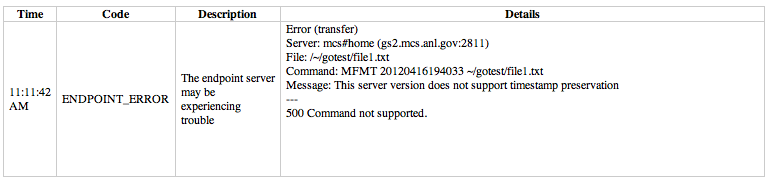

:toc-placement: manual
:toc:
:toclevels: 1
:toc-title:

= FAQs: Globus Connect and Endpoints

toc::[]

== What is Globus Connect?
Globus Connect is easy-to-install, pre-configured software that turns your laptop, server, cluster or other local resource into a Globus link:#what_is_an_endpoint[endpoint].

There are two versions of Globus Connect, one for use with personal machines such as your laptop, and another for use with server-class machines such as campus computing clusters and lab servers. Use link:https://www.globus.org/globus-connect-personal[Globus Connect Personal] to enable file transfer to and from your personal machine (laptop or desktop.) A Globus Connect Personal endpoint is intended to be used only by a single user. link:https://www.globus.org/globus-connect-server[Globus Connect Server] enables system administrators to turn shared resources such as campus clusters and lab servers into a Globus endpoint. If it is made publicly visible, a Globus Connect Server endpoint can be used by multiple Globus users.

== What is the difference between Globus Connect Personal and Globus Connect Server?
Globus Connect Personal is used to create an endpoint on a single-user system, e.g. on a laptop or a personal desktop machine. We sometimes refer to this as a "personal endpoint". Globus Connect Server is used to create an endpoint on a multi-user system, e.g. on a campus HPC cluster or a lab server. We sometimes refer to this as a "server endpoint". See the link:#how_can_i_create_an_endpoint[links below] for instructions on creating personal and server endpoints.

== What is an "endpoint"?
An "endpoint" is one of the two file transfer locations – either the source or the destination – between which files can move. Once a resource (server, cluster, storage system, laptop, or other system) is defined as an endpoint, it will be available to authorized users who can transfer files to or from this endpoint.

Globus endpoints are named using the following format: [uservars]#<globus-username>#<endpoint-name>#. For example, the XSEDE project has a Globus account under the username "xsede" and so it's endpoints are named [uservars]#xsede#stampede# (for the Stampede system at Texas Advanced Computing Center) and xsede#kraken (for the Kraken system at the National Institute for Computational Sciences). Likewise, an individual that has a Globus account under the username "maxim" might have a personal endpoint called [uservars]#maxim#mylaptop#.

== How can I create an endpoint?
If you wish to create an endpoint on a personal machine (laptop, personal desktop computer, etc.) please see the instuctions for setting up a Globus Connect Personal endpoint here: link:../../how-to/globus-connect-personal-mac/[Mac OS X], link:../../how-to/globus-connect-personal-windows/[Windows], link:../../how-to/globus-connect-personal-linux/[Linux].

If you are setting up an endpoint on a multi-user machine (e.g. HPC cluster, lab server, etc.)
please follow the instructions in the link:../../resource-provider-guide/[Resource Provider Guide].

If you already have a GridFTP server running on your machine you can use the link:https://www.globus.org/xfer/ManageEndpoints[Manage Endpoints webpage] to add an endpoint that refers to that GridFTP server. The link:../../cli/reference/endpoint-add[+endpoint-add+] command on the Globus command line interface can also be used to add an endpoint.

== Are transfers between Globus Connect Personal endpoints possible?
Yes. You must be a link:https://www.globus.org/researchers/plus-plans[Globus Plus] user to transfer files between two Globus Connect Personal endpoints. If the two endpoints are owned by different Globus users, both users must be Globus Plus users. You account may be upgraded to Globus Plus if your institution subscribes to a link:https://www.globus.org/provider-plans[Globus Provider plan].

NOTE: You do not need to be a Plus user to transfer files between a link:https://www.globus.org/globus-connect-personal[Globus Connect Personal] endpoint (e.g. on your laptop) and a link:https://www.globus.org/globus-connect-server[Globus Connect Server] endpoint (e.g. on your lab server or campus cluster). Globus Connect Personal can execute a transfer as long as either the source or destination endpoint has a routable IP address (which is the case for almost all Globus Connect Server endpoints).

== How do I specify paths on Globus Connect Personal running on Windows?
link:https://www.globus.org/globus-connect-personal[Globus Connect Personal] on Windows will translate a path beginning with /~/ into your home directory, e.g. [uservars]#C:\Users\Anatoly\#. To access paths and drives outside of your home directory, use the syntax +/drive_letter/path+, for example [uservars]#/C/xinfo# lists the C:\xinfo directory.

== Where does Globus Connect Personal store its settings?
Globus Connect stores a few configuration files, such as its private certificate and key, in this location:

- Microsoft Windows : +%LOCALAPPDATA%\Globus Connect+ (or +%APPDATA%\Globus Connect+ on Windows XP)
- Mac OS X and Linux: +~/.globusonline/lta+
- On Mac OS X, Globus Connect stores preferences in +~/Library/Preferences/org.globusonline.Globus-Connect.plist+

== How do I get a new setup key for a reinstallation of Globus Connect Personal?
In order to reinstall a Globus Connect Personal endpoint and obtain a new setup key, please follow this step-by-step procedure:

1. Quit Globus Connect

2. Delete the entire Globus Connect Personal settings directory (**THIS IS AN IMPORTANT STEP**): 




- Microsoft Windows: +%LOCALAPPDATA%\Globus Connect



 Personal+ (or +%APPDATA%\Globus Connect




 Personal+ on Windows XP)
- 
Mac OS X and Linux: +~/.globusonline/lta+

3. Install Globus Connect from scratch: link:../../how-to/globus-connect-personal-mac/[Mac OS X], link:../../how-to/globus-connect-personal-windows/[Windows], link:../../how-to/globus-connect-personal-linux/[Linux]

- Then, Click "Generate Setup Key".
- Select the generated key with your mouse and copy it to the clipboard.
- Return to the "Initial Setup" window of Globus Connect Personal and paste the setup key into the provided field. The "OK" button will be enabled if the key is valid. Click "OK" to complete the installation. (If the "OK" button is not enabled, please ensure you have properly copied the entire key generated in the previous step above.

Please note the ports that Globus Connect Personal needs open: Globus Connect Personal uses only outbound TCP connections; port 2223 is used for communicating with the Globus service, and ports and 50000-51000 are used when doing a transfer.

== What is the purpose of the Globus Connect Personal setup key?
The setup key is a one-time credential used during the Globus Connect Personal installation process to uniquely identify your laptop/personal computer's endpoint to Globus. Once the endpoint is created and the installation is complete the key is discarded.

== Does Globus recognize a USB external drive on my laptop as part of an endpoint?
Yes but, by default, Globus Connect Personal only allows you to access your home directory on your personal computer. Follow these steps to allow Globus to recognize your USB external drive:

. Ensure you have the latest version of Globus Connect Personal installed.
. Open the Globus Connect Personal settings window to add your USB drive. On Mac OS X, click "Preferences" in the Globus Connect Personal menu. On Windows, select the Tools -> Options menu option. On Linux, select the File -> Preferences menu option.
. Click on the "+" button and select your USB drive. Optionally, change the directory path that you would like to access.

Now, when you access your Globus Connect Personal endpoint on the Start Transfer page, you can change the path to the name of your USB drive to browse/transfer files.

== How does Globus Connect Personal work?
The Globus service manages transfers to and from a Globus Connect Personal endpoint. Globus Connect Personal uses GSI SSH to maintain a control connection to the Globus service and receive commands. Data are always transferred directly between the Globus Connect Personal endpoint and the destination endpoint – data does not "flow through" Globus in any way.

== How Do I Configure Accessible Directories on Globus Connect Personal for Linux
When using Globus Connect Personal, you will only be able to transfer files to and from directories on your local computer that are set to be accessible. To configure which directories are accessible to Globus Connect Personal, you must configure the +\~/.globusonline/lta/config-paths+ file. This file is a plain text file, with each line corresponding to the configuration of a particular directory path you wish to make accessible. By default, a +~/.globusonline/lta/config-paths+ file that looks like this will be generated the first time Globus Connect Personal for Linux is run:

----
~/,0,1
----

This configuration tells Globus Connect Personal to make the user’s home directory accessible, and to make it read/write in terms of the ability to do Globus transfers. If we wanted to configure the user’s home directory to be read only with respect to the ability to do Globus transfers we could change config-paths like so:

----
~/,0,0
----
 
If the user wishes to make additional directories accessible, then each new top level path must be given its own line in the +~/.globusonline/lta/config-paths+ file. For example, if the user wanted to enable Globus Connect Personal to access the /data/tables directory then they would add the following line to their config-paths file:

----
/data/tables,0,1
----
 
After making a change to the +~/.globusonline/lta/config-paths+ file you must stop and restart Globus Connect Personal like so before the changes will take effect:

----terminal
$ [input]#./globusconnectpersonal -stop#

$ [input]#./globusconnectpersonal -start &#
----terminal
 
In all cases, it is important to note that a user cannot access a directory or a file via Globus Connect Personal that they don’t have proper unix file permissions for on the local system. Unix file permissions must be considered along with the permissions specified in the config-paths file to determine actual accessibility for a given file or directory. In any case, the most restrictive of the two categories of permissions will always apply.

NOTE: There are some caveats concerning how Globus Connect Personal handles symlinks found in accessible paths. Please read more about that in the following FAQ: link:../transfer-sharing/#how_does_globus_handle_symlinks[How Does Globus Handle Symlinks?]

== How do I update to the latest version of Globus Connect Personal
The steps you will need to take to upgrade your current Globus Connect Personal install will depend on the operating system you are using. Please refer to the section below that corresponds to the OS of the system that you have Globus Connect Personal installed on.

=== Windows
. Ensure that Globus Connect Personal for Windows is running
. Locate the Globus icon (circle with the letter "g": in it) in the system tray (bottom right of screen)
. Right-click on the Globus icon to see the following menu:
+
[role="img-responsive center-block"]

+
. Select the "Check for updates..."" option and left-click
. Follow the prompts to get updated to the latest version of Globus Connect Personal
. If you should encounter any issues updating in this fashion, then consider simply uninstalling the old version of Globus Connect Personal, downloading the new version (link below), and then installing the new version from the downloaded installer

=== Mac
. Ensure that Globus Connect Personal for Mac is running
. Locate the Globus icon (circle with the letter "g" in it) in the menu bar (top right of screen)
. Click on the Globus icon to see the following menu:
+
[role="img-responsive center-block"]

+
. Select the "Check for updates..."" option and click
. Follow the prompts to get updated to the latest version of Globus Connect Personal
. If you should encounter any issues updating in this fashion, then consider simply uninstalling the old version of Globus Connect Personal, downloading the new version (link below), and then installing the new version from the downloaded installer

=== Linux
. If Globus Connect Personal for Linux is running, kill it:
+
----terminal
$ [input]#killall gc-ctrl.py#
----terminal
+
. Delete the old Globus Connect Personal install directory
. Download and extract the new Globus Connect Personal for Linux package (see link below)
. Start Globus Connect Personal from the new install directory just as you started it before

If you should encounter problems when attempting your upgrade and cannot resolve them, then feel free to contact support@globus.org for help.

=== Globus Connect Personal Download Links:
https://www.globus.org/globus-connect-personal

== What can I do if my endpoint does not support timestamp preservation?
In the event that you see an error like this - [error]#Message: This server version does not support timestamp preservation#, follow the steps below.

[role="img-responsive center-block"]

. Cancel your job and restart it without the timestamp preservation option.
. Also, restart with the Transfer setting option:

[role="img-responsive center-block"]

NOTE: If you require timestamp preservation, please contact the administrator of your endpoint and request that they upgrade the GridFTP server to 5.0.5 or 5.2.1 (or later versions).

== Why can't I connect to relay.globusonline.org?
=== Cannot Reach relay.globusonline.org on Port 2223
If you are running Globus Connect Personal on a Linux or Mac machine, you may see the following error message:

----terminal
[output]#Error: Could not connect to server 
--- 
ssh: connect to host relay.globusonline.org port 2223: Connection refused#
----terminal

There is an equivalent message on Windows systems:

----terminal
[output]#Could not communicate with server

ssh: connect to host relay.globusonline.org port 2223: A connection attempt failed because the connected party did not properly respond after a period of time, or established connection failed because connected host has failed to respond.#
----terminal

These errors indicate that you are having trouble reaching Globus through your network.

Throughout this article, we will use the common notation of relay.globusonline.org:2223 to refer to port 2223 on the server relay.globusonline.org.

==== Confirming the Source of the Error 
To confirm that you are unable to reach our server, and that the Globus Connect Personal is not suffering from some other error that it cannot distinguish, you can use the telnet tool to test your ability to connect to relay.globusonline.org.

On Mac or Linux, open the Terminal program or your preferred terminal emulator. On Windows, open the Command program (cmd.exe). At the prompt, type "telnet relay.globusonline.org 2223" followed by the Enter key. This will attempt to establish a connection to the server on port 2223. If everything is working properly, you should receive a message similar to the following:

----terminal
[output]#Trying 184.73.255.160...
Connected to relay.globusonline.org.
Escape character is \'^]'.
SSH-2.0-OpenSSH_5.9p1-hpn13v11 GSI_GSSAPI_GPT_5.4 GSI#
----terminal

You may then exit the telnet program by typing `Ctrl+]` and closing the terminal.
This confirms that you are able to connect to our server, even though Globus Connect Personal reports that it is unable to do so. At this stage, we recommend opening a support ticket.

It may take some time, and then fail with an error message,

----terminal
[output]#Trying 184.73.255.160...
telnet: Unable to connect to remote host: Connection timed out#
----terminal

if this is the case, you are not able to connect to the Globus service, and the error reported by Globus Connect Personal is accurate.

==== Troubleshooting the Error
A failure to connect to relay.globusonline.org:2223 most commonly indicates the presence of firewall rules that restrict access to a specific set of ports.

This most often arises on a publicly accessible network like a University or Hospital network. Firewall rules restrict connections on specific port numbers in order to protect users on the network. Unfortunately, the ports used by Globus are not among the standard set used for connections to webservers or for remote logins, so they are typically not listed as being allowed.

You can confirm that this is the problem by attempting to run Globus Connect Personal from a home network or other location that does not have these firewall rules in place. If you are able to use Globus Connect Personal from another network successfully, it means that it is almost certainly a matter of firewall restrictions on the network that you are attempting to use.

==== Resolving the Error in the Case that there is a Firewall
If you have confirmed that there are firewall rules or similar restrictions preventing you from reaching Globus, you will need to contact your network administrators to have these restrictions lifted or exceptions added.

You should supply your network administrators with the set of ports that will be used by the Globus Connect Personal software. These are:

- an outbound connection on 2223 in order to register the endpoint with our relay server
- connections on ports 50000-51000 for your Globus Connect Personal endpoint to move data to and from other endpoints

It is worth noting that the data ports 50000-51000 can be altered to other values, although these defaults are the common case. If the endpoint that you are attempting to transfer with has specified a different port range, you will need to obtain that set of ports from the endpoint's administrator.

Some network administrators maintain automated systems or sets of forms that can be submitted in order to request firewall exceptions. If you able to find these resources, it may greatly expedite this process.

==== Checking iptables on Linux Systems
A very common source of trouble for Globus Connect Personal Linux users is a restrictive configuration of the iptables firewall rules. We will not provide a guide to reading and editing iptables here, but if you are comfortable adding, removing, and modifying rules in iptables, you may want to attempt to troubleshoot the problem yourself.

Simply make sure that inbound and outbound TCP connections are allowed on ports 50000-51000, and outbound connections are allowed on port 2223. It is possible to configure an endpoint to use UDT for file transfers. If you are performing transfers with an endpoint that uses UDP, you must ensure that the data ports 50000-51000 are accessible over UDP as well as (or instead of) TCP.

=== If All Else Fails, Open a Support Ticket
If you are unable to resolve the problem yourself, or have confirmed that there are no firewall restrictions preventing your Globus Connect Personal endpoint from reaching Globus, please open a support ticket with us. A member of our team will contact you as soon as possible to help you get your Globus Connect Personal endpoint working.

Please include, in as much detail as you are able, the following pieces of information

- The platform you are using (Mac, Windows, Linux)
- The troubleshooting steps you have attempted thusfar. Please detail the exact actions that you have taken
- The full error message, as presented to you by Globus Connect Personal
- The network(s) on which you are experience the error

As an example, an ideal ticket might have the following content:

----
Hi,

I'm trying to set up Globus Connect Personal on my laptop running Windows XP, Service Pack 3. Whenever I start the program, I am presented with the error message

Could not communicate with server

ssh: connect to host relay.globusonline.org port 2223: A connection attempt failed because the connected party did not properly respond after a period of time, or established connection failed because connected host has failed to respond.

I have included a screenshot of the error message below.

I have experienced this error both on my home network, and on the University of Chicago Hospital network. I have confirmed with the university's technical staff, ITS, that there are no firewall rules in place that should prevent me from reaching relay.globusonline.org, and have successfully connected to the server from both networks using the command 'telnet relay.globusonline.org 2223' from both networks.

I do not believe that my laptop has any firewall rules or security restrictions in place, but I don't know how to check this.

Thanks,

Jane Doe
----

We always attempt to provide quick response time, but the more information you provide, the more likely we will be able to resolve your issue promptly, and the less likely you are to be asked to provide more information before your problem can be solved.

== What happens if my user profile is on a network share?
If you have a home directory on a network share, you may see an error message of the form

[error]#"Your user profile is on a network share, at location "<path>". To use Globus Connect Personal, you must map this location to a local drive. Please contact support@globus.org for more information."#

This issue arises when your home directory is stored on a server, and "*<path>*" takes the form of "*\\example.com\share\Users\ExampleUsername*".

To resolve this problem, you must use Windows' capability to create a shortcut to a network share, or "Map" it to a drive letter. Microsoft provides official documentation for this for link:http://windows.microsoft.com/en-us/windows/create-shortcut-map-network-drive[Windows 7 and Windows Vista], link:https://www.microsoft.com/resources/documentation/windows/xp/all/proddocs/en-us/windows_fcab_connect_drive.mspx[Windows XP], and link:http://windows.microsoft.com/en-us/windows-8/create-shortcut-to-map-network-drive[Windows 8]. Follow these instructions to assign a drive letter of your choosing to the network share containing your home directory, and then restart Globus Connect Personal.

== Why do I get “Permission Denied” or “Path not allowed” errors on my endpoint?
When transferring files with from Globus Connect Personal, a common error that appears on the web site is:

----
Permission Denied

The administrator of the directory you have selected does not permit you to view its contents; and the directory may not be transferrable.
----

If you select "see debug information" you will probably be presented with an error like the following:

----
Command Failed: Error (list) Server: username#endpointname (Globus Connect) Command: MLST /directory/ Message: Fatal FTP Response --- 500 Command failed : Path not allowed.
----

In the Globus command line interface, the corresponding error is very similar:

----
Error: Command Failed: Error (list)

Server: username#endpointname (Globus Connect)

Command: MLST /directory

Message: Fatal FTP Response

---

500 Command failed : Path not allowed.
----

=== What does this error mean?
This error arises from one of two things:

. You attempted to transfer a file or folder, or list the contents of a folder, to which Globus has not been allowed access
. Your user account does not have the privileges needed to access the file or folder in question

=== Option 1: The Folder Is Not In Your "Accessible Folders", "Accessible Directories and Files", or "Access Path Configuration"
Depending on your operating system, this setting may be called by any of the above names. The *Accessible Folders* is Globus Connect Personal's list of files and directories to which you have granted Globus access.

This is the more common cause of this error. The *Accessible Folders* must include a folder that contains the file or folder you are attempting to transfer.

=== Option 2: You Do Not Have Sufficient Permissions to Access the File or Folder
If you have the file or folder entered into your *Accessible Folders* settings, and are still receiving permission denied errors, it is likely that your user account on the endpoint does not have sufficient privileges on the file or folder that you are attempting to access with Globus. 

==== Resolving the Error: Accessible Folders
To resolve this issue, you may need to modify your *Accessible Folders* on Globus Connect Personal.

- If you are using Windows, go to the System Tray, and right-click on the Globus icon. Select "Options" to bring up the menu, and select the "Access" tab.
- If you are using Linux, go to the File menu and select "Preferences".
- If you are using OS X, go to the Taskbar, and left-click on the Globus icon. Select "Preferences", and then select the "Access" tab.

Any folder name in the *Accessible Folders* list may have its contents read—that is, inspected or copied—by Globus. There are additional checkboxes to make the file or folder _Writable_ —may be modified, replaced, or deleted—and _Sharable_ —accessible from Shared Endpoints you might create (note: you must be a link:https://www.globus.org/researchers/plus-plans[Globus Plus user] to share from a Globus Connect Personal endpoint). Add your file or folder, or a folder which contains your file or folder, and make it _Writable_ if desired, and you should no longer see "Permission Denied" errors. 

For example, if [uservars]#exampleuser# wants to transfer file [uservars]#/a/b/c# from Globus Connect Personal endpoint [uservars]#exampleuser#myendpoint# to [uservars]#exampleuser#otherendpoint#, all he or she has to do is open the Accessible Folders settings on [uservars]#exampleuser#myendpoint#, and ensure that one or more of the following files or directories are in the Accessible Folders list: [uservars]#/a/b/c#, [uservars]#/a/b/#, [uservars]#/a/#, or [uservars]#/#.

==== Resolving the Error: Insufficient Permissions
If you do not have sufficient permissions to read or write a file or folder, you will need to change the permissions on those files or directories so that Globus can access them. Once you can view or edit files or directories under your user account on the Globus Connect Personal endpoint, Globus should no longer have problems reading or writing their contents, as long as the *Accessible Folders* settings are correct.

== Why do I get an SSLv3 handshake error?
This is the error message:

----terminal
[output]#530-globus_xio: Authentication Error

530-globus_gsi_gssapi: Unable to verify remote side's credentials

530-globus_gsi_gssapi: SSLv3 handshake problems: Couldn't do ssl handshake

530-OpenSSL Error: s3_srvr.c:965: in library: SSL routines, function

SSL3_GET_CLIENT_HELLO: wrong version number

530 End.#
----terminal

This would indicate that some users are still using an old/incompatible version of the client.

The reason for this issue is that we’ve recently updated our infrastructure to disallow SSLv3 (and prefer TLS) to avoid the POODLE vulnerability discovered last year. This upgrade was coordinated by Globus. All Globus installations are due to be configured to disallow SSLv3 by this time (July 2015). If there are transfer issues such as you are seeing, this means that remote services must be upgraded in order to accommodate this fix. The endpoint administrator will need to be contacted to request that the endpoint be updated.

For more information, please check out the following:

- link:../../security-bulletins/2014-10-poodle/[How is Globus impacted by the SSLv3 "POODLE" vulnerability?]

- http://lists.globus.org/pipermail/gt-user/2015-March/010791.html

== What does "You are not an admin of the MyProxy Delegation Service" mean?

This error message occurs if you run the `globus-connect-server-setup` or `globus-connect-servser-web-setup` multiple times using different Globus usernames. As a workaround to get rid of this error, run this command as root: 

----terminal
# [input]#rm /var/lib/myproxy-oauth/myproxy-oauth.db#
----terminal

Then rerun the setup script.

If you aren't using an OAuth server in your configuration (if you are using, for example, `IdentityMethod = MyProxy` in your configuration), you can disable the OAuth server by commenting out the `Server = %(HOSTNAME)s` line in the [OAuth] section of the configuration file.

== How do I fix Globus Connect Server file permission errors?
If you experience issues with Globus Connect Server related to file permissions, e.g. [error]#500-globus_sysconfig: File has bad permissions: Could not read /var/lib/globus-connect-server/grid-security/certificates#, ensure that your Globus Connect Server installation has the following permissions set:

/var/lib/globus-connect-server should have the following permissions:

----terminal
[output]#755 root.root /var/lib/globus-connect-server
755 root.root /var/lib/globus-connect-server/gridftp.d
755 root.root /var/lib/globus-connect-server/myproxy.d
755 root.root /var/lib/globus-connect-server/grid-security
755 root.root /var/lib/globus-connect-server/grid-security/certificates
700 root.root /var/lib/globus-connect-server/myproxy-ca
700 root.root /var/lib/globus-connect-server/myproxy-ca/private
700 root.root /var/lib/globus-connect-server/myproxy-ca/newcerts
700 root.root /var/lib/globus-connect-server/myproxy-ca/certs
700 root.root /var/lib/globus-connect-server/myproxy-ca/store
700 root.root /var/lib/globus-connect-server/myproxy-ca/crl#
----terminal

The files in /var/lib/globus-connect-server/grid-security/certificates should all have permissions set to 644.

== What ports does Globus Connect Server need open?
Globus Connect Server running on a cluster or other shared storage resource uses the following default ports:

* GridFTP server control channel connections: Port 2811 or 21 inbound (21 for anonymous GridFTP) from 184.73.189.163 and 174.129.226.69
* GridFTP server data channel connections: Ports 50000 – 51000 inbound and outbound to/from Any
* MyProxy CA server authentication requests: Port 7512 inbound from 174.129.226.69
* OAuth server authentication requests: Port 443 inbound and outbound to/from Any

Globus Connect Server needs the following ports open during the setup process:

* Port 2223 outbound to 184.73.255.160

If you experience issues activating an endpoint, it's often the case that one or more of the above ports is not open.

== How do I enable logging for Globus Connect Server 2.x.y?
Currently, logging is not supported in Globus Connect Server >= 2.x.y. However, it can be enabled directly in GridFTP server, one of the Globus Connect Server components.

To enable logging, create a file in the /etc/gridftp.d directory with two extra parameters:

----terminal
$ cat > /etc/gridftp.d/extra-settings

log_level ALL

log_single /var/log/gridftp.log

<Ctrl-d>
----terminal

and restart the GridFTP server:

----terminal
$ /etc/init.d/globus-gridftp-server restart
----terminal

All GridFTP options with their detailed description can be found at: http://toolkit.globus.org/toolkit/docs/5.2/5.2.5/gridftp/admin/#globus-gridftp-server

== Does Globus Connect Server require an X.509 certificate to be installed?
If you link:../../resource-provider-guide/#install_section[install Globus Connect Server] and select the MyProxy option, two components are installed: a GridFTP server and a MyProxy server. By default, certificates for both of these components are automatically installed so there is no need to add or configure X.509 certificates separately. You may choose to configure Globus Connect Server to use a certificate other than the default one installed. Please refer to the link:../../resource-provider-guide/#globus_connect_server_configuration[Globus Connect Server configuration section] to see how that can be set up.

If you install Globus Connect Server and select the MyProxy OAuth option, an additional component is installed, namely an OAuth server (either on an existing web server or as part of a new Apache server installation). In this instance, you will need a certificate to be installed on the Apache server and this certificate should be issued by a Certificate Authority (CA) that is automatically trusted by the browser.

== Can I use a different PAM module for authenticating users to Globus Connect Server endpoint. How do I configure that?
By default, Globus Connect Server uses the same PAM module as the "login" command. If you would like to use a different PAM module for authenticating users to the endpoint, you can modify /var/lib/globus-connect-multiuser/myproxy-server.conf file and modify "pam_id" parameter. For example, you can set "pam_id" to "sshd" for it to use the same PAM module used by SSH.

You can also create a completely new PAM configuration for Globus Connect Server use and place the file in /etc/pam.d/. 

Note that the /var/lib/globus-connect-multiuser/myproxy-server.conf file is overwritten on a setup command execution, and you will need to manually update the file.