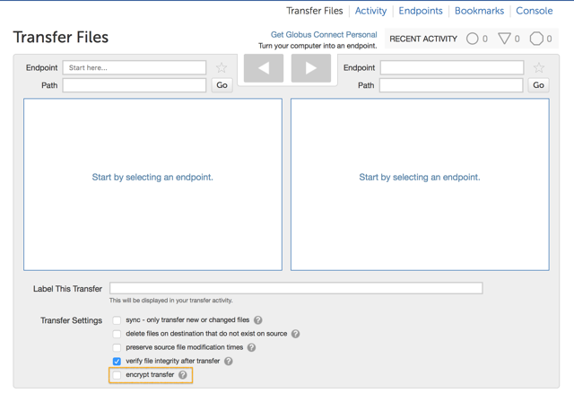
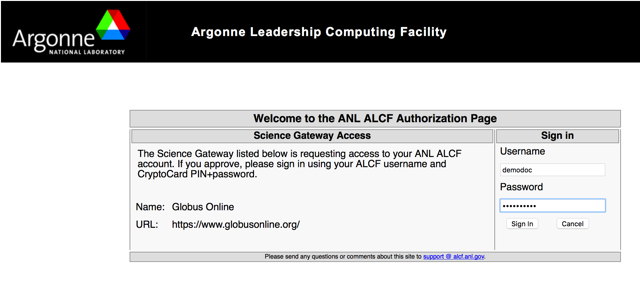
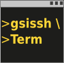

:toc:
:toc-placement: manual
:toclevels: 1
:toc-title:

= FAQs: Security

toc::[]

== Does Globus need credentials when accessing my system? Does it store these permanently?
Globus uses only temporary credentials to act on your behalf when making a transfer request, and never keeps your password nor long-term credentials to access a site.

== How does Globus ensure my data is secure?
Globus uses a "data channel" for moving data between two endpoints. This data channel is established directly between the source and destination endpoints and cannot be accessed by Globus, only by the GridFTP servers running on the endpoints.

By default the data channel is authenticated, but unencrypted. It can be encrypted by selecting the "encrypt transfer" option on the Transfer Files page (see screenshot below), or by including the `—encrypt` option for the transfer command when using the command line interface. You should be aware that encryption adds processing overhead, and will likely reduce transfer speed. Encrypted transfers use the SSL cipher configured on the endpoints (the default for OpenSSL is AES256-SHA).

In addition to the data channel, Globus uses a "control channel" to communicate with the source and destination endpoints for a transfer. All control channel communications are encrypted.

[role="img-responsive center-block"]

== How does Globus use my Google account?
You can use your Google identity to log into Globus. Select Google as an option from the organizations listed on the link:https://www.globus.org/login[Globus login page], and sign in with your Google account. If you have previously logged into Globus using another identity (e.g. your campus username), Globus will give you the option to link it with your Google identity under a single Globus account. If you choose to link, you can use any of your linked identities to access Globus. You can choose not to link and keep your Google identity as a separate Globus account. You can manage your linked identities on the link:https://www.globus.org/app/account[Globus Account page].

== How do I stop Globus from automatically authenticating using my Google account?
Visit link:http://www.google.com/accounts/IssuedAuthSubTokens?hl=en[this link on Google] (you may be prompted to login using your Google account). You will see a list of websites for which you have authorized access to your Google account. Select the Globus entry and click the "Remove" button. Your Google account will no longer be used by Globus. If you try to login to Globus with your Google account, you will be asked to re-confirm that Globus may use your Google account.

== Which method should I use to sign in to Globus?
You can use a username and password from any organization that is recognized (and trusted) by the Globus service. Select your preferred organization from the list on the link:https://www.globus.org/login[Globus login page], and you will be redirected to your organization’s login page to provide your credentials. If you don’t see your organization listed or would like to create a separate account, you can use link:https://accounts.google.com[Google] or link:https://globusid.org[Globus ID] to sign into Globus. 

If you are an existing Globus user and have previously logged in using a Globus username and password, that option is now the Globus ID. We’ve moved Globus username/passwords created prior to February 13, 2016 into an independent service called Globus ID (globusid.org). Your Globus account can include a Globus ID as a linked identity, but this is not required.

== What authentication methods does Globus support?
Globus supports multiple authentication methods, including username/password (our default method), MyProxy, MyProxy with OAuth, OpenID (using a Google account) and InCommon. In all instances, you are first required to set up a Globus account (username/password) and then can link:https://www.globus.org/account/ManageIdentities[associate additional identities with your Globus account]. You will subsequently be able to sign in to Globus using any of the identities mapped to your account.

== Does Globus support one-time passwords (OTP)?
Yes, one-time passwords work with Globus and do not require any specialized configuration. To access a site that requires an OTP, simply enter your password as you would normally when prompted.

For example, when accessing an ALCF endpoint you are prompted to enter a CryptoCard PIN + your password (see screenshot below). In this case you might enter "456324ax34D_fDWR", assuming "456324" is the one-time password generated by your CryptoCard and  "ax34D_fDWR" is your password.

[role="img-responsive center-block"]

== How does Globus work with XSEDE security infrastructure?
From the perspective of XSEDE, Globus looks like a science gateway that uses user-specific credentials to access resources on behalf of the user, instead of using community credentials. Globus uses the MyProxy OAuth server provided by XSEDE to get a user's short term X.509 certificate, without requiring the user's password to flow through Globus.

When a user chooses to activate an XSEDE endpoint, they are redirected to the XSEDE MyProxy OAuth server, where they are prompted to log in using their XSEDE credential (username/password). Once they have authenticated, they are automatically redirected to the Globus page and the activation is completed. Globus only receives a short-term X.509 certificate from the MyProxy server, and never sees the user's username and password.

If the user is using the Globus command line interface, the activation of an XSEDE endpoint prints a URL for them to use to complete the activation. Once the user browses to the URL, the flow is similar to the one described when using the Globus website.

== How can I delete my Globus account?
Please send email to support@globus.org and request to delete your account. In order to complete the deletion process you should ensure that:

1. You have no active file transfers (if you do, you should cancel them or wait for them to complete).
2 All endpoints that you created have been deleted (e.g. the endpoint on your local machine created by installing Globus Connect Personal).
3. All shared endpoints that you created have been deleted (note that users that were granted access to the shared endpoint will no longer be able to access the files shared on that endpoint).

== How do I generate a VOMS-enabled proxy certificate and upload it to a MyProxy server?
GSISSH-Term is a Java-based client that can be installed and launched with one simple click. link:https://www.lrz.de/[Leibniz Supercomputing Centre] maintains and develops a customized version of this client that generates a proxy certificate and uploads it to any MyProxy server with no additional setup. European EUGridPMA CA certificates are automatically installed and updated on the client machine.

Virtual Organization Membership Service (VOMS) is a system for managing authorization data within multi-institutional collaborations. VOMS provides a database of user roles and capabilities, and a set of tools for managing the database and generating Grid credentials for users. If you are using VOMS, particularly a EGI VO, this tool is for you—all EGI VOs are automatically configured and updated by this client.

To generate a proxy certificate (either a regular or VOMS-enabled) for use with a MyProxy server, click on the link below. Begin by selecting menu option "Tools" -> "MyProxy Tool".

[role="img-responsive center-block"]

NOTE: You must have a Java Runtime Environment (JRE 1.6 or later) installed to run this program.

For more information on GSISSH-Term:

- link:https://www.lrz.de/services/compute/grid_en/software_en/gsisshterm_en/[Full Documentation]
- link:https://wiki.egi.eu/wiki/MyProxy_tool_GUI[EGI WIKI - MyProxy tool GUI]

EGI users that have questions or need assistance with this tool should submit a ticket using link:https://ggus.eu/pages/home.php[GGUS]. All other users may contact the mailto:grid-admin@lrz.de[LRZ support team].

== Why is endpoint activation with GSI SSH failing?
This error happens when your Globus account is not configured for use with GSI SSH, and only has SSH keys. Please see the link:../../faq/command-line-interface/#how_do_i_set_up_globus_so_i_can_connect_to_cli_globusonline_org_using_gsi_ssh[FAQ on configuring your account to use GSI SSH].

== Is there an independent assessment of Globus security?
Multiple organizations have conducted Globus security reviews. Their findings and our responses are link:https://www.globus.org/technology/security/globus-security-reviews[documented here].

== What is Globus ID? 

Globus ID provides and manages identities (usernames and passwords) for use with the Globus service. It is an independent service operated by the Globus team for those users that choose not to use their organization's login to access Globus (and for users whose institutional identity provider is not yet supported by the Globus service). *A Globus ID _is not_ required to use Globus - you are encouraged to access the access the service using your institutional username and password.*

Globus ID was introduced so that we can continue to support Globus usernames/passwords for those users that registered for a Globus account prior to February 13, 2016. For example, if you had previously created the Globus username "auser", you can log into Globus as auser@globusid.org with your existing Globus password.

== What is my Globus account? 

Your Globus account is the set of linked identities that you have used to log into Globus. link:https://www.globus.org/app/account[Click here] to see the set of identities for your Globus account. 

We've moved Globus username/passwords created prior to February 13, 2016 into an independent service called Globus ID (link:https://globusid.org[globusid.org]). Your Globus account can include a Globus ID as a linked identity, but this is not required. 

== Why should I link accounts? 

Globus allows users to link their many identities (e.g., university login, facility logins, Google, Globus ID) into a single Globus account. This allows the user to have a single account to manage their resources across these multiple identities. For example, a user with a University of Chicago account, might also have XSEDE account. By linking those together into a single Globus account, use of services such as Globus transfer and groups using either identity is consolidated under that single Globus account.

== How do I get my organization added as an option to log into Globus?
If your organization is part of the InCommon Federation, the administrator of your campus identity system can configure it to work with Globus. Globus supports logins from InCommon members whose identity systems release link:https://spaces.internet2.edu/display/InCFederation/Research+and+Scholarship+Attribute+Bundle[Research & Scholarship] attributes. 

Please send the following information to your IT administrator: "To setup your Identity Provider for use with Globus, please see http://www.cilogon.org/faq#TOC-What-if-I-don-t-see-my-organization-listed-on-the-CILogon-Service-. If your identity provider is listed in CILogon, but not in Globus, please ensure that Research and Scholarship attributes are released to CILogon as described here https://spaces.internet2.edu/display/InCFederation/Research+and+Scholarship+Attribute+Bundle. Once your organization’s system is configured to release the required attributes, it will appear in the list of institutions on the Globus login page within two business days and can be selected by your users."

If your organization is not part of the InCommon Federation, you can request to add your organizational login as an alternate identity provider in Globus. Your system must support the link:http://openid.net/connect/[OpenID Connect] protocol, and be registered with Globus as a trusted identity provider. Please link:https://www.globus.org/alternate-identity-provider-registration[submit this form] so we can register your system. Once the request is vetted and approved, your identity provider will be available as an option for login.

NOTE: In order for your organization’s identity provider to be supported by Globus you must have at least a Standard subscription *and* an Alternate Identity Provider Subscription as link:https://www.globus.org/providers/provider-plans[described here].