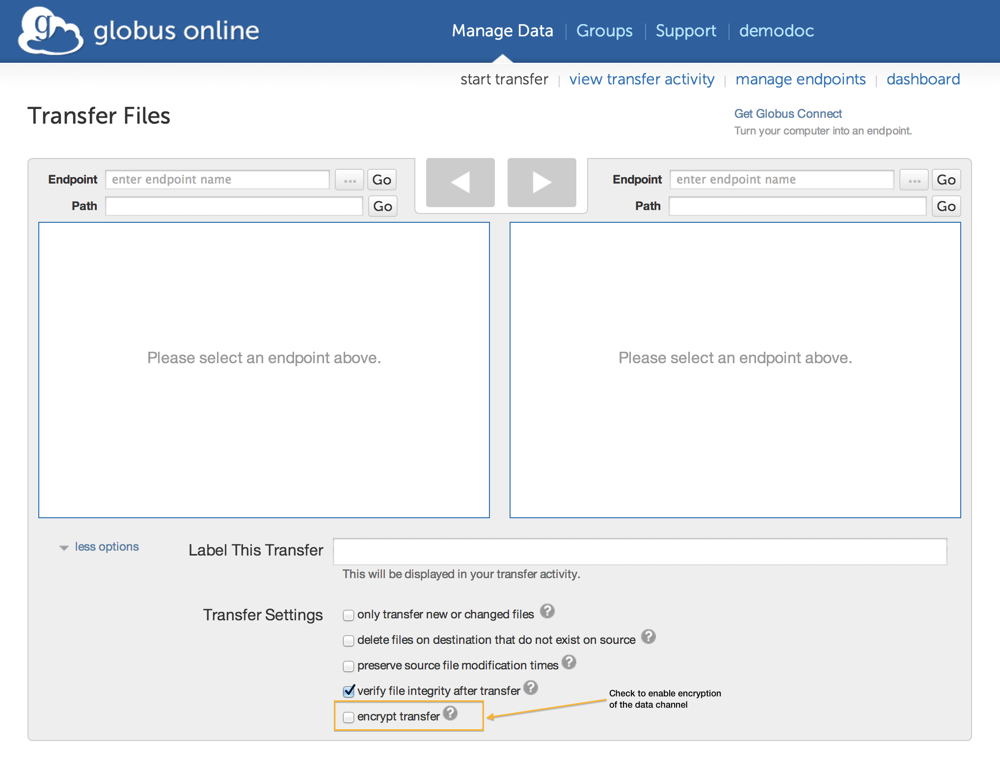

:toc:
:toc-placement: manual
:toclevels: 1
:toc-title:

= FAQs: Security

toc::[]

== Does Globus need credentials when accessing my system? Does it store these permanently?
Globus uses only temporary credentials to act on your behalf when making a transfer request, and never keeps your password nor long-term credentials to access a site.

== How does Globus Online ensure my data is secure?
Globus Online uses a "control channel" to communicate with the source and destination endpoints for a transfer. All control channel communications are encrypted.

In addition to the control channel, the data is transferred over a "data channel" that exists only between the source and destination endpoints, i.e. Globus Online does not have access to this channel, it is only accessed by the servers on the endpoints. By default the data channel is authenticated, but unencrypted.  It can be encrypted by selecting the "encrypt transfer" option on the Transfer Files page (see screenshot below), or by including the +--encrypt+ option for the +transfer+ command when using the command line interface.

[role="img-responsive center-block"]

You should be aware that encryption adds processing overhead, resulting in slower transfers. Encrypted transfers use the SSL cipher configured on the endpoints (the default for OpenSSL is AES256-SHA).

== How does Globus use my Google account?
We provide the option of mapping your Google identity to your Globus account, enabling you to sign on to Globus using your Google credentials instead of your Globus username/password. To add your Google identity to your account follow the "Add External Identity" link on the link:https://www.globus.org/account/ManageIdentities[Manage Identities page] and select the "Google" account provider.

Once your Google identity is mapped to your Globus account you will allow you to log in to Globus as described link:#how_to_use_a_third_party_login_e_g_incommon_xsede_to_access_globus[here].

To remove the association between my Google account and Globus click the "Delete" button next to the Google identity you wish to remove.

== How do I stop Globus from automatically authenticating using my Google account?
Visit link:http://www.google.com/accounts/IssuedAuthSubTokens?hl=en[this link on Google] (you may be prompted to login using your Google account). You will see a list of websites for which you have authorized access to your Google account. Click the "Revoke Access" link next to Globus.org. Your Google account will no longer be used by Globus. If you try to login to Globus with your Google account, you will be asked to re-confirm that Globus may use your Google account.

== How do I use a third-party login (e.g. InCommon, XSEDE) to access Globus?
Use the following steps to use a third-party login to access Globus:

. Go to the Sign In page and click on "alternate login" link
+
[role="img-responsive center-block"]
image::images/AlternateLogin_highlight.png[]
. Click on the third-party login you wish to use. (login providers with a box/arrow icon next to them will redirect to their own log in page, just click the *Proceed* button)
. Enter your username/pass associated with the third party if prompted
. On your first use of a third-party login, you will be prompted to *Make a Connection* to link that login with your Globus account - this is a one-time process (if you don't already have a Globus account you will be prompted to create one)
. Your accounts are now linked, click *Let's Go»* to enter the site.

== Which method should I use to sign in to Globus?
The method you use is based on personal preference, but may be influenced by the types of endpoints you use. For example, if you plan to use Globus routinely to transfer files to/from NERSC (or ALCF or other resources with a third-party identity server supported by Globus) then you can link:#how_to_use_a_third_party_login_e_g_incommon_xsede_to_access_globus[use that same identity to log into Globus].

You can also map multiple identities to your Globus account — just sign on with your Globus username/password and add your other identities using the appropriate links on the link:https://www.globus.org/account/ManageIdentities[Manage Identities page].

== What authentication methods does Globus support?
Globus supports multiple authentication methods, including username/password (our default method), MyProxy, MyProxy with OAuth, OpenID (using a Google account) and InCommon. In all instances, you are first required to set up a Globus account (username/password) and then can link:https://www.globus.org/account/ManageIdentities[associate additional identities with your Globus account]. You will subsequently be able to sign in to Globus using any of the identities mapped to your account.

== Does Globus support one-time passwords (OTP)?
Yes, one-time passwords work with Globus and do not require any specialized configuration. To access a site that requires an OTP (e.g. ACLF), simply enter your password as you would normally when prompted.

== How does Globus work with XSEDE security infrastructure?
From the perspective of XSEDE, Globus looks like a science gateway that uses user-specific credentials to access resources on behalf of the user, instead of using community credentials. Globus uses the MyProxy OAuth server provided by XSEDE to get a user’s short term X.509 certificate, without requiring the user’s password to flow through Globus.

When a user chooses to activate an XSEDE endpoint, they are redirected to the XSEDE MyProxy OAuth server, where they are prompted to log in using their XSEDE credential (username/password). Once they have authenticated, they are automatically redirected to the Globus page and the activation is completed. Globus only receives a short-term X.509 certificate from the MyProxy server, and never sees the user’s username and password.

If the user is using the Globus command line interface, the activation of an XSEDE endpoint prints a URL for them to use to complete the activation. Once the user browses to the URL, the flow is similar to the one described when using the Globus website.

== How can I delete my Globus account?
Please sign in to Globus and submit a support request to delete your account here: https://support.globus.org/tickets/new. In order to complete the deletion process you should ensure that:

- you have no active file transfers (if you do, you should cancel them or wait for them to complete)
- all endpoints that you created have been deleted (e.g. the endpoint on your local machine created by installing Globus Connect Personal)
- all shared endpoints that you created have been deleted (note that users that were granted access to the shared endpoint will no longer be able to access the files shared on that endpoint)

== How do I generate a VOMS-enabled proxy certificate and upload it to a MyProxy server?
GSISSH-Term is a Java-based client that can be installed and launched with one simple click. link:https://www.lrz.de/[Leibniz Supercomputing Centre] maintains and develops a customized version of this client that generates a proxy certificate and uploads it to any MyProxy server with no additional setup. European EUGridPMA CA certificates are automatically installed and updated on the client machine.

Virtual Organization Membership Service (VOMS) is a system for managing authorization data within multi-institutional collaborations. VOMS provides a database of user roles and capabilities, and a set of tools for managing the database and generating Grid credentials for users. If you are using VOMS, particularly a EGI VO, this tool is for you—all EGI VOs are automatically configured and updated by this client.

To generate a proxy certificate (either a regular or VOMS-enabled) for use with a MyProxy server, click on the link below. Begin by selecting menu option "Tools" -> "MyProxy Tool".

[role="img-responsive center-block"]
image::images/hfjaigge.png[GSISSH-Term icon]

NOTE: You must have a Java Runtime Environment (JRE 1.6 or later) installed to run this program.

For more information on GSISSH-Term:

- link:https://www.lrz.de/services/compute/grid_en/software_en/gsisshterm_en/[Full Documentation]
- link:https://wiki.egi.eu/wiki/MyProxy_tool_GUI[EGI WIKI - MyProxy tool GUI]

EGI users that have questions or need assistance with this tool should submit a ticket using link:https://ggus.eu/pages/home.php[GGUS]. All other users may contact the mailto:grid-admin@lrz.de[LRZ support team].

== Why is endpoint activation with GSI SSH failing?
This error happens when your Globus account is not configured for use with GSI SSH, and only has SSH keys. Please see the link:../../faq/command-line-interface/#how_do_i_set_up_globus_so_i_can_connect_to_cli_globusonline_org_using_gsi_ssh[FAQ on configuring your account to use GSI SSH].

== Is there an independent assessment of Globus security?
Multiple organizations have conducted Globus security reviews. Their findings and our responses are link:https://www.globus.org/technology/security/globus-security-reviews[documented here].