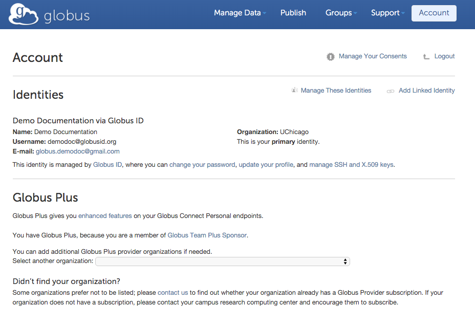

:toc-placement: manual
:toc:
:toclevels: 1
:toc-title:

= FAQs: Subscriptions

toc::[]

== How much does Globus cost?
Globus is free for researchers at non-profit institutions to use for file transfer, thanks to the generous support of sponsors who fund our research.

As a non-profit institution, our goal from day one has been to make Globus a self-sustaining service, so that we can continue to serve the needs of academic and non-profit research organizations for many years to come. Most of our funding is intended for research and early software development, not to cover operation, support, and ongoing evolutionary improvement of the service. As usage grows, our costs have grown and we decided that charging a usage-based subscription fee for additional features that go beyond file transfer is the best way to ensure that we can continue to provide a high-quality research data management service.

To this end, certain Globus features are available only by subscribing to a link:https://www.globus.org/subscriptions[Globus subscription plan]. Such features include the ability to share files directly from existing storage, access to data publication functionality, and performing various administrative tasks for Globus endpoints at your institution. Globus subscription plans also offer higher levels of support from the Globus team, with priority response times.

If you are a commercial user, you may use Globus by signing up for a link:https://www.globus.org/subscriptions#commercial-pricing[commercial subscription plan]. We are unable to offer the service free of charge to commercial users, but believe that you will find Globus provides valuable capabilities at a reasonable price. Thanks!

== How do I add a managed endpoint to my subscription?
NOTE: The commands below must be run on the Globus command line interface (CLI). Please read link:../../cli/using-the-cli/[this page] to configure your account to access the Globus CLI.

You can add a managed endpoint via the link:../../cli/using-the-cli/[Globus command line interface] by running the following command:

----terminal
$ endpoint-add <username>#<endpoint-name> --managed-endpoint
----terminal

For example, if user [uservars]#demodoc# wishes to add a managed endpoint called [uservars]#onecluster# then the user must run:

----terminal
$ endpoint-add demodoc#onecluster --managed-endpoint
----terminal

Please ensure that [uservars]#<username># has subscription management rights, otherwise the command will fail. Note that a subscription manager can only create endpoints under their own account.

You must have a current link:https://www.globus.org/subscriptions[Globus subscription plan] to be granted subscription management rights. If your Globus account does not have subscription management rights, please contact support@globus.org so that we may enable your account. If you do not have a Globus subscription plan please link:https://www.globus.org/subscriptions/non-profit-subscription-inquiry[contact us to sign up].

== How do I convert an existing endpoint into a managed endpoint?
NOTE: The commands below must be run on the Globus command line interface (CLI). Please read this article to configure your account to access the Globus CLI.

You can convert an existing endpoint into a managed endpoint via the Globus command line interface by running the following command:

----terminal
$ endpoint-modify --managed-endpoint <username>#<endpoint-name>
----terminal

For example, if user [uservars]#demodoc# wishes to flag the endpoint [uservars]#zerocluster# as a managed endpoint then the user must run:

----terminal
$ endpoint-modify --managed-endpoint demodoc#zerocluster
----terminal

Please ensure that [uservars]#<username># has subscription management rights, otherwise the command will fail. Note that a subscription manager can only create endpoints under their own account.

You must have a current link:https://www.globus.org/subscriptions[Globus subscription plan] to be granted subscription management rights. If your Globus account does not have subscription management rights, please contact support@globus.org so that we may enable your account. If you do not have a Globus subscription plan please link:https://www.globus.org/subscriptions/non-profit-subscription-inquiry[contact us to sign up].

== What is Globus Plus? Do I need it?
Globus Plus enables you to transfer files between two _personal_ Globus endpoints, i.e. computers on which you have installed Globus Connect Personal, such as your laptop and a desktop personal computer. Globus Plus also allows you to share files from _personal_ Globus endpoints. *_You do not need Globus Plus_* if transferring files to/from a Globus server endpoint (e.g. your campus cluster or supercomputing center), or if you want to share files from a Globus server endpoint.

== How do I get Globus Plus?
Your Globus account may be upgraded to Globus Plus by associating it with your organization's Globus subscription. Go to: link:https://www.globus.org/account/Plus[www.globus.org/account/Plus], select your organization from the list and follow the instructions. Depending on your organization's policy, you may be directed to complete a request form or send email to an administrator. Once you have Globus Plus, visiting the above link will show your institution as in the example below.

[role="img-responsive center-block"]
