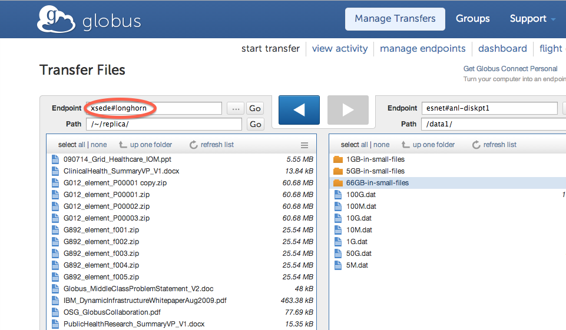
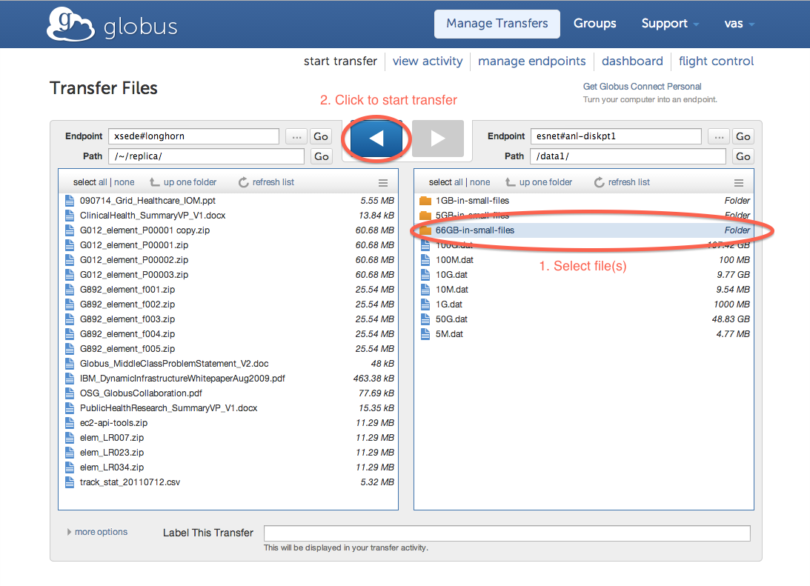

:toc-placement: manual
:toc:
:toclevels: 1
:toc-title:

= FAQs: Using Globus Transfer

toc::[]

== Which browsers does the Globus web user interface support?
The Globus web user interface is tested and verified to work on the most recent desktop version of Chrome, Edge, Firefox, Internet Explorer, and Safari.

Earlier versions of these browsers, as well as other desktop browsers (e.g. Opera) and mobile/touch-based browsers, may experience loss of functionality and/or distorted visual effects. Limited or no support may be available for such browsers.

== How much does Globus cost?
Globus is free for researchers at non-profit institutions to use for file transfer, thanks to the generous support of sponsors who fund our research.

As a non-profit institution, our goal from day one has been to make Globus a self-sustaining service, so that we can continue to serve the needs of academic and non-profit research organizations for many years to come. Most of our funding is intended for research and early software development, not to cover operation, support, and ongoing evolutionary improvement of the service. As usage grows, our costs have grown and we decided that charging a usage-based subscription fee for additional features that go beyond file transfer is the best way to ensure that we can continue to provide a high-quality research data management service.

To this end, certain Globus features are available only by subscribing to a link:http://www.globus.org/providers/provider-plans[Globus Provider plan]. Such features include the ability to share files directly from existing storage, access to data publication functionality, and performing various administrative tasks for Globus endpoints at your institution. Globus Provider plans also offer higher levels of support from the Globus team, with priority response times.

If you are a commercial user, you may use Globus by signing up for a link:https://www.globus.org/providers/provider-plans#commercial-pricing[commercial Provider plan]. We are unable to offer the service free of charge to commercial users, but believe that you will find Globus provides valuable capabilities at a reasonable price. Thanks!

== How do I "refresh my credentials" (or "activate an endpoint")?
Because Globus does not store usernames/passwords for your endpoints, periodic re-authentication is required. This means you need to log on with the appropriate username and password for the given endpoint (this is called endpoint "link:#what_is_activation[activation]"). There are two ways to refresh your credentials in Globus:

1. Sign in to your account via the web GUI and go to the link:https://www.globusonline.org/xfer/ManageEndpoints[Manage Endpoints page]. Click the "activate" links for the source and destination endpoints relevant to your current transfers.
+
-OR-
+
2. Sign in to the command line interface (ssh cli.globusonline.org) and use the +endpoint-activate+ command to refresh your credentials. For example, enter [uservars]#endpoint-activate nersc#dtn#, and it should prompt you for your NERSC login and password.

Usage Notes:

- You can refresh any credential from any network-connected computer at any time using the above mechanisms.
- Globus Connect Personal endpoints do not need to be explicitly activated. If a Globus Connect Personal endpoint is part of an active transfer request, its credentials will be automatically refreshed as needed.
- You do *not* need to resubmit a previously inactive transfer after you've reactivated the relevant endpoints; Globus will automatically resume transferring files when both the source and destination endpoints are activated.

== What is \'activation'?
Activation is the mechanism Globus uses to authenticate a user on an endpoint. It enables users to specify which identity should be used to authenticate with an endpoint. For example if I wanted to transfer a file from NERSC to ALCF, I could sign in to Globus using my Globus account name and password, and activate the [uservars]#nersc#dtn+# endpoint using my NERSC username and password, and finally activate the [uservars]#alcf#dtn# endpoint using my ALCF username and pin+OTP.

== How can I transfer files to/from my server?
In order to transfer files to/from a server using Globus the server must be set up as a Globus endpoint. This requires that you link:http://dev.globus.org/resource-provider-guide/#install_section[install Globus Connect Server] which will allow all users with a local account on the server to access the endpoint. Before installing, check to link:https://www.globus.org/xfer/ManageEndpoints[see if an endpoint is already defined for your server]; many campuses, research communities, and national cyberinfrastructure providers (e.g., XSEDE, NERSC, etc.) have created Globus endpoints on their systems.

Once your endpoint is set up you can access it by going to the link:https://www.globus.org/xfer/StartTransfer[Transfer Files page] and entering its name in the Endpoint field. Endpoint names are of the form <globus-user-name>#<endpoint-name>; for example, if you registered a Globus user called [uservars]#myrcc# and wanted to create an endpoint for your cluster called [uservars]#capricorn# the resulting endpoint name would appear as [uservars]#myrcc#capricorn#. See the screenshot below: in this instance the endpoint being accessed is [uservars]#xsede#longhorn# which represents the Longhorn supercomputer managed by the XSEDE project.

[role="img-responsive center-block"]

To access your Globus endpoint you may authenticate using your local username and password on that server or you may configure the endpoint to redirect users to an external identity provider such as your campus identity system. A common scenario for universities in the U.S. is using their campus credentials to authenticate via the institution's InCommon identity provider (link:http://dev.globus.org/resource-provider-guide/#security_section[see this page for details on configuring your Globus endpoint to use InCommon]).

After accessing the endpoint, you may select the files to transfer, select the destination endpoint, and click the highlighted arrow button to start the transfer.

[role="img-responsive center-block"]

== How do I see error logs for my transfers?
You can access a detailed list of errors (and other status messages) for any Globus Online task using both the Web interface and the command line interface.

*Using the Web interface:*

. Click on the link:https://www.globusonline.org/xfer/ViewTransfers[View Transfers page].
. Click on the label of the transfer you would like to examine. You will see a popup with the transfer details.
. Click on the “View Event Log” link at the bottom of the popup to see a complete list of status messages. Note: this may be a very long list (potentially thousands of pages for a large transfer).

*Using the command line interface (CLI):*

. The +status+ command provides a summary of the transfer.
. The +details+ command provides additional information like start and end times, number of files transferred, and average transfer speed. Adding the +-t+ provides information on each file in the task.
. The +events+ command lists the complete event log for the transfer (this command returns a very long list but you can use various command options to find the event(s) of interest).

All of the above commands have options that control the amount and format of the output returned. Please run +man+ for further details.

== How do I check the status of my transfers?
You can use the link:https://www.globus.org/xfer/ViewActivity[Web interface] or the link:../../cli/reference/status[+status+] and link:../../cli/reference/details[+details+] commands on the Globus command-line interface to check the status of your transfers. More information and examples are link:../../cli/using-the-cli/[available here].

== How can I transfer files to and from my laptop or desktop?
Use link:https://www.globusonline.org/globus_connect/[Globus Connect Personal], which provides a point-and-click interface for configuring and operating a Globus link:#what-is-an-endpoint[endpoint] on your local machine. After installing Globus Connect Personal, your computer looks just like any other Globus endpoint, so all the standard Globus web and command line interface features will work. Globus Connect Personal runs behind NATs and firewalls, as long as it can make an outbound connection. Globus Connect Personal is available for Mac OS X, Windows, and Linux. link:https://www.globus.org/globus-connect-personal[Get started here].

== How do I transfer files?
Once you sign up you can initiate transfers using the Web interface or using the transfer and scp commands on the command-line interface. Please see link:../../how-to/signup-transfer/[this how-to guide] for more details.

