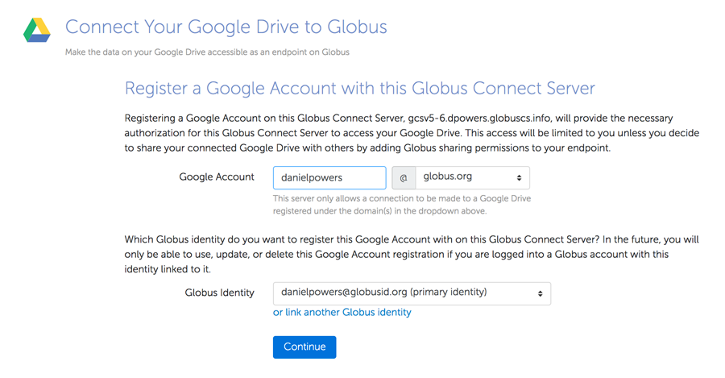
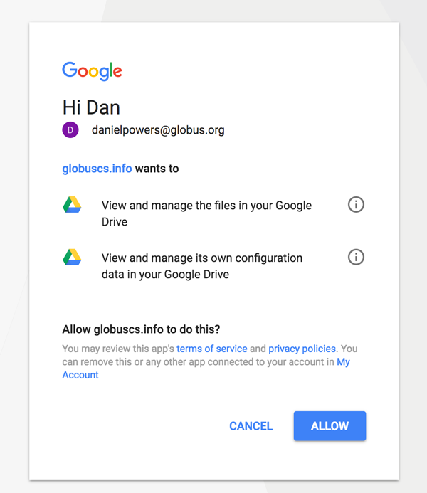
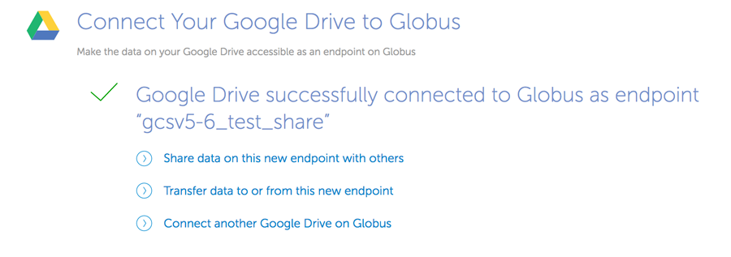

= How to Access your Google Drive with Globus
:numbered:

Globus users who have access to an endpoint configured with a Google Drive connector can use Globus to access and share content from the Google Drive associated with their Google account. This section describes how to use this capability and has the following steps:

- Find an endpoint that supports Google Drive connector. 
- Connect your Google Drive to the endpoint, by choosing the Google Account to use and authorizing the endpoint to access Google Drive content on your behalf.
- Create a shared endpoint for you to access content on your Google Drive

Use the Google Drive connector-enabled endpoint provided by your site administrator or use the search feature on: https://www.globus.org/app/endpoints?scope=all to find an endpoint that has a Google Drive connector. The status column for properly-configured endpoints will contain “GCSv5 Connector”. Such endpoints can also have policy restrictions on Google accounts that can be used to create shared endpoints to access Google Drive content. 

Choose the endpoint and select the "My Shares" tab. Choose the option to "Add Google Drive Share" to setup a shared endpoint for your Google Drive content. Once created, only you will be able to access the content on that endpoint, and you can choose to share with other collaborators by explicitly setting permissions.

[role="img-responsive center-block"]
image::images/google-drive-1.png[]

If this is the first time you are using Globus for Google Drive, you will see a consent screen. In order for the endpoint to create a shared endpoint on your behalf for Google Drive access you must grant permission by clicking Allow.

[role="img-responsive center-block"]
image::images/google-drive-2.png[]

If this is your first time creating a share on this endpoint, you may be prompted to associate a Google Account with your Globus Identity, so that Globus knows which Google Drive you want to share.

[role="img-responsive center-block"]

Google may next prompt you to select the Google account you wish to grant consents for.

[role="img-responsive center-block"]

Google will prompt for consent for the endpoint to access your Google Drive.

[role="img-responsive center-block"]

Configure the details for your share. Click the "Create Endpoint" button when done.

[role="img-responsive center-block"]
image::images/google-drive-6.png[]

Your shared endpoint has now been created and you can access the contents of your Google Drive from this shared endpoint. When the share is first created, only you have access to the contents of the Google Drive via the share. You can also choose to allow other users to access the contents by setting appropriate permissions on the shared endpoint.

[role="img-responsive center-block"]
