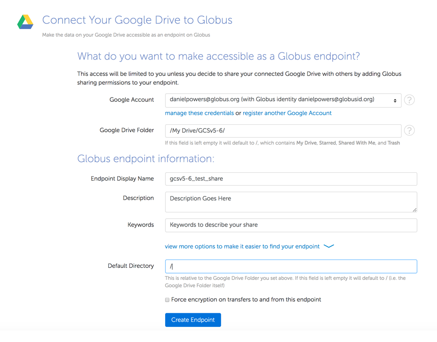

= How to Access your Google Drive with Globus
:numbered:

Globus users who have access to an endpoint configured with a Google Drive connector can use Globus to access and share content from the Google Drive associated with their Google account.   This section describes how to use this capability.

Use the Google Drive connector-enabled endpoint provided by your site administrator or use the search feature on: https://www.globus.org/app/endpoints?scope=all.   The status column for properly-configured endpoints will contain "GCSv5 Connector".

Choose the endpoint and select the "My Shares" tab. Choose the option to "Add Google Drive Share"

[role="img-responsive center-block"]

The first time you will see a consent screen. In order for the endpoint to access Google Drive on your behalf you must grant permission by clicking "Allow"

[role="img-responsive center-block"]

If this is your first time creating a share on this endpoint, you may be prompted to associate a Google Account with your Globus Identity, so that Globus knows which Google Drive you wish to share.

[role="img-responsive center-block"]
image::images/google-drive-3.png[]

Google will prompt for consent for the endpoint to access your Google Drive.

[role="img-responsive center-block"]
image::images/google-drive-4.png[]

Configure the details for your share. Click the "Create Endpoint" button when done.

[role="img-responsive center-block"]
image::images/google-drive-5.png[]

Your share has now been created.

[role="img-responsive center-block"]
