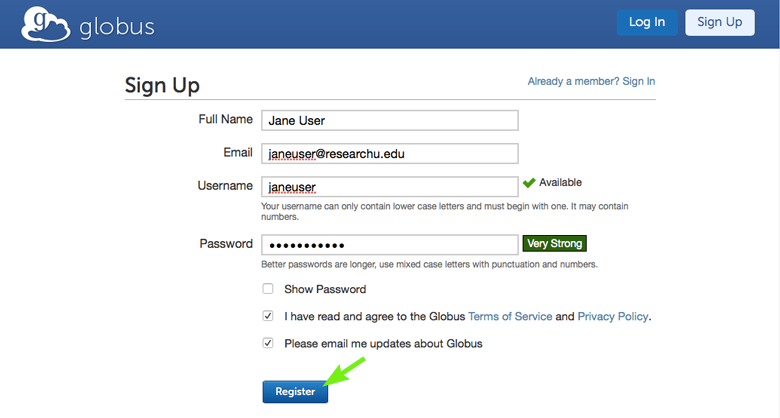
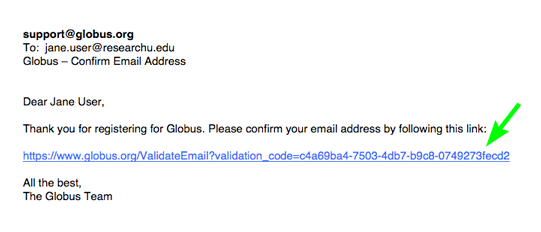
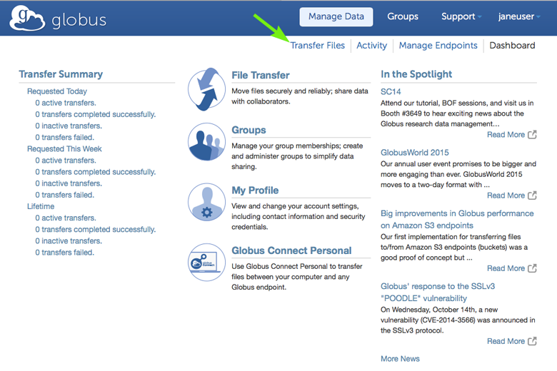
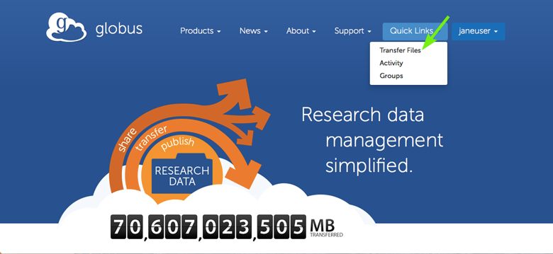
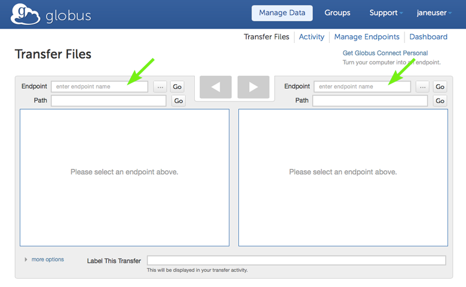
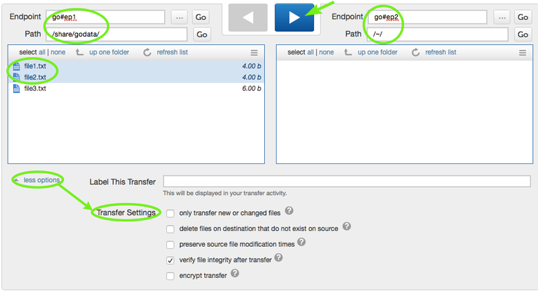
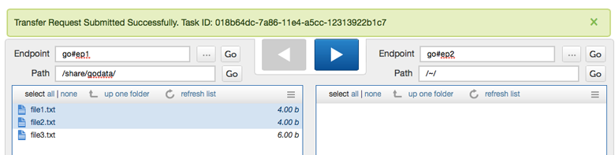
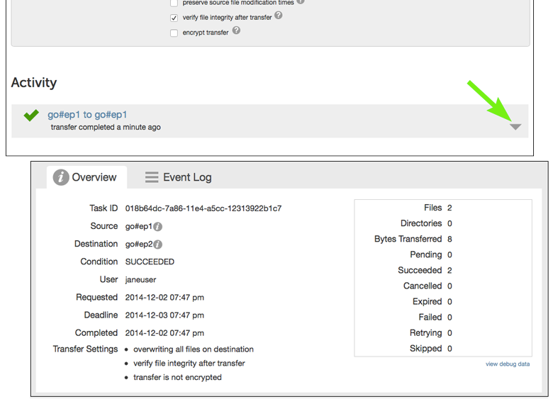
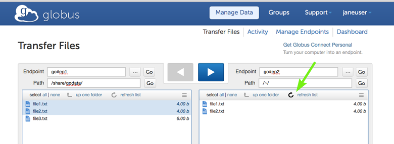

= How To Sign Up and Transfer Files with Globus
:numbered:

This step-by-step guide will show you how to create a Globus account and transfer files reliably and securely. You will become familiar with basic Globus concepts and interfaces, and begin to experience how Globus can help you spend more time on your research and less time on data management.

'''
== Sign up for a Globus account
Your Globus account will let you access the Globus data management service. *Complete the form* at link:https://www.globus.org/signup[globus.org/signup]...

[role="img-responsive center-block"]

...and *follow the link* in the email you receive to complete the account creation process.

[role="img-responsive center-block"]

== Navigate to the Transfer Files page
The Transfer Files page is used to initiate data transfers and is one of the most important web interfaces to Globus.

*Select Transfer Files* from the Manage Data submenu on the Dashboard that appears after your email verification is complete.

[role="img-responsive center-block"]

*Or, select Transfer Files* from the Quick Links drop-down menu on the link:https://globus.org[Globus home page] after logging in.

[role="img-responsive center-block"]

The first time you navigate to the Transfer Files page, all fields will be blank.

[role="img-responsive center-block"]

.Key Concept:  _Globus endpoint_
[TIP]
====
A Globus endpoint is a data transfer location. Different types of resources (campus storage systems, HPC clusters, laptops, Amazon S3 buckets, scientific instruments, etc.) can be set up as Globus endpoints and made accessible to authorized users via Globus. An endpoint allows users with accounts on the underlying resource to transfer files, and it can also be configured to allow data sharing, publication, and discovery capabilities for other Globus users, including those who do not have local accounts on that resource.

There are two primary classes of endpoints: server endpoints and personal endpoints. Multi-user resources such as campus storage systems and HPC clusters are set up as server endpoints, typically by system administrators. Laptops or other personal computers are set up as _personal_ endpoints, typically by individuals.

Globus endpoints are named using the format +<globus-username>#<resource-name>+. For example, the XSEDE project has a Globus account under the username "xsede" and server endpoints named +xsede#stampede+ (for the Stampede system at Texas Advanced Computing Center) and +xsede#kraken+ (for the Kraken system at the National Institute for Computational Sciences).  As another example, an individual with a Globus account under the username "johnsmith" might have personal endpoints named +johnsmith#macbook+ and +johnsmith#pc+.

link:https://www.globus.org/globus-connect[Globus Connect] is used to set up server and personal endpoints.
====

== Request a data transfer
Use the Transfer Files page to *select the source and destination endpoints and paths, choose files to transfer, specify the transfer settings,* and *request the transfer* with one of the arrows.

The Transfer Files screenshot shown here has recommended selections for your first data transfer. Selection descriptions follow the screenshot.

[role="img-responsive center-block"]

The endpoints +go#ep1+ and +go#ep2+ are server endpoints administered by the Globus team for demonstration purposes and are accessible to all Globus users without further authentication. In the left panel, the user can access three files in the +/share/godata/+ path on +go#ep1+, and has selected two of them (highlighted) to be transferred. In the right panel, the path is +/~/+, indicating the user's home on the +go#ep2+ endpoint resource. _Note that you must hit "Enter" or click on the "Go" button after typing an endpoint name or path—simply moving the cursor to the next field is not sufficient._

The "more options" button on the initial Transfer Files page was selected, revealing various transfer settings that Globus supports. By default, Globus verifies file integrity after transfer using checksums. Click on the question mark icons for explanations of the other transfer settings. Globus gives you powerful control over the behavior of the transfer with a simple mouse click—change the transfer settings if you'd like. You may also enter a label for the transfer, but this is not required.

When you are ready to request the transfer, select a directional arrow between the endpoints. In this example, data will be transferred from the endpoint shown in the left pane to the endpoint shown in the right pane, so the right arrow is selected.

A green notification panel will appear, confirming that the transfer request has been submitted.

[role="img-responsive center-block"]

.Key Concept:  _Fire and forget data transfer_
[TIP]
====
After you request a file transfer, Globus takes over and does the work on your behalf. You can navigate away from the Transfer Files page, close the browser window, and even logout. Globus will optimize the transfer for performance, monitor the transfer for completion and correctness, and recover from network errors and endpoint resource downtime.

The Globus service achieved 99.95% availability in 2013, providing nearly uninterrupted oversight of data transfers taking place on much less reliable networks and endpoint resources. When a problem is encountered part-way through the transfer, Globus resumes from the point of failure and does not retransmit all of the data specified in the original request.

Globus can handle extremely large data transfers, even those that do not complete within the authentication expiration period of an endpoint (which is controlled by the resource administrator). If the credentials expire before the transfer completes, Globus will notify you to re-authenticate on the endpoint so that Globus can continue the transfer.

These wide-ranging capabilities make data transfer with Globus truly "fire and forget".
====

== Confirm transfer completion
In our simple example only two small files were transferred, so the transfer will complete quickly. When it does, you will see an Activity notice at the bottom of your Transfer Files page. You can *click the arrow* in the lower right corner to view details about the transfer. You will also receive an email with the transfer details.

[role="img-responsive center-block"]

You may notice that the transferred files are not listed in the right pane of your Transfer Files page under the +go#ep2+ endpoint and the +/~/+ path, even though the transfer has completed. *Refresh the list* to see the updated contents.

[role="img-responsive center-block"]

WARNING: files are periodically deleted from the user paths on the +go#ep1+ and +go#ep2+ demonstration endpoints, so if you return later these files may be gone.

== Move beyond getting started
At this point you've mastered the basic Globus data transfer capabilities by copying files between two endpoints that are accessible to all Globus users. You know how to specify additional transfer options (such as encryption), understand how Globus manages the transfer on your behalf, and are familiar with Activity notices that let you find out about transfer task progress. You are well on your way to letting Globus simplify your research data management.

Follow the next steps suggested here or explore link:https://globus.org[globus.org] on your own to understand and experience more of what Globus has to offer.

+++
<ul class="go-icon-list-circle">
	<li><h3>Set up and use a personal endpoint.</h3>
		<ul>
			<li><a href="https://globus.org/globus-connect-personal">Follow these instructions</a> to download Globus Connect Personal and set up an endpoint on your Mac, Linux, or Windows system.</li>
			<li>Navigate to the Transfer Files page and request a transfer between your new personal endpoint and go#ep1 or go#ep2.</li>
			<li>Navigate to the Activity page (via Manage Data submenu or Quick Links dropdown) and review your transfers.</li>
		</ul>
		
Personal endpoints do not require administrative privileges to set up. Transfers to and from your personal endpoint will not fail if you shutdown your system; transfers will be suspended and then resumed by the Globus service when the system comes back online. Try it!
</li>
	<li><h3>Discover and access endpoints on your campus computing systems. </h3>
		
Many campuses, research labs, and cross-site projects have set up Globus server endpoints on their multi-user resources to enable reliable, secure, and high-performance data transfer and sharing via the Globus service.

		<ul>
			<li>If your resource provider has set up a Globus endpoint, enter the endpoint name on the Globus Transfer Files page, authenticate using your normal username and password for the site when prompted, and proceed with your data transfer request.</li>
			<li>If you don't know the endpoint name, you can use the pattern match capability on the Globus Transfer Files page to look for an endpoint. Just enter a likely resource name and look for the resource in the scroll-down list of matching endpoints. For example, "umich", "nersc", "xsede", ...</li>
			<li>If your site is not set up as a Globus endpoint, direct your system administrator to the <a href="https://globus.org/providers">Resource Provider information</a> or <a href="https://globus.org/contact-us">ask us</a> to contact them on your behalf.</li>
		</ul></li>
	<li><h3>Learn how Globus lets you easily share data.</h3>
		<ul>
			<li><a href="https://globus.org/data-sharing">Follow this link</a> to find out how Globus lets you share files with others.</li>
		</ul>
		
Globus lets you share your data with others, even if they do not have accounts on the resource where the data is stored. This capability can be a huge benefit in terms of both time and money because the data need not be copied to cloud storage (e.g., to Box or DropBox) in order to be accessible.
</li>
	<li><h3>Learn more about Activity reporting and transfer retry.</h3>
		<ul>
			<li>Using the Transfer Files page, transfer one of the files from <code>go#ep2 /~/</code> (entered in right panel) to <code>go#ep1 /share/godata/</code> (entered in left panel).
				<ul>
					<li>If necessary, refresh the list in the left panel to deselect the two files that were selected previously.</li>
					<li>Select the file you want to transfer in the right panel.</li>
					<li>Use the left arrow to request the transfer.</li>
					<li>Observe the green notification panel informing you the transfer has been successfully submitted.</li>
				</ul></li>
			<li>Scroll down to the Activity area of the Transfer Files page.
				<ul>
					<li>Monitor the task status and observe the caution icon and the warning message "permission denied".</li>
					<li>Expand the notice and look at the Overview and Event Log details.</li>
					<li>In the Event Log, notice multiple instances of "The operation was started or restarted" and "Permission denied" log messages.</li>
				</ul></li>
		</ul>
		
Globus, on your behalf, continues to retry the transfer when a problem is encountered. There could be a permission problem (as is the case in this exercise), or an endpoint resource that goes down mid-transfer (perhaps you closed your laptop while copying data to it), or any number of other issues that prevent the transfer from progressing. Globus will continue to retry the transfer until (1) the problem is fixed (permissions changed, resource becomes available), (2) you cancel the transfer task (click the <strong>X</strong> next to the task in the Activity log), or (3) no progress has been made in three days, at which point Globus will notify you the transfer has failed.
</li>
	<li><h3>Get more technical details.</h3>
		<ul>
			<li>Read the <a href="https://globus.org/publications">publications</a> for technical details.</li>
			<li>Find out how to use the <a class="zendeskLink zendeskChecked" href="../../cli">Command Line Interface (CLI)</a>.</li>
		</ul></li>
</ul>
+++