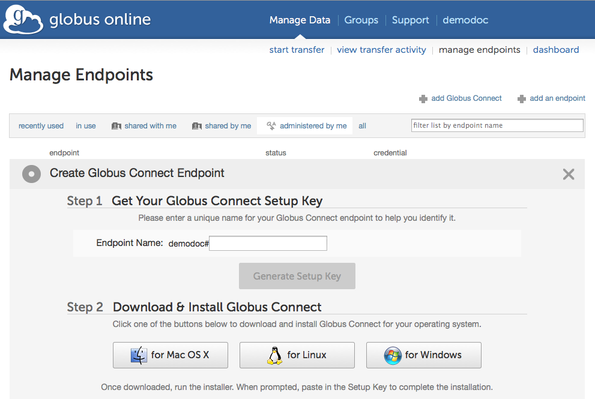
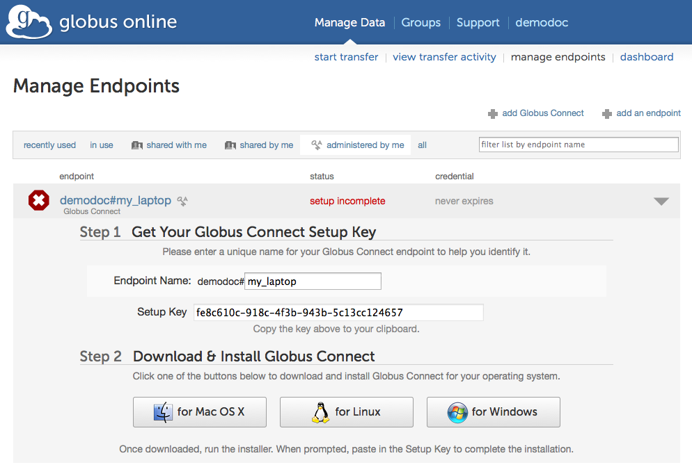
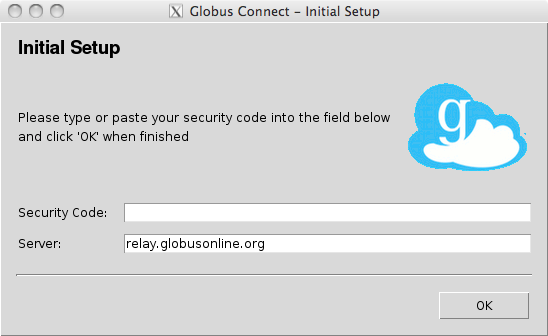
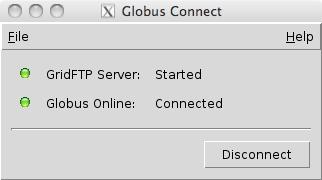

= How To Install, Run, & Remove Globus Connect Personal for Linux

Globus Connect Personal enables you to share and transfer files to and from your Linux laptop or desktop computer — even if it’s behind a firewall. Follow the easy steps below to turn your machine into a full-fledged Globus endpoint.

NOTE: Instructions are also available for link:../globus-connect-personal-cli[installing and running Globus Connect Personal using the command line].

== Prerequisites
- A Linux distribution with Tcl/Tk installed (if you do not have tcllib installed you can install and run Globus Connect Personal from the command line)
- A Globus account (link:https://www.globus.org/signup[sign up at www.globus.org/signup])
- A valid SSH key associated with your Globus account (link:../../faq/command-line-interface/#how_do_i_generate_an_ssh_key_to_use_with_the_globus_command_line_interface[please see instructions here])

== Installation
link:https://www.globus.org/xfer/ManageEndpoints?globus_connect=true[Click here to create a Globus Connect Personal endpoint] and follow the instructions below.

[role="img-responsive center-block"]

. Enter a name for your endpoint. This name can be anything you choose, as long as you haven’t previously created another endpoint with the same name.
. Click “Generate Setup Key”.
. Select the generated key with your mouse and copy it to the clipboard.
+
[role="img-responsive center-block"]

. Click "for Linux" to download the installer tarball.
. Extract the files from the downloaded tarball and run the installer:
+
----terminal
$ tar xzf globusconnect-latest.tgz
$ cd globusconnect-n.m
$ sh globusconnect &
----terminal
. Since this is the first time you are running Globus Connect Personal, you will see the Initial Setup window below where you are required to enter a setup key.
+
[role="img-responsive center-block"]

. Paste in the key you generated in step 2 above. The ‘OK’ button will be enabled if the key is valid. Click ‘OK’ to complete the installation. (If the ‘OK’ button is not enabled, please ensure you have properly copied the entire key generated in step 2 above.

NOTE: The configuration for Globus Connect Personal is stored in +~/.globusonline/lta+. The unique host certificate is stored here and must be kept private. By default, it is not readable by any other user.

== Setting Up a Globus Connect Personal Endpoint Using the Command Line
After downloading and installing Globus Connect Personal on your personal computer follow the steps below to complete the setup:

. Log in to cli.globusonline.org using ssh or gsissh:
+
----terminal
$ ssh [input]#demodoc#@cli.globusonline.org
----terminal
. Run the following command to add the endpoint: +endpoint-add --gc <my_endpoint_name>+ and replace [uservars]#<my_endpoint_name># with a name of your choice (e.g. my_laptop).
+
----terminal
$ [input]#endpoint-add --gc my-laptop#
[output]#Created the Globus Connect endpoint \'my-laptop'.
Use this setup key when installing Globus Connect:
7296f199-a347-48d9-800f-326133cb59be#
----terminal
. Select the setup key (ex: "7296f199-a347-48d9-800f-326133cb59be") with your mouse and copy it to the clipboard.
. Return to the "Initial Setup" window of Globus Connect Personal and paste the setup key into the provided field. The "OK" button will be enabled if the key is valid. Click "OK" to complete the installation. (If the "OK" button is not enabled, please ensure you have properly copied the entire key generated in the previous step above.

== Running
Once the installation is complete, click the \'Connect' button to establish connection to Globus. You should see the status reflected below.

[role="img-responsive center-block"]

Both lights green indicate that Globus Connect Personal is running properly and is connected to Globus. If you have any problems connecting to Globus, you may start the application from the command line using the +-debug+ option (link:../../cli[see more information on running from the command line here]). You may minimize or hide this status window once Globus Connect Personal has connected successfully.

=== Running from the Command Line

If you prefer to run Globus Connect Personal on the Linux command line, specify one of the following six options: +-setup+, +-start+, +-stop+, +-status+, +-debug+, and +-trace+. This will force Globus Connect Personal to remain in command line mode. The status of Globus Connect Personal running in the background can be controlled using the +-status+ or +-trace+ options. The +-trace+ option provides more detailed information.

A typical command line usage scenario might look as follows:

----terminal
$ [input]#sh globusconnect -start &#
[output]#[1] 15268#
----terminal

----terminal
$ [input]#sh globusconnect -status#
[output]#Globus Online: connected
Transfer Status: idle#
----terminal

----terminal
$ [input]#sh globusconnect -trace#
[output]##gsissh connected
#gridftp 0
#gsissh connected
Got connection from (\'127.0.0.1', 47677)
Sock fd: 9
debug1: client_input_channel_open: ctype forwarded-tcpip rchan 2 win 87380 max 32768
debug1: client_request_forwarded_tcpip: listen localhost port 0, originator 10.207.43.146 port 44326
debug1: connect_next: host 127.0.0.1 ([127.0.0.1]:1024) in progress, fd=5
debug1: channel 1: new [10.207.43.146]
debug1: confirm forwarded-tcpip
debug1: channel 1: connected to 127.0.0.1 port 1024
#gridftp 1
#gsissh connected
#gridftp 1
#gsissh connected
#gridftp 1
[...]#
----terminal

== Removing Globus Connect Personal
. Be sure that all running instances of Globus Connect Personal are terminated by running this command:
+
----terminal
$ [input]#killall gc-ctrl.py#
----terminal
+
. Delete the old Globus Connect Personal install directory.
. Delete the old Globus Connect Personal config with this command:
+
----terminal
$ [input]#rm -r ~/.globusonline/#
----terminal
+
. Globus Connect Personal is now removed from your system.