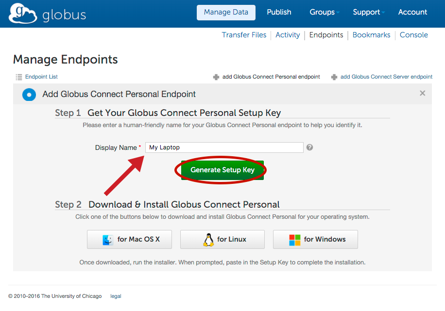
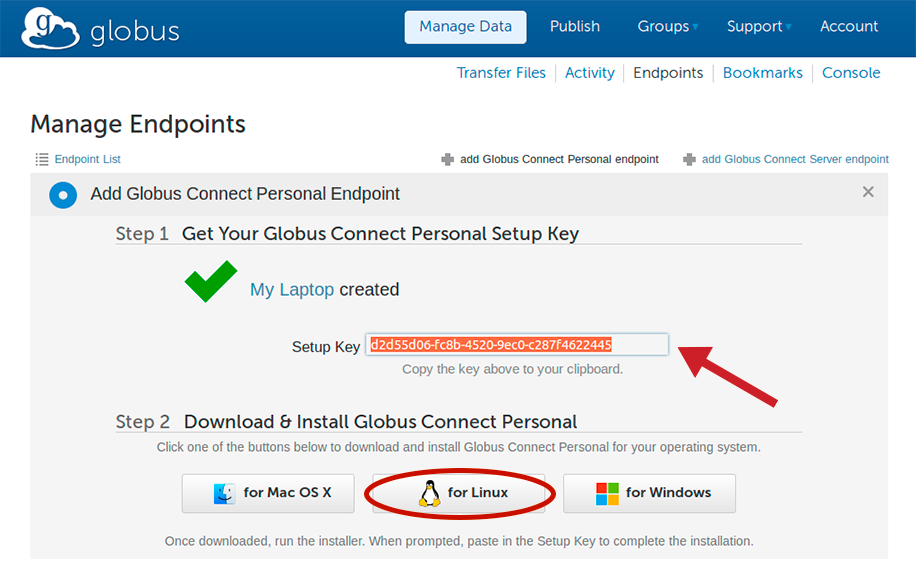
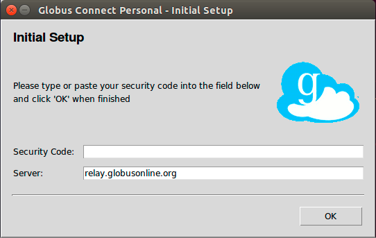
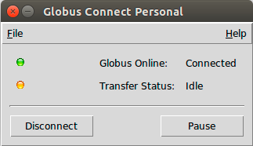

= How To Install and Configure Globus Connect Personal for Linux

Globus Connect Personal enables you to share and transfer files to and from your Linux laptop or desktop computer — even if it's behind a firewall. Follow the easy steps below to turn your machine into a full-fledged Globus endpoint.

NOTE: Instructions are also available for link:#globus-connect-personal-cli[installing and running Globus Connect Personal using the command line].

== Prerequisites
- A Linux distribution with Tcl/Tk installed (if you do not have tcllib installed you can link:#globus-connect-personal-cli[install and run Globus Connect Personal from the command line])
- A Globus account (link:https://www.globus.org/signup[sign up at www.globus.org/signup])

== Installation
link:https://www.globus.org/app/endpoints/create-gcp[Click here to create a Globus Connect Personal endpoint] and follow the instructions below.

[role="img-responsive center-block"]

. Enter a name for your endpoint. This name can be anything you choose, as long as you haven't previously created another endpoint with the same name.
. Click “Generate Setup Key”.
. Select the generated key with your mouse and copy it to the clipboard.
+
[role="img-responsive center-block"]

. Click "for Linux" to download the installer tarball.
. Extract the files from the downloaded tarball and run the installer:
+
----terminal
$ tar xzf globusconnectpersonal-latest.tgz
$ cd globusconnectpersonal-n.m
$ ./globusconnect &
----terminal
. Since this is the first time you are running Globus Connect Personal, you will see the Initial Setup window below where you are required to enter a setup key.
+
[role="img-responsive center-block"]

. Paste in the key you generated in step 2 above. The "OK" button will be enabled if the key is valid. Click "OK" to complete the installation. (If the "OK" button is not enabled, please ensure you have properly copied the entire key generated in step 2 above.

NOTE: The configuration for Globus Connect Personal is stored in +~/.globusonline/lta+. The unique host certificate is stored here and must be kept private. By default, it is not readable by any other user.

== Running
Once the installation is complete, click the \'Connect' button to establish connection to Globus. You should see the status reflected below.

[role="img-responsive center-block"]

The green light indicates that Globus Connect Personal is running properly and is connected to Globus. If you have any problems connecting to Globus, you may start the application from the command line using the +-debug+ option (link:#globus-connect-personal-cli[see more information on running from the command line here]). You may minimize or hide this status window once Globus Connect Personal has connected successfully.

== Removing Globus Connect Personal
. Be sure that all running instances of Globus Connect Personal are terminated by running this command:
+
----terminal
$ [input]#killall gc-ctrl.py#
----terminal
+
. Delete the old Globus Connect Personal install directory.
. Delete the old Globus Connect Personal config with this command:
+
----terminal
$ [input]#rm -r ~/.globusonline/#
----terminal
+
. Globus Connect Personal is now removed from your system.

'''

[[globus-connect-personal-cli]]
== How To Install Globus Connect Personal for Linux Using the Command Line

You may install Globus Connect Personal for Linux using only the command line. To install Globus Connect Personal you will need to be logged into the Globus CLI. If you don't already have the Globus CLI installed consult the getting started section of the link:../../cli/index.html#command_line_interface_cli[Globus CLI documentation] for installation and login instructions.

NOTE: Instructions are also available for link:../globus-connect-personal-linux[installing a Globus Online Personal endpoint using your Web browser].

=== Installation
. Download and unpack the Globus Connect Personal for Linux installer:
+
----terminal
$ wget https://s3.amazonaws.com/connect.globusonline.org/linux/stable/globusconnectpersonal-latest.tgz
[output]#--2013-06-07 00:14:10-- https://s3.amazonaws.com/connect.globusonline.org/linux/stable/glob...
Resolving s3.amazonaws.com (s3.amazonaws.com)... 72.21.214.199
Connecting to s3.amazonaws.com (s3.amazonaws.com)|72.21.214.199|:443... connected.
HTTP request sent, awaiting response... 200 OK
Length: 8291206 (7.9M) [application/x-tar]
Saving to: \`globusconnectpersonal-latest.tgz'

100%[==============================================================================>] 8,291,206 1010K/s in 8.0s

2013-06-07 00:14:18 (1018 KB/s) - \`globusconnectpersonal-latest.tgz' saved [8291206/8291206]#
$ tar xzf globusconnectpersonal-latest.tgz
$ cd globusconnectpersonal-[input]#x.y.z#
----terminal
+
NOTE: In the last line above, replace [uservars]#x.y.z# with the version number from the downloaded file, e.g. globusconnectpersonal-2.0.2.

. Generate a setup key for your endpoint via the Globus command line interface. The example below show an already logged in Globus user generating a setup key for an endpoint called [uservars]#my-linux-laptop#:
+
----terminal
$ globus endpoint create --personal [input]#my-linux-laptop#
[output]#Message:     Endpoint created successfully
Endpoint ID: b19b3b45-01ae-11e6-a71c-22000bf2d559
Setup Key:   224532bb-8a4b-4d32-8995-e1fb442be98e#
----terminal

. Now run the following command to complete the installation (note that you will need to copy and paste the setup key generated in step 2 above):
+
----terminal
$ ./globusconnectpersonal -setup [input]#224532bb-8a4b-4d32-8995-e1fb442be98e#
[output]#Configuration directory: /home/demodoc/.globusonline/lta
Contacting relay.globusonline.org:2223
Installing certificate and key
Creating /home/demodoc/.globusonline/lta/gridmap
Done!#
----terminal

. Globus Connect Personal is now installed and your endpoint is configured. You should see your endpoint and be able to get its ID if you search for endpoints you own:
+
----terminal
$ globus endpoint search --filter-scope my-endpoints
[output]#ID                                   | Owner                | Display Name
------------------------------------ | -------------------- | ----------------------------
b19b3b45-01ae-11e6-a71c-22000bf2d559 | demodoc@globusid.org | my-linux-laptop#
----terminal

=== Running Globus Connect

To transfer and share files using Globus, start Globus Connect Personal as follows:

----terminal
$ ./globusconnectpersonal -start &
[output]#[1] 2965#
----terminal

Your endpoint is now running and fully usable, which you can confirm with a `globus ls` command using the endpoint's id from above. Note that you do not need to activate the endpoint as Globus Connect Personal endpoints accept automatic activation based on your Globus credentials.

----terminal
$ globus ls b19b3b45-01ae-11e6-a71c-22000bf2d559:/
[output]#home/#
----terminal

The status of Globus Connect Personal running in the background can be controlled using the +-status+ or +-trace+ options. The +-trace+ option provides more detailed information:

----terminal
$ ./globusconnectpersonal -status
[output]#Globus Online: connected
Transfer Status: idle#
$ ./globusconnectpersonal -trace
[output]#gridftp 1
#gsissh connected
#gridftp 1
#gsissh connected
#gridftp 1
[...]#
----terminal