= How To Install, Configure, & Remove Globus Connect Personal for Mac OS X

Globus Connect Personal allows you to share and transfer files to and from your Apple laptop or desktop computer — even if it's behind a firewall. Follow the steps below to turn your personal computer into a Globus endpoint.

== Installation

link:https://www.globus.org/app/endpoints/create-gcp[Click here to create a Globus Connect Personal endpoint] and follow the instructions below.

. Enter a name for your endpoint. This name can be anything you choose, as long as you haven't previously created another endpoint with the same name.
. Click "Generate Setup Key".
+
[role="img-responsive center-block"]
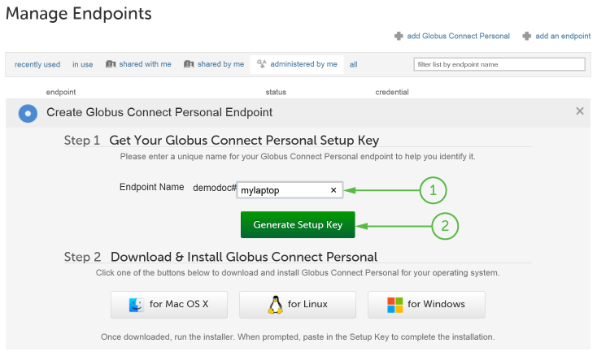
. Select the generated key with your mouse and copy it to the clipboard.
. Click "for Mac OS X" to download the Mac OS X installer.
+
[role="img-responsive center-block"]
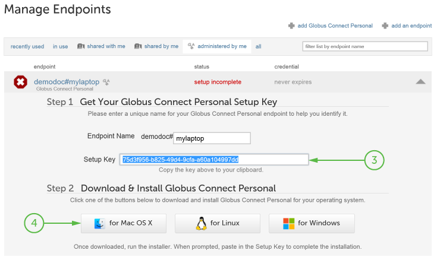
. Open the downloaded file and drag the Globus Connect Personal application into your Applications folder.
+
[role="img-responsive center-block"]
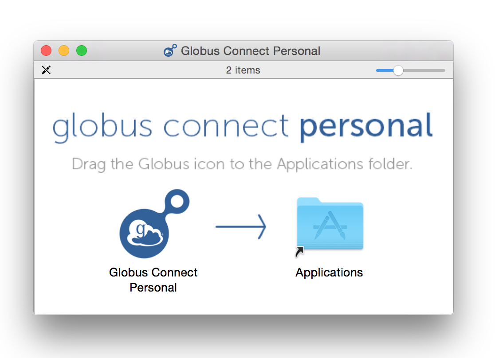
. Navigate to your Applications folder and double-click the Globus Connect Personal application to run it. If you are prompted to confirm that it is safe to run this application, click "Open".
+
[role="img-responsive center-block"]
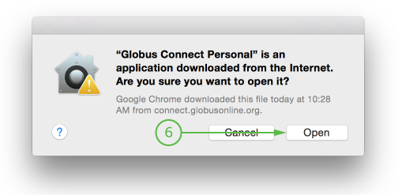
. Since this is the first time you are running Globus Connect Personal, you will see the Setup window below where you are required to enter a setup key. Paste in the key you generated in step 2 above. The "OK" button will be enabled if the key is valid. Click "OK" to complete the installation. (If the "OK" button is not enabled, please ensure you have properly copied the entire key generated in step 2 above.
+
[role="img-responsive center-block"]
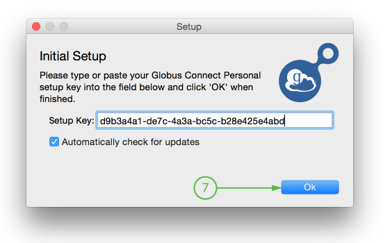
+
Globus Connect Personal will connect to Globus and await transfer commands. You will see an icon in the menu bar at the top of your screen, indicating that Globus Connect Personal is running.
+
[role="img-responsive center-block"]
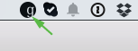

== Configuration
You may configure Globus Connect Personal by clicking on the Globus Connect Personal icon in the main menu bar and selecting "Preferences...".

[role="img-responsive center-block"]
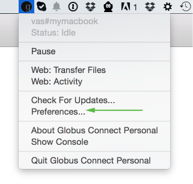

Options under the "General" tab allows you to specify how the Globus icon looks and whether the software should automatically check for updates. "Use black and white menu bar icons" changes the color of the Globus Connect Personal status icon in the menu bar. The two options in the middle determine how Globus Connect Personal should handle availability of a newer version. You should leave the "Automatically check for updates" option selected so that you are notified of important security updates. "Provide feedback with anonymous system profile information" periodically sends information to Globus so that we can continue to improve the user experience. No personally identifiable information is ever transmitted and we encourage you to leave this option selected so we can make Globus Connect Personal better for all.

.General Preferences Tab
[role="img-responsive center-block"]
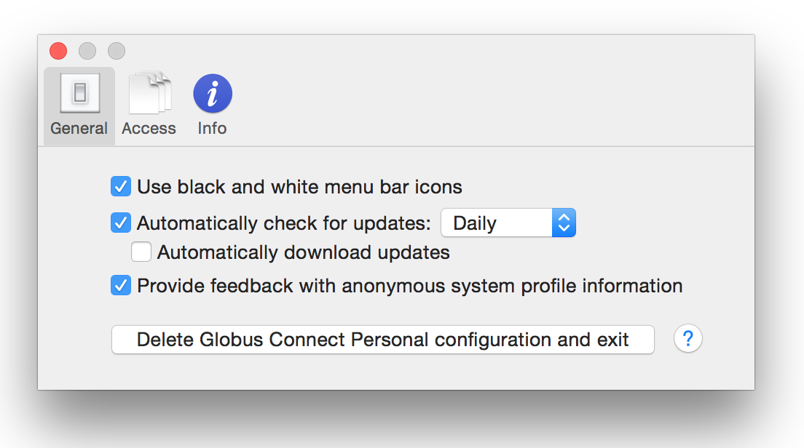

The "Access" tab lists directories that will be accessible via Globus for file transfer and sharing and allows you to have more control over what information is accessible on your Globus Connect Personal endpoint. By default, your home directory (e.g.: [uservars]#/Users/vas#) will be read/write accessible. The "Deny access to hidden (e.g. security) files in your home directory" option controls whether or not you'll be able to access hidden files (i.e. filenames beginning with "."") in your home directory. By default, Globus Connect Personal will not allow access to files like: +\~/.globusonline+ and +\~/.ssh+.

.Access Tab
[role="img-responsive center-block"]
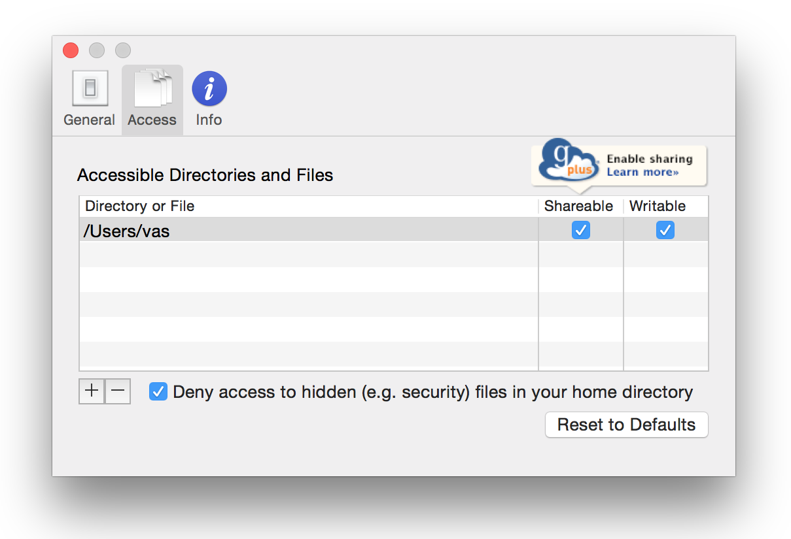

You may add folders by clicking the "+" icon and selecting the folder you wish to make accessible. Note that, in most cases, you should not need to add folders other than the default home directory, unless you wish to share files in a different folder with other Globus users. To share a folder, add it to the accessible list and check the "Sharable" box. Note: you must be a link:https://www.globus.org/plus[Globus Plus] user to share files and folders. If you are not a Globus Plus user, click on the "Enable sharing" icon and follow the instructions.

NOTE: If you remove everything from the access list, no files will be accessible on your Globus Connect Personal endpoint and you will be prompted to setup accessible paths, as shown below. You can either click "+"" and add directories and files, or click "Reset to Defaults".

The Info tab displays internal configuration information that's helpful in troubleshooting any issues you encounter. You may be asked to provide this information if you contact Globus support about a problem with your Globus Connect Personal endpoint.

[role="img-responsive center-block"]
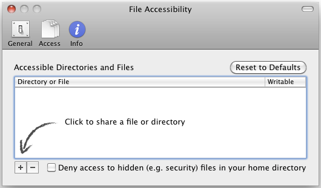

.Info Tab
[role="img-responsive center-block"]
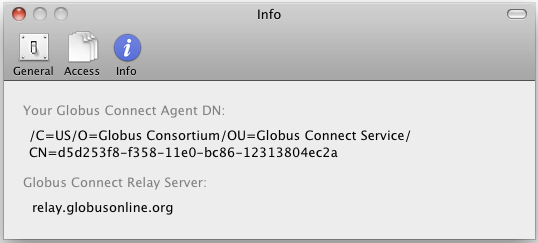

== Removing Globus Connect Personal
Please note that if you remove Globus Connect Personal, you will not be able to transfer files to or from your personal computer using Globus, and any files you have shared with other Globus users will not be accessible to those users. To remove Globus Connect Personal:

. Click on the Globus Connect Personal icon in the main menu bar and select "Preferences...".
+
[role="img-responsive center-block"]
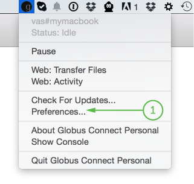
. Click "Delete Globus Connect Personal configuration and exit".
+
[role="img-responsive center-block"]
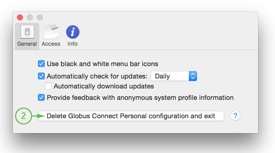
. Click "Delete & Exit" to remove all Globus Connect Personal settings from your computer.
+
[role="img-responsive center-block"]
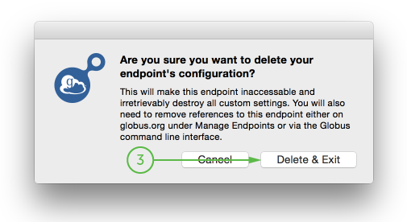
. Navigate to your Applications directory and delete the Globus Connect Personal application.