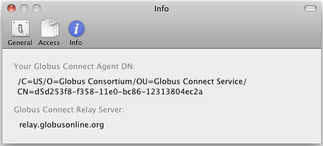

= How to Set Preferences on Globus Connect Personal for Mac
:numbered:

Globus Connect Personal for Mac OS X provides a number of user-configurable settings, as described below. They are accessed by clicking on the Globus Connect Personal icon in the Mac OS menu bar and selecting “Preferences…”.

.General Preferences Tab
[role="img-responsive center-block"]

"Use black and white menu bar icons" changes the color of the Globus Connect Personal status icon in the menu bar. The two options in the middle determine how Globus Connect Personal should handle availability of a newer version. You should leave the "Automatically check for updates" option selected so that you are notified of important security updates. "Provide feedback with anonymous system profile information" periodically sends information to Globus so that we can continue to improve the user experience. No personally identifiable information is ever transmitted and we encourage you to leave this option selected so we can make Globus Connect Personal better for all.

.Access Tab
[role="img-responsive center-block"]

The "Access" preferences tab allows you to have more control over what information is accessible on your Globus Connect Personal endpoint. By default, your home directory (e.g.: [uservars]#/Users/vas#) will be read/write accessible. The "Deny access to hidden (e.g. security) files in your home directory" option controls whether or not you'll be able to access hidden files (i.e. filenames beginning with "."") in your home directory. By default, Globus Connect Personal will not allow access to files like: +\~/.globusonline+ and +\~/.ssh+.

You may click the "+"" icon to add directories or files to this panel. For example, to make just the "Science" folder writable and the entire home directory readable do the following:

. Uncheck the "Writable" checkbox next to my home directory.
. Click the "+"" button which displays the file dialog below
. On the file dialog, navigate to [uservars]#/Users/vas/Science# and click the "Open" button:
+
[role="img-responsive center-block"]

+
. Check the "writable" checkbox next to [uservars]#/Users/vas/Science#:
+
[role="img-responsive center-block"]

NOTE: If you remove everything from the access list, no files will be accessible on your Globus Connect Personal endpoint and you will be prompted to setup accessible paths, as shown below. You can either click "+"" and add directories and files, or click "Reset to Defaults".

[role="img-responsive center-block"]
image::images/gcprefs_05.png[]

.Info Tab
[role="img-responsive center-block"]

The Info tab displays internal configuration information that's helpful in troubleshooting any issues you encounter. You may be asked to provide this information if you contact Globus support about a problem with your Globus Connect Personal endpoint.