= How To Install and Configure Globus Connect Personal for Windows

Globus Connect Personal allows you to share and transfer files to and from your Windows laptop or desktop computer — even if it's behind a firewall. Follow the easy steps below to turn your personal computer into a full-fledged Globus endpoint.

== Installation

link:https://www.globus.org/app/endpoints/create-gcp[Click here to create a Globus Connect Personal endpoint] and follow the instructions below.

NOTE: Globus Connect Personal is supported on Windows Vista, Windows 7, Windows 8, and Windows 10.

. Enter a name for your endpoint. This name can be anything you choose, as long as you haven't previously created another endpoint with the same name.
. Click "Generate Setup Key".
+
[role="img-responsive center-block"]
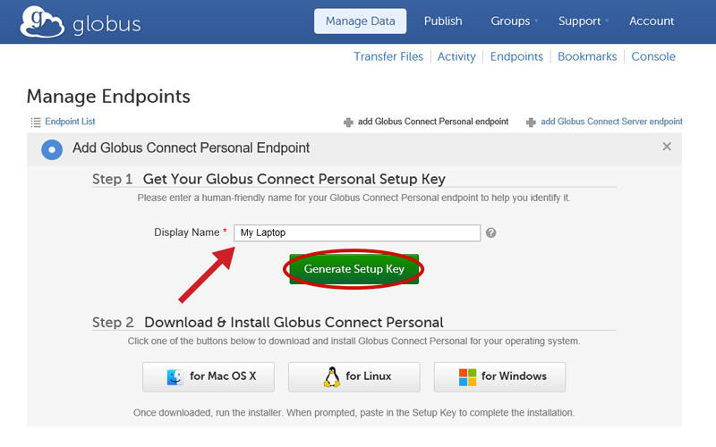
. Select the generated key with your mouse and copy it to the clipboard.
. Click "for Windows" to download the Windows installer.
+
[role="img-responsive center-block"]
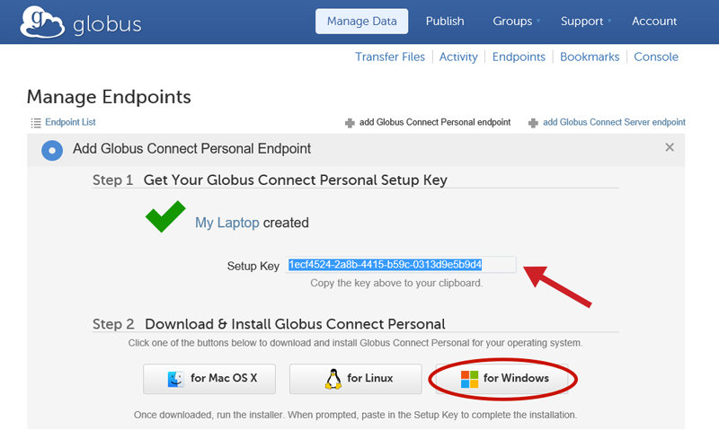
. Double click the downloaded file and follow the instructions to install Globus Connect Personal. If you're asked whether the program can make changes to your computer, please click "Yes".
+
[role="img-responsive center-block"]
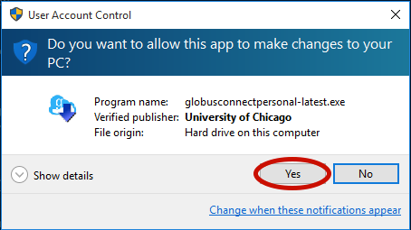
. Confirm the directory where Globus Connect Personal will be installed and click "Install".
+
[role="img-responsive center-block"]
image::images/gcp-win-4.png[]
. When the installation completes, ensure that "Run Globus Connect Personal" is checked and click "Finish".
+
[role="img-responsive center-block"]
image::images/gcp-win-5.png[]
. Since this is the first time you are running Globus Connect Personal, you will see the Setup window below where you are required to enter a setup key. Paste in the key you generated in step 2 above. The "OK" button will be enabled if the key is valid. Click "OK" to complete the installation. (If the "OK" button is not enabled, please ensure you have properly copied the entire key generated in step 2 above.
+
[role="img-responsive center-block"]
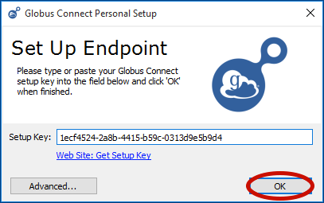
. You will be prompted to specify which directory may be accessed via Globus Connect Personal. For now, leave this as the default setting, which is your home directory. You can change this later, if necessary.
+
[role="img-responsive center-block"]
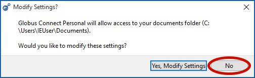
+
Globus Connect Personal will connect to Globus and await transfer commands. You will see the notification below when Globus Connect Personal starts running - you may minimize this to your task bar.
+
[role="img-responsive center-block"]
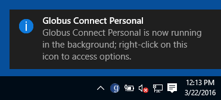

== Configuration

You may configure Globus Connect Personal by right-clicking on the Globus Connect Personal icon in the taskbar and selecting "Options...". Configuration options are divided into four groups; the most important (and commonly used) are the "Access" and "General" options. The "Access" tab lists folders that will be accessible via Globus for file transfer and sharing. By default, the only folder listed is your home directory.

[role="img-responsive center-block"]
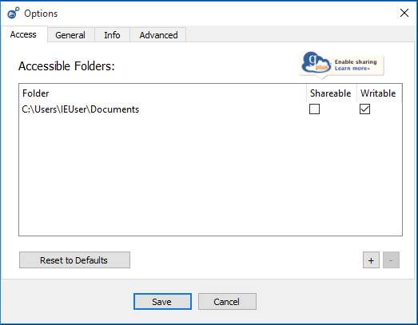

You may add folders by clicking the "+" icon and selecting the folder you wish to make accessible. Note that, in most cases, you should not need to add folders other than the default home directory, unless you wish to share files in a different folder with other Globus users. To share a folder, add it to the accessible list and check the "Sharable" box. Note: you must be a Globus Plus user to share files and folders. If you are not a link:https://www.globus.org/plus[Globus Plus] user, click on the "Enable sharing" icon and follow the instructions.

The "General" tab allows you to specify whether you want Globus Connect Personal to run when Windows starts and whether the software should automatically check for updates. We recommend that you leave the "Automatically check for updates" box checked, to ensure that you are running the most stable and secure version of Globus Connect Personal at all times.

[role="img-responsive center-block"]
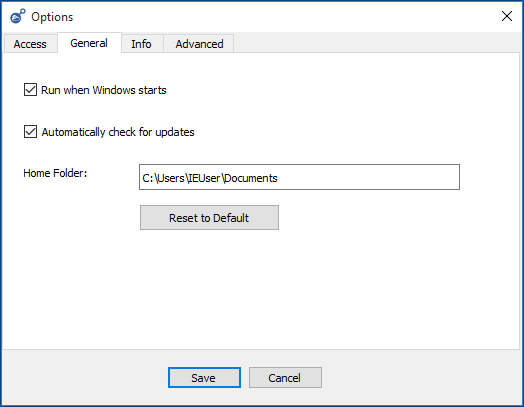

[NOTE]
======
_Drive Mapping_: Globus Connect Personal on Windows will translate a path beginning with /~/ into your home directory, e.g. C:\Users\Demodoc\. To access paths and drives outside of your home directory, use the syntax "/drive_letter/path", for example "/C/xinfo" lists the C:\xinfo directory. Also, as discussed above, it would be necessary for the C:\xinfo directory to be permitted in the Accessible Folders configuration as well. If the C:\xinfo directory is not permitted in the Accessible Folders configuration, then that folder will not be accessible via your endpoint.

_Installing as non-administrator_: By default, Globus Connect Personal prompts to be installed in C:\Program Files. Regular users can not write to this folder. Instead, browse to a place you have write access to (e.g. your Desktop folder).
======

== Removing Globus Connect Personal

Please note that if you remove Globus Connect Personal, you will not be able to transfer files to or from your personal computer using Globus, and any files you have shared with other Globus users will not be accessible to those users.

To remove Globus Connect Personal:

. Open the Windows Control Panel, open the "Programs and Features" applet, then select Globus Connect Personal from the list and click "Uninstall/Change".
+
[role="img-responsive center-block"]
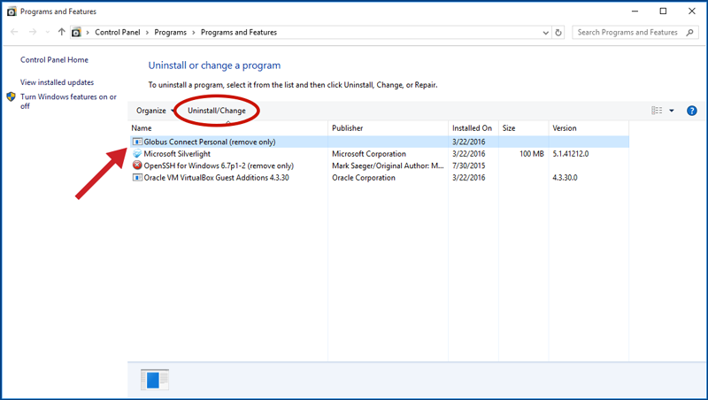
. Click "Uninstall" to confirm that you wish to remove Globus Connect Personal from your computer.
+
[role="img-responsive center-block"]
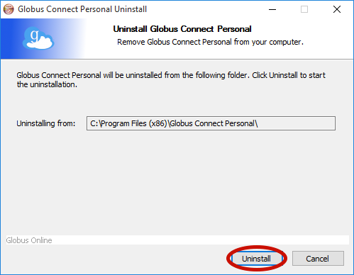
. Click "Yes" to remove all Globus Connect Personal settings from your computer.
+
[role="img-responsive center-block"]
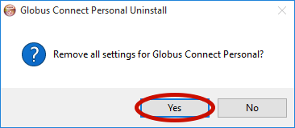
. You will see the following confirmation when Globus Connect Personal has been removed from your computer.
+
[role="img-responsive center-block"]
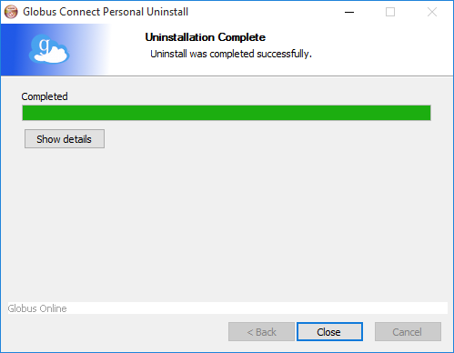
