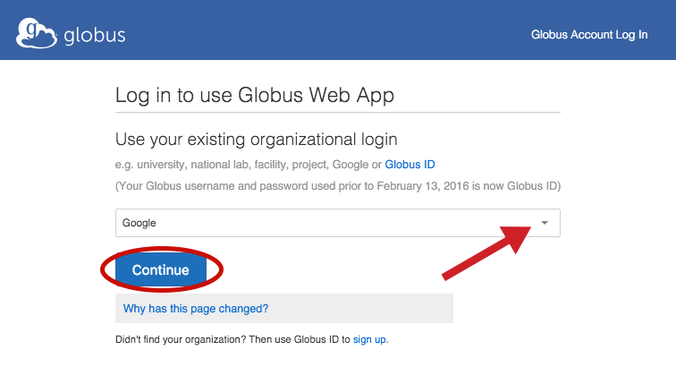
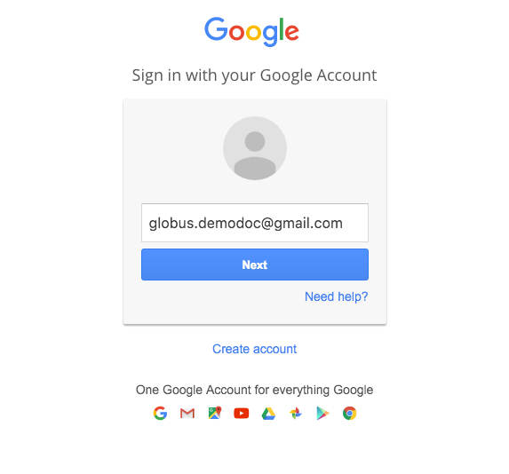
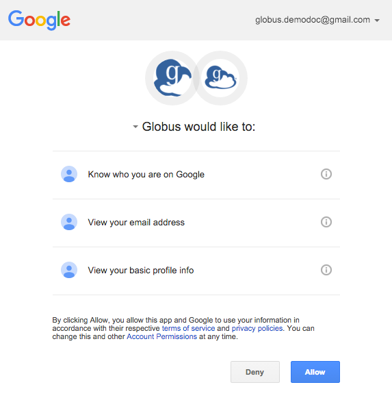
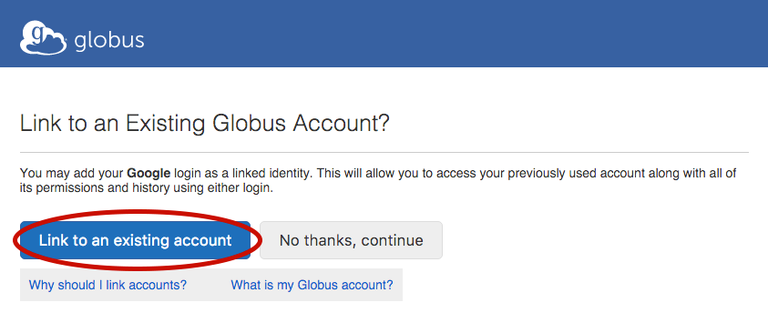
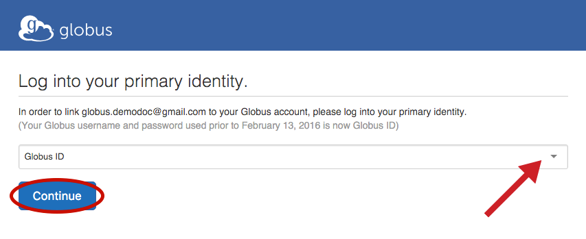

= How To Link a New Identity to an Existing Globus Account
:numbered:

If you've already signed up to use the Globus Web App, you can link another identity so you can use that to login and perform actions within the Globus Web App.

'''
== Log in to use Globus Web App
Log in by choosing an existing organizational login in the dropdown at link:https://www.globus.org/SignUp[globus.org/login] and clicking "Continue"...

[role="img-responsive center-block"]

You will then be redirected to your organization's login page ([uservars]#Google# in this example) where you will login using your credentials for that organization. Depending on the organization you choose, you may encounter a screen that Globus is requesting access to your account information (in this example, Google has a page that states: "Globus would like to:").

[role="img-responsive center-block"]

[role="img-responsive center-block"]

Once you've logged in with your organization's credentials, Globus will ask if you'd like to link to an existing account. If this is your first time signing up to use the Globus Web App (you don't already have an existing account), you'll click "No thanks, continue" and follow link:../get-started[these instructions] on how to create a new account. If you've already signed up with another account, you can choose link:../[link to an existing account].

[role="img-responsive center-block"]

Then you will login using the identity you used to initially create your Globus account. Choose the organization from the dropdown and click "Continue". In this example, user [uservars]#demodoc# signed up initially by creating a [uservars]#Globus ID#.

[role="img-responsive center-block"]
