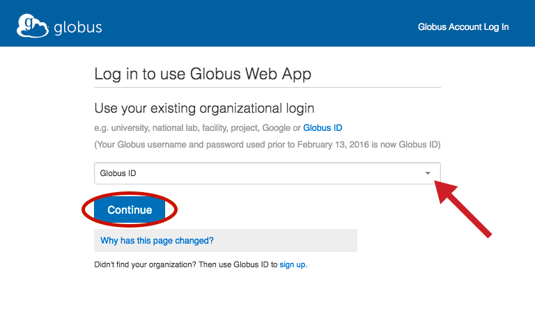
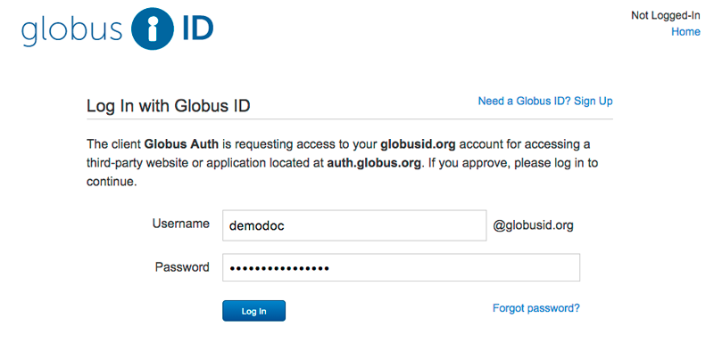
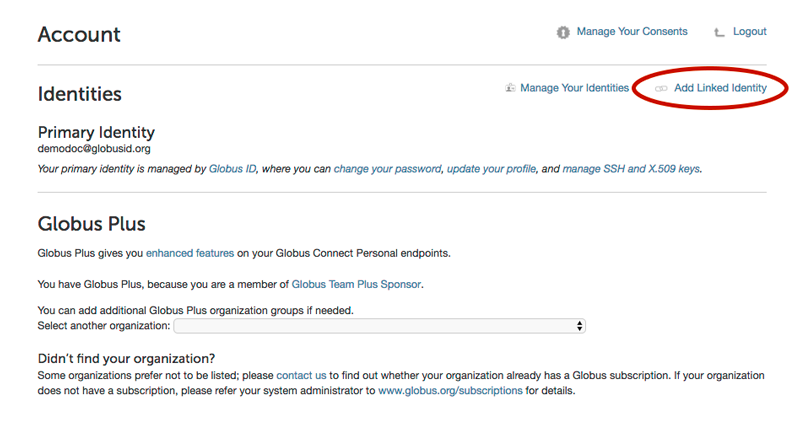
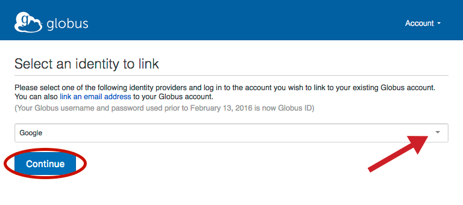
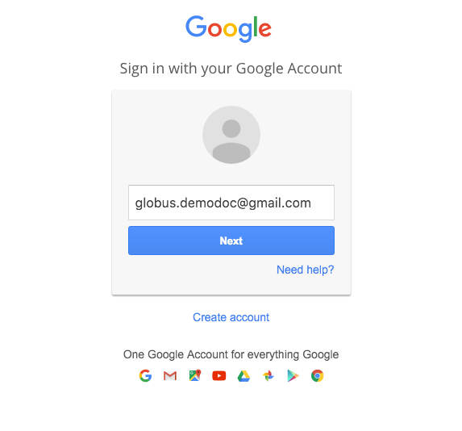
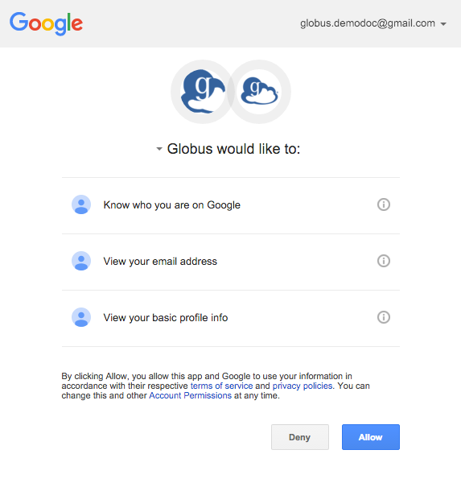
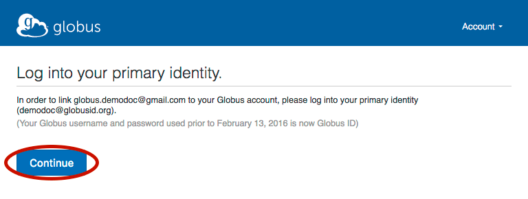
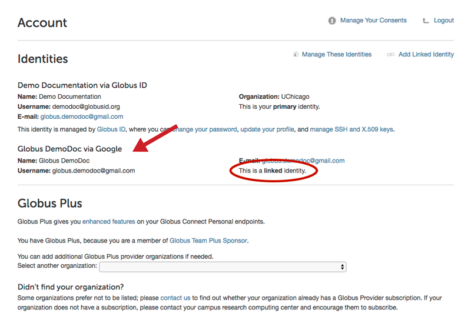

= How To Link a New Identity to an Existing Globus Account
:numbered:

If you've already signed up to use the Globus Web App, you can link another identity so you can use that to login and perform actions within the Globus Web App. If you haven't signed up yet, you can create a new account by following link:../get-started[these instructions].

'''
== Log in to use Globus Web App
Log in by choosing the identity you used to sign up in the dropdown at link:https://www.globus.org/SignUp[globus.org/login] and clicking "Continue"... (Note: If you created a Globus username and password prior to February 13, 2016, this is now GlobusID.)

[role="img-responsive center-block"]

== Log in on your organization's login page
On your organization's login page ([uservars]#GlobusID# in this example), complete your login using your credentials for that organization.

[role="img-responsive center-block"]

== Link to an existing account
Once you've logged in with your organization's credentials, navigate to the link:https://www.globus.org/app/account[account page]. Click on "Add Linked Identity" in the upper right.

[role="img-responsive center-block"]

== Select an identity to link
Select the identity institution you'd like to link from the dropdown and click "Continue".

[role="img-responsive center-block"]

== Log in on your organization's login page
You will then be redirected to your organization’s login page ([uservars]#Google# in this example) where you will login using your credentials for that organization. Depending on the organization you choose, you may encounter a screen that Globus is requesting access to your account information (in this example, Google has a page that states: "Globus would like to:").

[role="img-responsive center-block"]

[role="img-responsive center-block"]

The next page will prompt you to log into your primary identity. Since you already logged into your primary in step 1, after you click "Continue" you will be redirected to the link:https://www.globus.org/app/account[account page] again. 

[role="img-responsive center-block"]

== Confirm your account is linked
On the link:https://www.globus.org/app/account[account page] you can view your primary and any linked identities.

[role="img-responsive center-block"]
