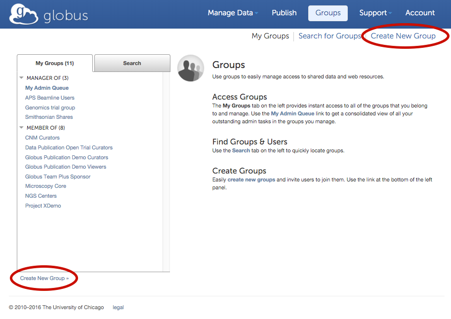
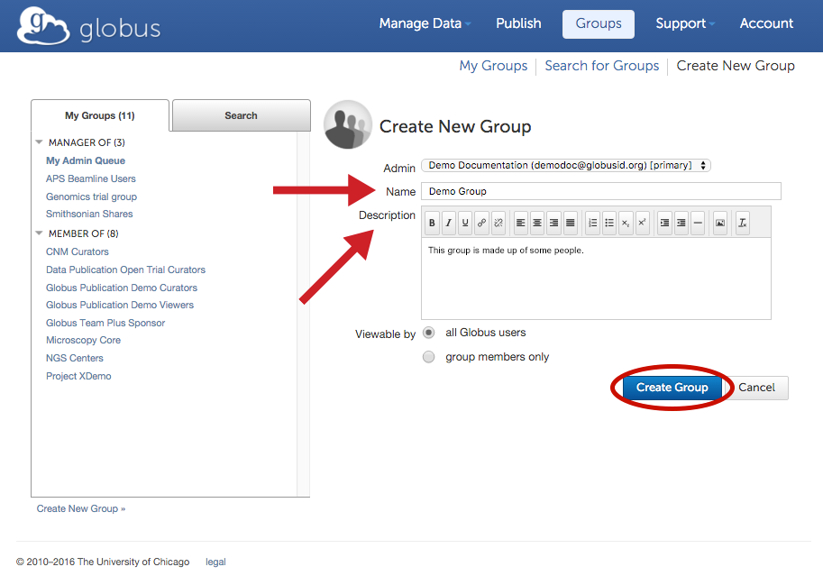
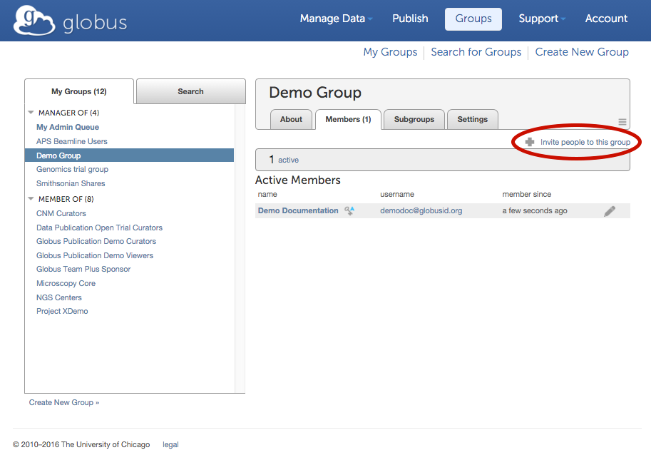
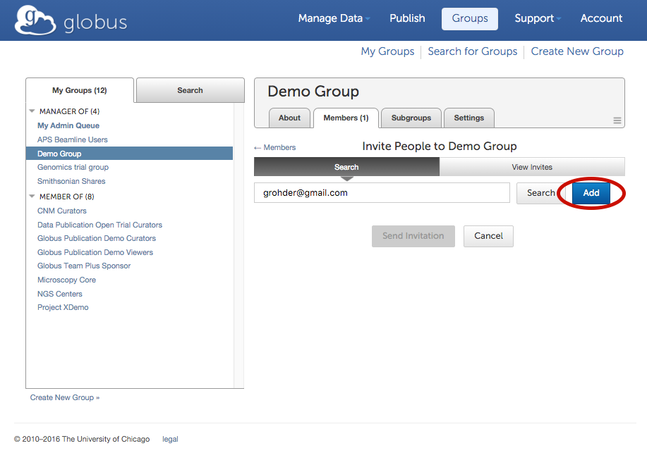
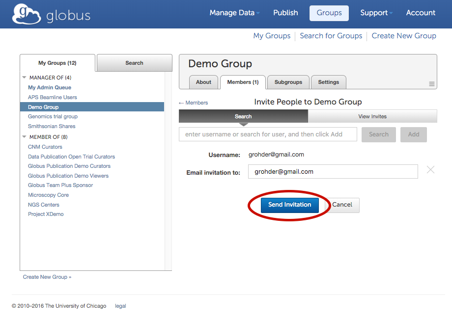
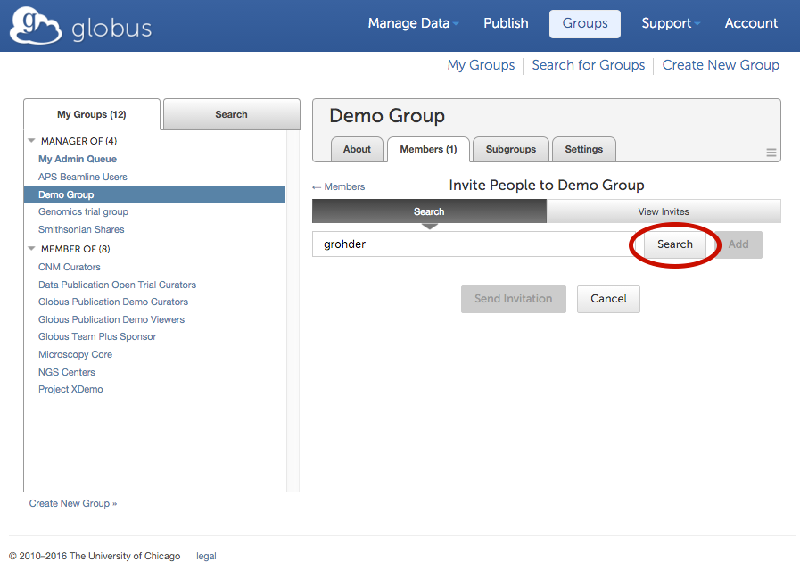
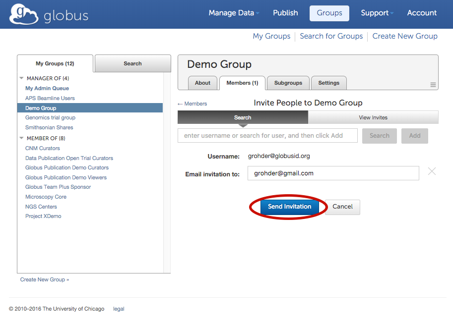

= How to Manage Globus Groups
:numbered:

Globus provides capabilities to create and manage groups, which can then be used to share files and folders with a group of Globus users.

. The link:https://www.globus.org/Groups[Groups dashboard] is the home for all group management capability in Globus. You can create a new group by clicking on one of the "Create New Group" links as shown below.
+
[role="img-responsive center-block"]

. Provide a name for the group, and an optional description that tells prospective members a bit more about the group. Then click "Create Group".
+
[role="img-responsive center-block"]

. You can now add users to the group by inviting other Globus users to join.
+
[role="img-responsive center-block"]

+
You can invite users either by providing their email address or by searching for their Globus username. A notification will be sent to the user’s registered email address with a link to use to accept the invitation to the group.
+
- Invite by email address: Enter the email address for the person you wish to invite. This is a good option to use for members who don’t yet have a Globus account.
+
[role="img-responsive center-block"]

+
[role="img-responsive center-block"]

+
- Invite by Globus username: You can search for a Globus username and check the box next to the user(s) you wish to invite to the group.
+
[role="img-responsive center-block"]

+
[role="img-responsive center-block"]

NOTE: Group policy settings can be configured under the Settings tab.