= How To Share Data Using Globus
:numbered:

Globus offers the ability to easily share your data with other researchers who have Globus accounts and allows the creator of a shared endpoint to assign the access manager role to select users, giving those users the ability to grant or revoke read/write access privileges for the shared endpoint.

NOTE: Shared endpoints may only be created on managed endpoints that are part of an active link:https://www.globus.org/provider-plans[Provider plan subscription]). If you wish to share from a personal endpoint (e.g. your laptop) or transfer files between two personal endpoints you must be a link:https://www.gloubs.org/plus[Globus Plus user]. Please contact your research computing center or IT manager to upgrade your Globus account to Plus. If your institution does not have a Provider plan subscription, please link:https://support.globus.org/entries/www.globus.org/providers/signup[contact us to discuss your requirements].

. link:https://www.globus.org/signin[Log into Globus] and navigate to the link:https://www.globus.org/xfer/StartTransfer[Start Transfer page].
. Select the endpoint that has the files/folders you wish to share, and activate the endpoint, i.e. login with your username and password for that endpoint.
+
[role="img-responsive center-block"]
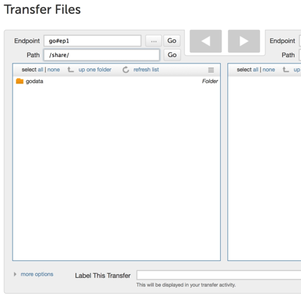
. Highlight the folder that you would like to share, and select the "share" option from the function menu. If the "share" option is not enabled, the endpoint is not configured for sharing. Please contact your endpoint administrator or refer to Globus Endpoint Administrator's Guide for information on how to update the endpoint configuration.
+
[role="img-responsive center-block"]
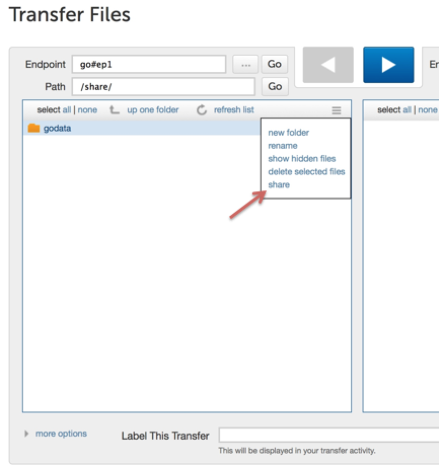
. Provide a name for the shared endpoint, [uservars]#support#demo# in this example, and click on Create and Manage Access.
+
[role="img-responsive center-block"]
image::images/sharing-pic3.png[]
+
[role="img-responsive center-block"]
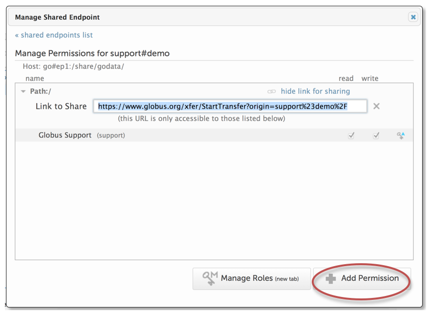
. Set permissions on that shared endpoint. Choose Email the link for Share, Search for User and Groups, or allow All Users, and set read or write permissions. Note: allowing write access implies the user can modify and/or delete the files or folders you give them access to.
. You can now email the shared endpoint name (support#demo) to the users who you shared with.
. You can set individual permissions (granted to Globus user [uservars]#grohder# in this example) at both the top level of a directory share, and also to the subdirectories in the share as well:
+
[role="img-responsive center-block"]
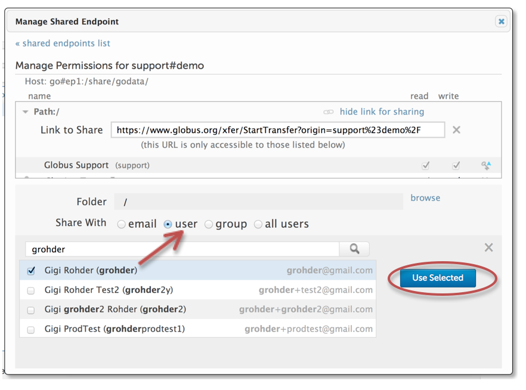
. You can set permissions for all members of a group.
+
[role="img-responsive center-block"]
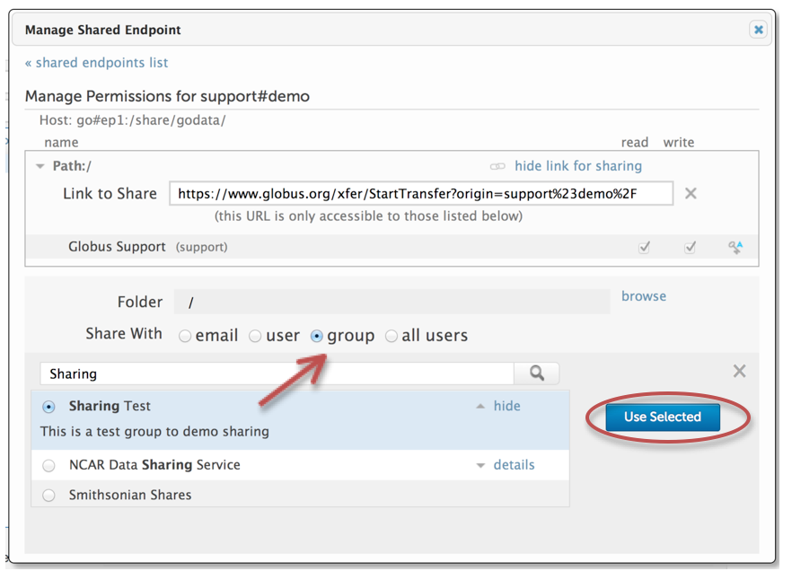
+
Example of Sharing a subfolder: 
+
[role="img-responsive center-block"]
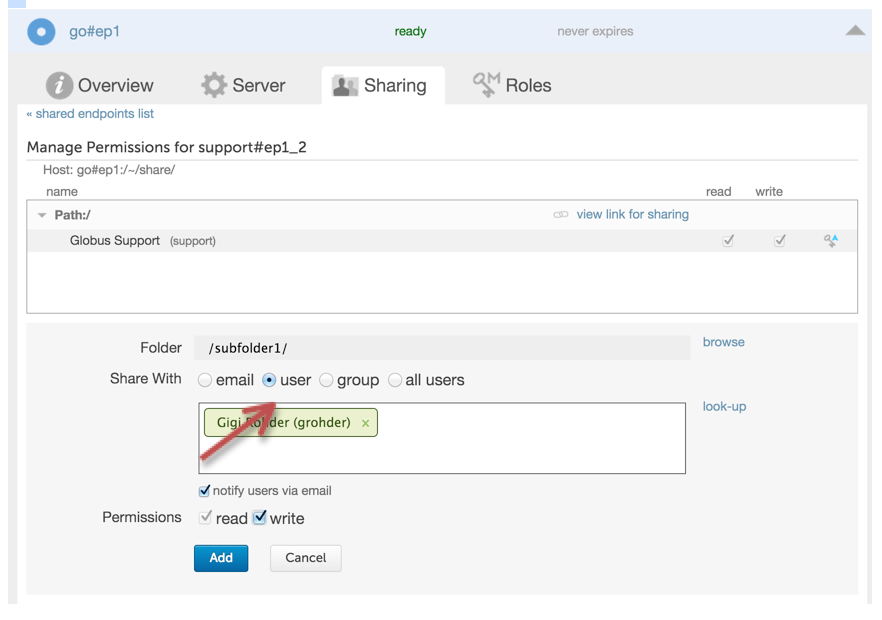
+
[role="img-responsive center-block"]
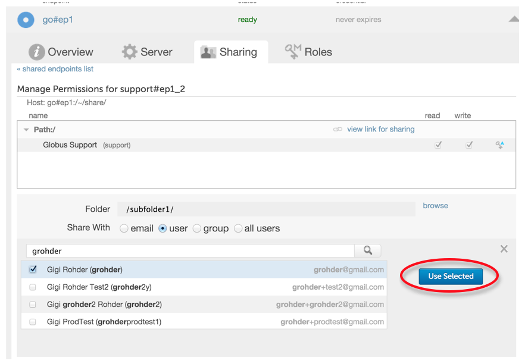
+
[role="img-responsive center-block"]
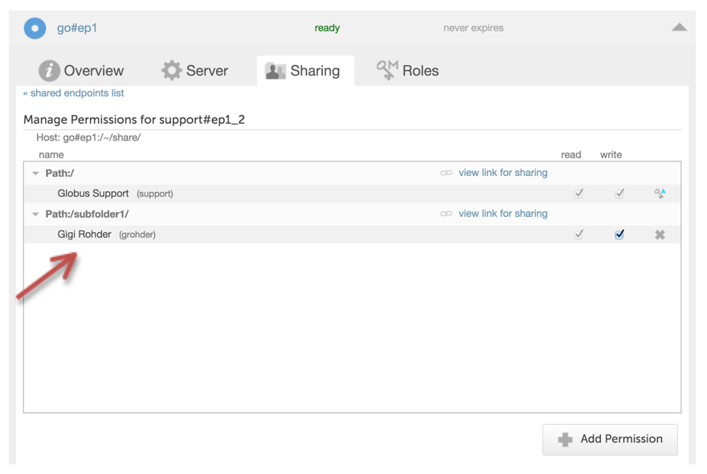
. Users can log into Globus, go the shared endpoint and access it. In this example, user [uservars]#grohder# accesses the files as shown below, using the endpoint support#demo.
+
[role="img-responsive center-block"]
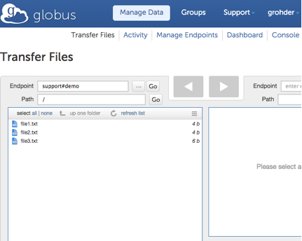
+
Additionally, remote collaborators on a project are able to access the project space (a Globus shared endpoint) without needing a local account. The *access manager role* grants the ability to control Read and/or Write access permissions for other Globus users on a Shared Endpoint. By assigning the *access manager role* to one or more of the project members, the site administrator who initially created the shared endpoint does not have to be involved every time access permission changes are needed for the project space.
+
[role="img-responsive center-block"]
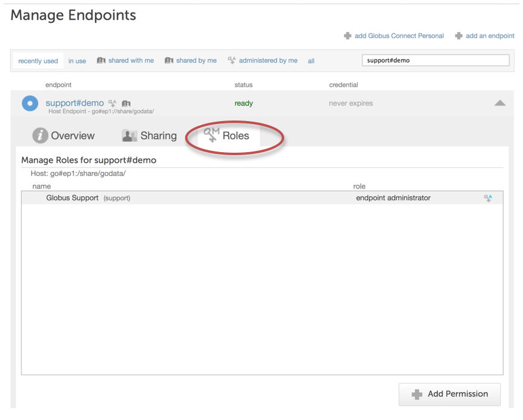
+
The creator of a shared endpoint can assign the access manager role from the new Roles tab on the link:http://globus.org/xfer/ManageEndpoints[Manage Endpoints] page or from the link:http://globus.org/xfer/StartTransfer[Transfer Files] page by entering the name of the shared endpoint and selecting the permissions option on the pull-down menu.
+
Choosing Manage Roles opens a new Roles tab, shown below, that can be used to assign a role (currently access manager is the only available role) to a Globus user or group.
+
[role="img-responsive center-block"]
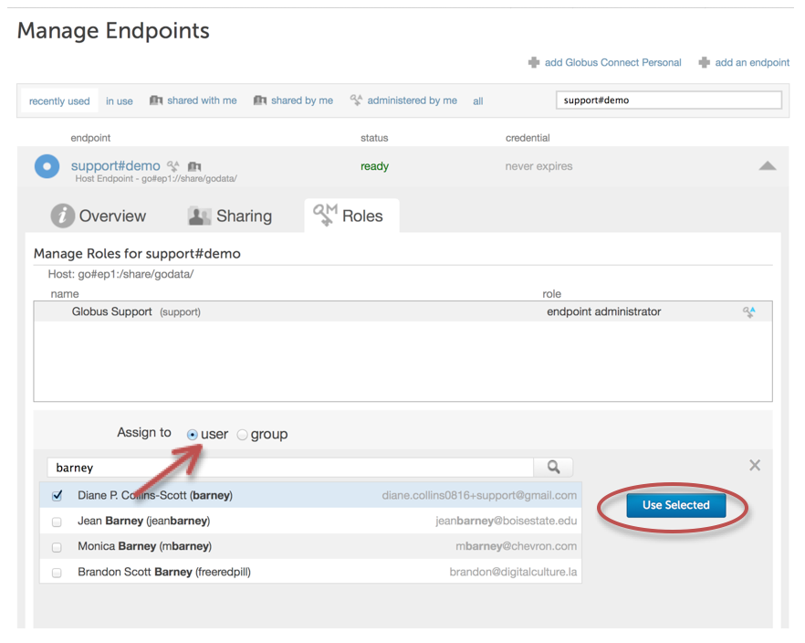
+
[role="img-responsive center-block"]
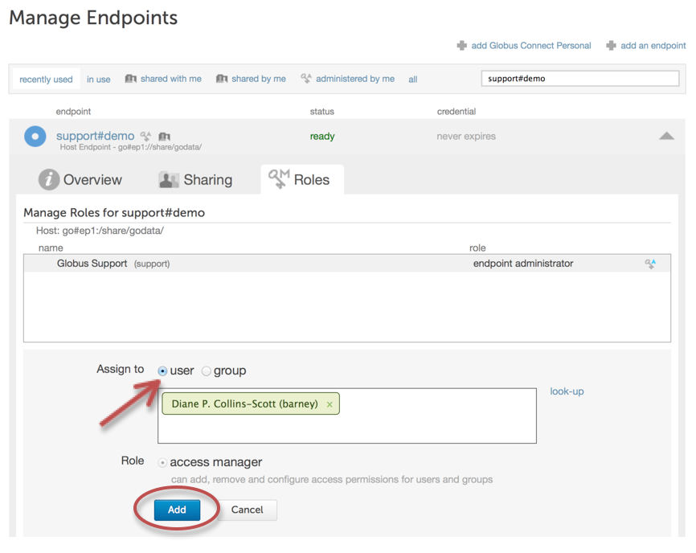
+
After the access manager role is assigned to a user, the user will have read/write access for the shared endpoint and can also control access to the shared endpoint for other users. The Manage Permissions screen, shown below, reflects user barney's permissions for the shared endpoint after he has been assigned the access manager role.
+
[role="img-responsive center-block"]
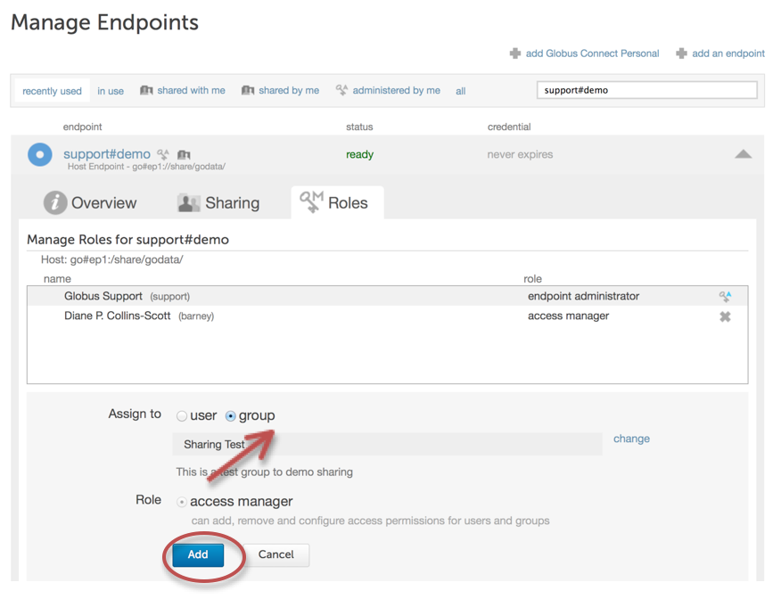
+
This same functionality can be assigned to a group allowing the group to have read/write access for the shared endpoint and can also control access to the shared endpoint for other users. The Manage Permissions screen, shown below, reflects the group Sharing Test’s permissions for the shared endpoint after it has been assigned the access manager role.
+
[role="img-responsive center-block"]
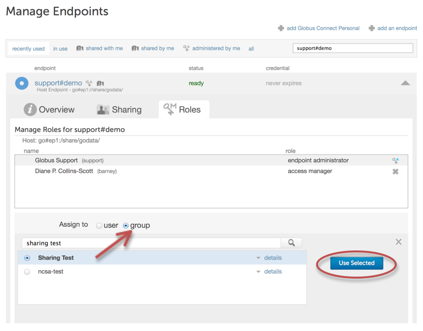
+
[role="img-responsive center-block"]
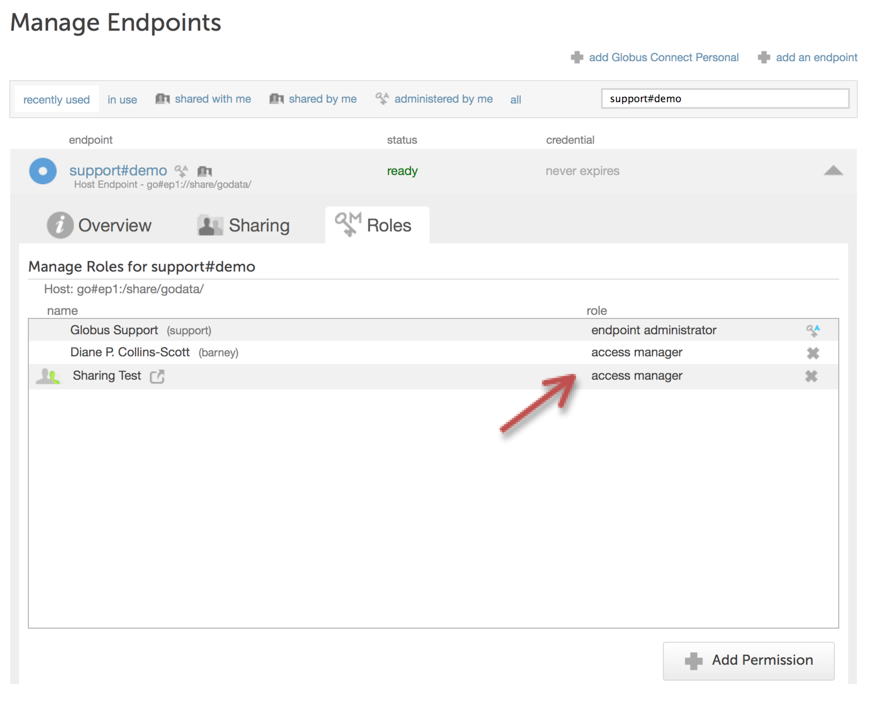