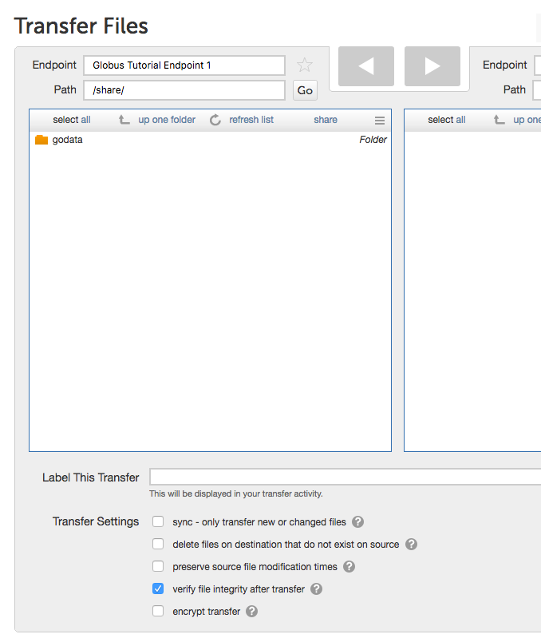
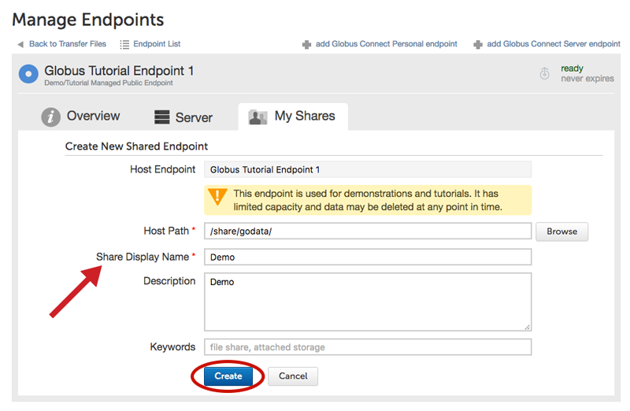
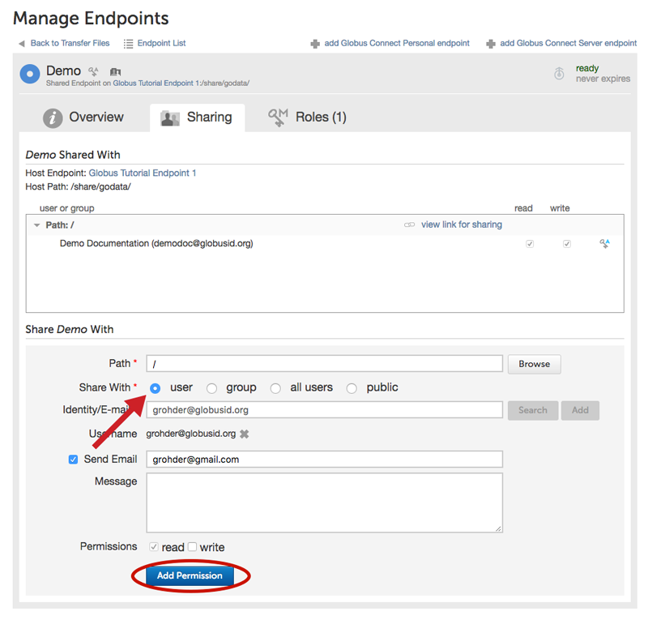
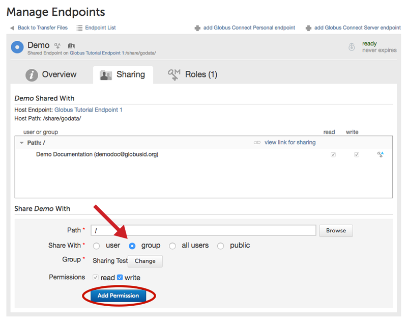
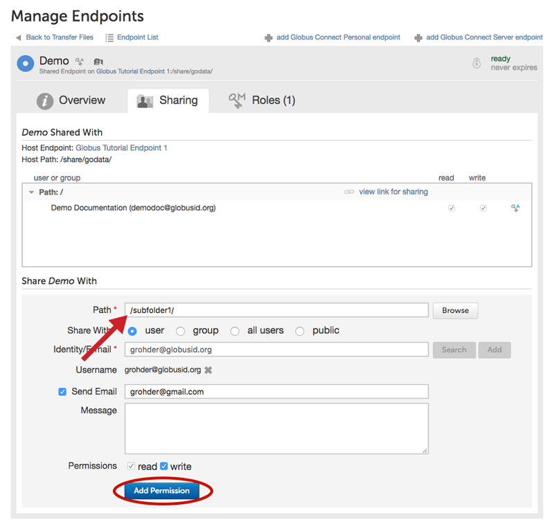
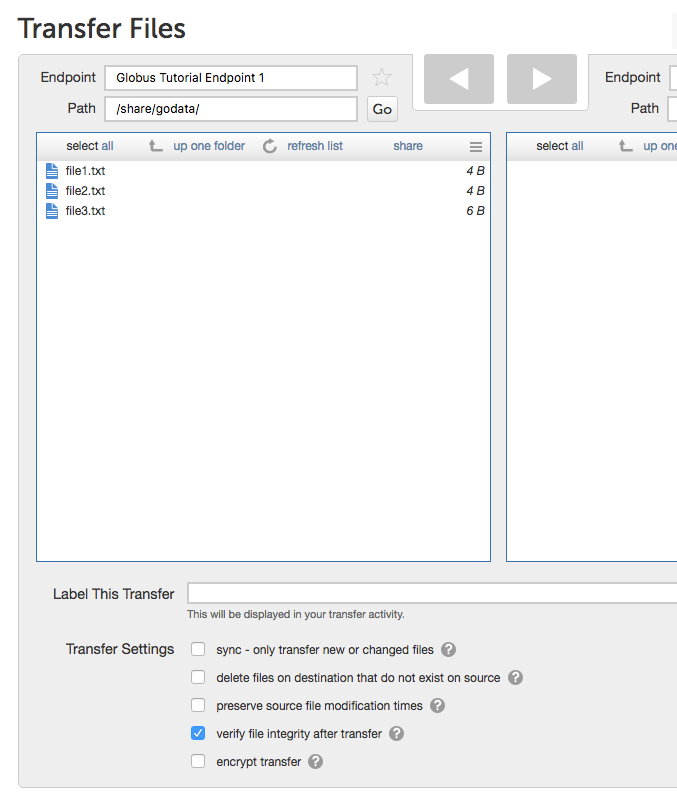
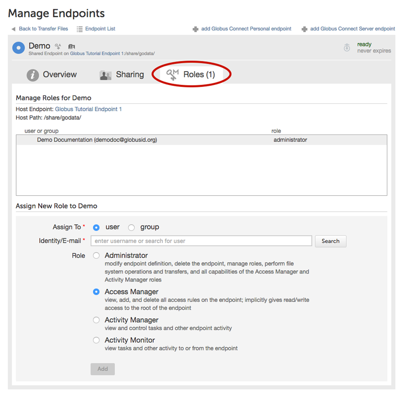
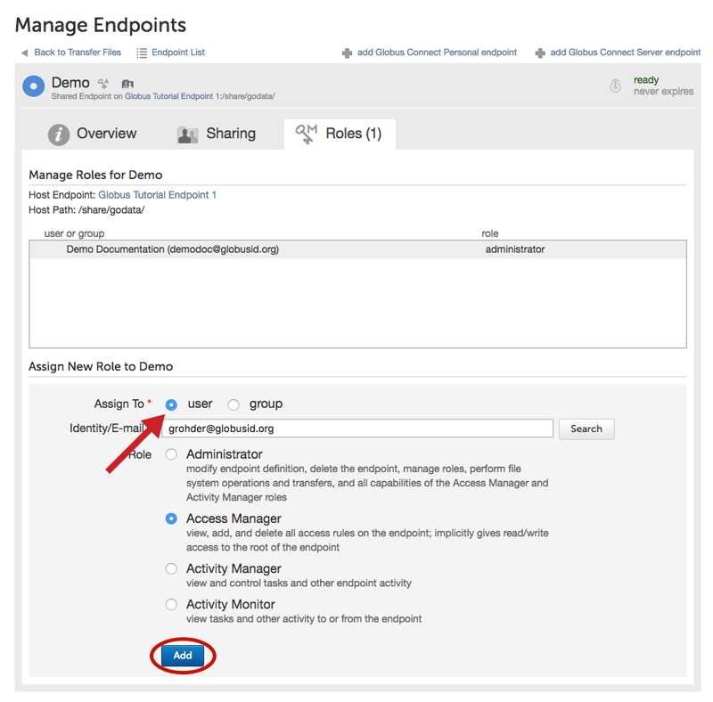
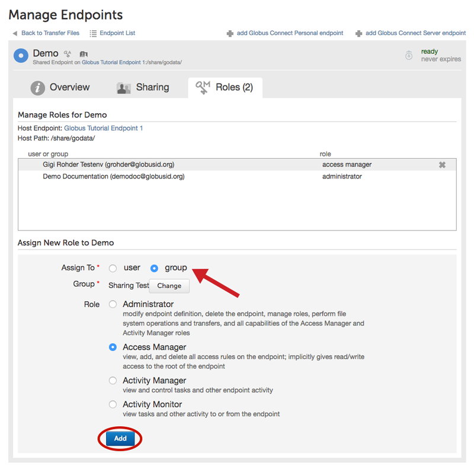

= How To Share Data Using Globus
:numbered:

Globus offers the ability to easily share your data with collaborators. Sharing data requires creating a shared endpoint and granting your collaborators access to that shared endpoint, as described in the instructions below. You may also designate another Globus user as an "access manager" for the shared endpoint; this user will then have the ability to grant or revoke read/write access privileges for other Globus users on the shared endpoint.

NOTE: Shared endpoints may only be created on managed endpoints that are part of an active link:https://www.globus.org/providers/provider-plans[Provider plan subscription]). If you wish to share from a personal endpoint (e.g. your laptop) or transfer files between two personal endpoints you must be a link:https://www.globus.org/researchers/plus-plans[Globus Plus user]. Please contact your research computing center or IT manager to upgrade your Globus account to Plus. If your institution does not have a Provider plan subscription, please link:https://www.globus.org/providers/signup[contact us to discuss your requirements].

. link:https://www.globus.org/signin[Log into Globus] and navigate to the link:https://www.globus.org/app/transfer[Transfer Files page].
. Select the endpoint that has the files/folders you wish to share, and activate the endpoint, i.e. login with your username and password for that endpoint.
+
[role="img-responsive center-block"]

. Highlight the folder that you would like to share, and select the "share" option from the function menu. If the "share" option is not enabled, the endpoint is not configured for sharing. Please contact your endpoint administrator or refer to link:../../resource-provider-guide#how_to_enable_and_disable_sharing_in_globus_connect_server[Resource Provider Guide] for information on how to update the endpoint configuration.
+
[role="img-responsive center-block"]

. Provide a name for the shared endpoint, [uservars]#demo# in this example, and click on Create.
+
[role="img-responsive center-block"]

+
. Set permissions on the shared endpoint. You can set individual permissions (granted to Globus user [uservars]#grohder# in this example) at both the top level of a directory share, and also to the subdirectories in the share as well. The users you share with will receive an email notification containing a link to the shared endpoint. You may add a customized message to this email. If you do not want to send an email, you may uncheck the "Send Email" checkbox.
+
NOTE: allowing write access implies the user can modify and/or delete the files or folders you give them access to.
+
[role="img-responsive center-block"]

. In addition to sharing with individual users, you can also set sharing permissions for all members of a Globus group (click link:../managing-groups[here] for instructions on creating Globus groups).
+
[role="img-responsive center-block"]

+
You may also share subfolders on your shared endpoint by specifying the "Path" name.
+
[role="img-responsive center-block"]

. After receiving the email notification, users can click on the link and log into Globus to access the shared endpoint. In this example, user [uservars]#grohder# accesses the files as shown below.
+
[role="img-responsive center-block"]

+
*Allowing Other Users to Manage Your Shared Endpoint*
+
The user who creates a shared endpoint may also allow other users to manage permissions for that endpoint. This is done by granting the access manager role to another user. The access manager role grants the ability to control read and/or write access permissions without involving the original creator of the shared endpoint. This is useful in a scenario where the systems administrator creates a shared endpoint and allows a team of researchers to control access for their collaborators on that endpoint.
+
.Managing Roles for Shared Endpoints
[role="img-responsive center-block"]

+
The creator of a shared endpoint can assign the access manager role from the Roles tab on the link:http://globus.org/xfer/ManageEndpoints[Manage Endpoints] page.
+
The Roles tab can be used to assign a role (currently access manager is the only available role) to a Globus user or group.
+
[role="img-responsive center-block"]

+
After the access manager role is assigned to a user, the user will have read/write access for the shared endpoint and can also control access to the shared endpoint for other users. The screen below reflects user Gigi's permissions for the shared endpoint after she has been assigned the access manager role.
+
[role="img-responsive center-block"]

+
This same functionality can be assigned to a group, allowing the group to have read/write access for the shared endpoint and to control access to the shared endpoint for other users.
