= Using Globus Management Console
:imagesdir: .
:toc:
:toc-placement: manual
:toclevels: 3
:numbered:
:revdate: May 12, 2016

[doc-info]#Last Updated: {revdate}#

The management console provides an interface to monitor and manage activity on managed endpoints and is available to Provider Plan subscribers. This allows administrators to identify and troubleshoot faults that may indicate underlying infrastructure issues, and manage resources on their infrastructure

'''
toc::[]

== Access to console
Users need to be granted Management Console access on endpoints before they can use the interface. An organization’s Provider Plan support contact(s) can grant such access by contacting Globus support.

== Monitoring Tasks
=== Activity overview
When an administrator first logs in to the Management Console they will see the Current Activity view for all endpoints they manage, as shown below:

.Endpoint Overview
[role="img-responsive center-block"]
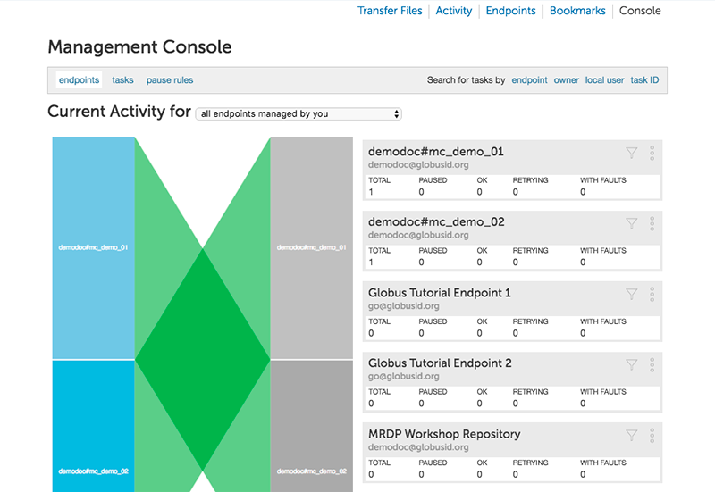

The above shows the console's endpoint overview. The interactive graphic gives endpoint managers an easy way to see the status of transfers to and from their managed endpoints; green represents transfers that are making progress and orange highlights transfers that are being retried. Per-endpoint summaries with links to drill down into endpoint details are also provided.

A count of active file transfer tasks for each endpoint is shown, and expanding an endpoint's listing presents an overview of the endpoint configuration and a list of shared endpoints hosted by the endpoint. The next image shows shared endpoints hosted on the go#ep1 endpoint, with a summary of permissions for each shared endpoint that gives the administrator a quick view of what is being shared from the endpoint.

.Shared Endpoints
[role="img-responsive center-block"]
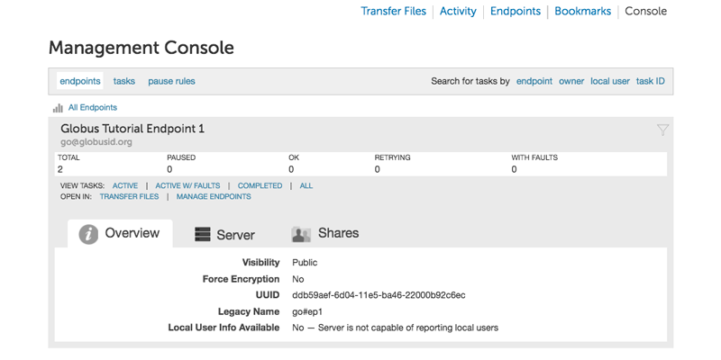

=== Search and filters
The Management Console supports search and filters to allow the administrator to find tasks of interest. To look at all active transfer tasks, click on the "active tasks" link. To look at a list of tasks filtered by Globus username, endpoint, or transfer task ID, the user can use the search box and press ENTER. Alternatively administrators can click on an endpoint name, username or task id to filter on that.

.Active Tasks
[role="img-responsive center-block"]

For example, if an admin wanted to find all tasks involving their endpoints for Gobus user "demodoc" they would enter "demodoc" as the search pattern in the search filter box and press enter - like so:

.Filter by User
[role="img-responsive center-block"]
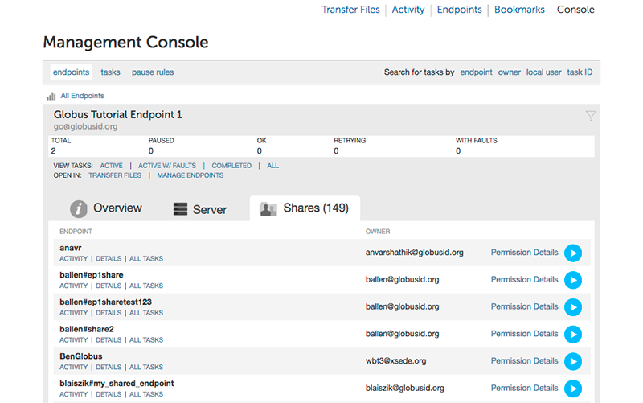

Once the admin has selected the tasks that they wish to examine they can then see detailed logs of the transfer, as well as choose to pause/resume or cancel the task.

The interface also has some pre-defined filters for common search parameters, such as tasks with faults, paused tasks, as shown in the screenshot below. These can be used to narrow down the search results. The administrator can also use the custom filter option to find tasks using options not covered by the pre-defined filters.

.Pre-defined Filters
[role="img-responsive center-block"]
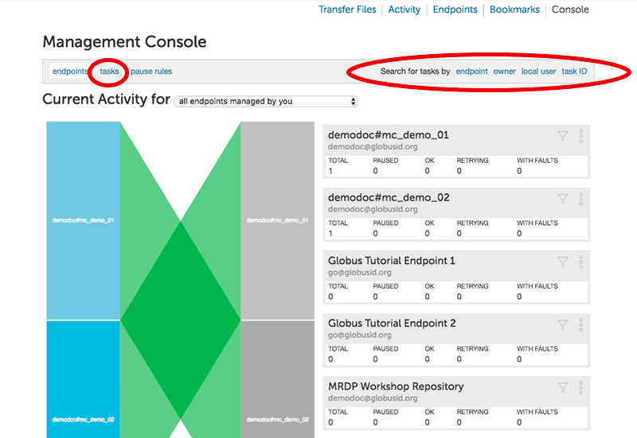

== Managing Tasks
The Management Console supports administrators cancelling or pausing user’s tasks.

=== Pause Tasks
To pause a single task, click the pause button for that task.

.Pause Tasks
[role="img-responsive center-block"]

The administrator will be prompted to provide a reason that will be included in the email notification sent to the user who initiated the task.

.Pause Reason
[role="img-responsive center-block"]
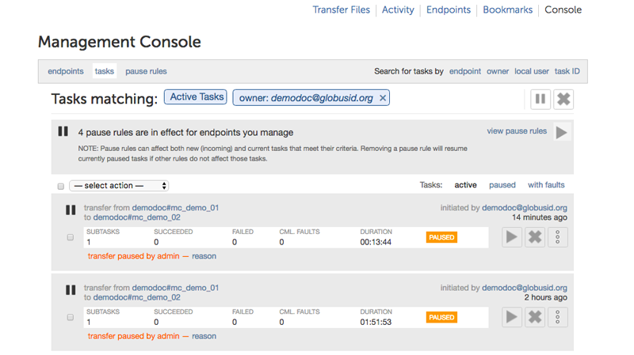

Once paused, the task can be resumed only by an administrator of the endpoint. It might take upto a couple of minutes for the task to pause and transfers to the server to stop, and for the status of the transfer to be reflected as paused on the web application.

To pause multiple tasks, the administrator can select the tasks they would like to pause using the checkbox next to the task.

.Pause Multiple Tasks
[role="img-responsive center-block"]

Once all of the desired tasks have been selected, choose "pause selected tasks" from the "- select action -" drop down menu.

.Pause Selected Tasks
[role="img-responsive center-block"]
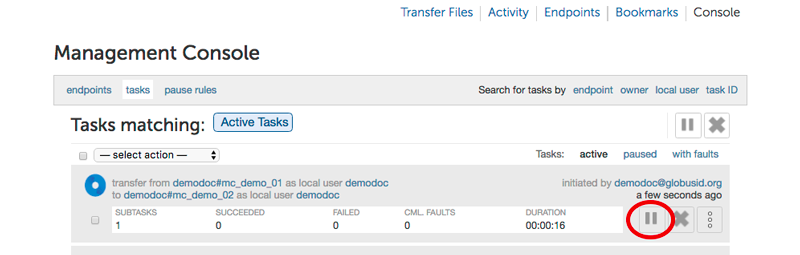

=== Resume Tasks
To resume a single task, click the resume button for that task.

.Resume Task
[role="img-responsive center-block"]

Once resumed, the user is sent an email that the task has been resumed by an administrator of the endpoint. Administrators can use the "paused tasks" filter to identify the set of tasks that can be resumed. 

Note that if the task has also been paused by the administrator of the other endpoint, it will not be resumed until both source and destination administrators have resumed the task.

To resume multiple tasks, the admin should click the checkbox for the task for each task they wish to resume.

.Resume Multiple Tasks
[role="img-responsive center-block"]
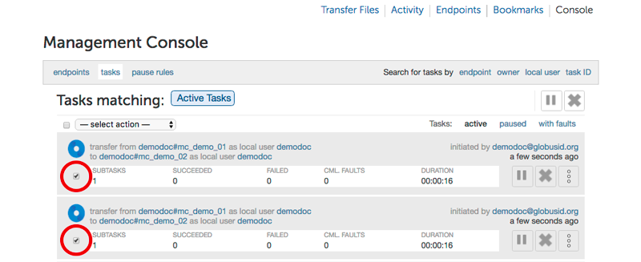

Once all of the desired tasks have been selected, pick "resume selected tasks" from the "- select action -" drop down menu.

.Resume Selected Tasks
[role="img-responsive center-block"]
image::images/mcg-12.png[Resume Selected Tasks]

As before,  the users are sent an email that their task(s) have been resumed by an administrator of the endpoint. 

=== Pause Rules
In addition to pausing specific tasks, the console allows the administrator to setup pause rules that can be used to affect both current and new tasks according to a set of filters the administrator specifies. Pause rules can be useful for situations in which the admin wants to pause tasks with much finer granularity than is possible with a normal task filter, or when an admin wants to pause both current and future tasks on their endpoint(s). 

To create a new pause rule or view current pause rules, click on the ‘pause rules’ link in the management console.

.Pause Rules
[role="img-responsive center-block"]

This will take you to the Pause Rules page, where you can see all currently existing pause rules. To create a new rule, click on the ‘add a pause rule’ link.

.Add Pause Rule
[role="img-responsive center-block"]
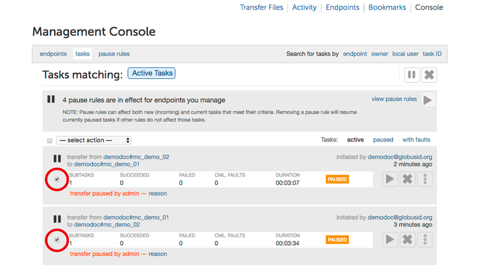

This will then open the dialog to create a new pause rule. Select the appropriate options for the rule you wish to create, and then press the Create Rule button.

.Create Rule
[role="img-responsive center-block"]

The pause rule will affect all tasks that meet the conditions set on the rule. 

By default all of the user’s currently active and queued tasks are paused, and any new tasks that the user submits will also be automatically paused. But the administrator can choose to pause only new tasks or tasks already submitted.

.Specify Which Tasks to Pause
[role="img-responsive center-block"]
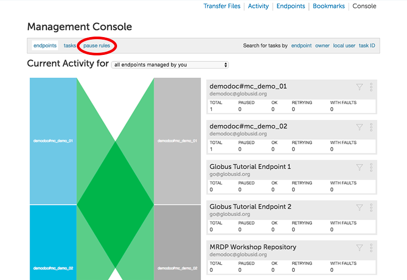

Similarly, by default, all types of tasks are paused: read, write, interactive tasks and submitted tasks. But the administrator can choose the types of task to pause. For example, in the screenshot below, write activity on the endpoint go#ep1 is paused, while all read activity is allowed.

.Specify Which Types of Tasks to Pause
[role="img-responsive center-block"]
image::images/mcg-17.png[Specify Which Types of Tasks to Pause]

A pause rule can also be created by choosing the pause option near the filters on the active tasks view, as shown below:

.Pause: Active Tasks View
[role="img-responsive center-block"]
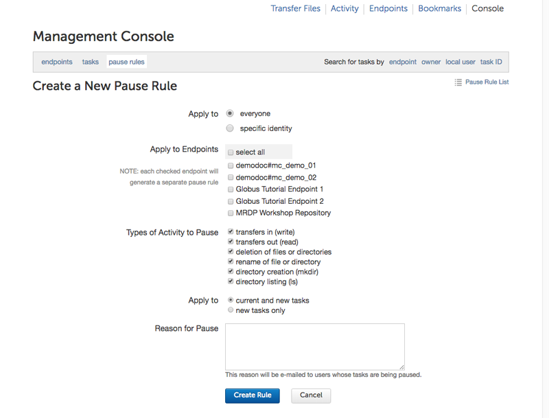

This will allow the creation of a pause rule with the filters on the active tasks tab pre-filled. For example, pause on a screen that has all tasks from ucrcc#midway, will show a pause rule creation window as follows:

.Pause Matching Tasks
[role="img-responsive center-block"]
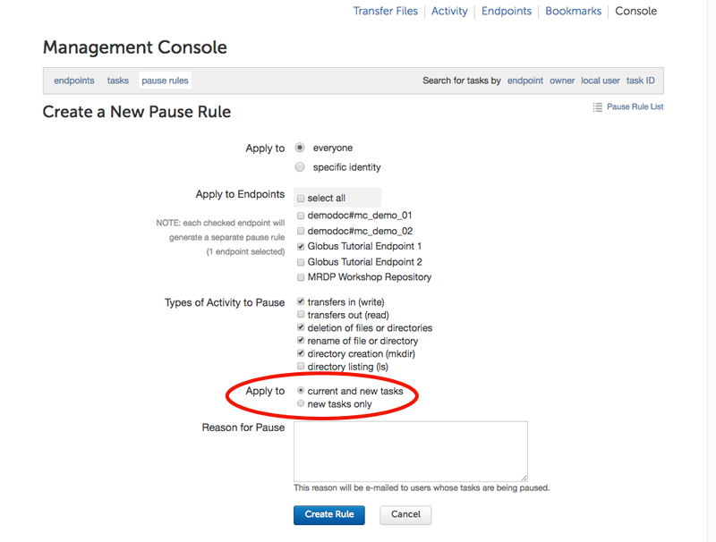

To edit an existing rule, click on the triangle next to the rule in the Pause Rules page.

.Edit Existing Pause Rule
[role="img-responsive center-block"]
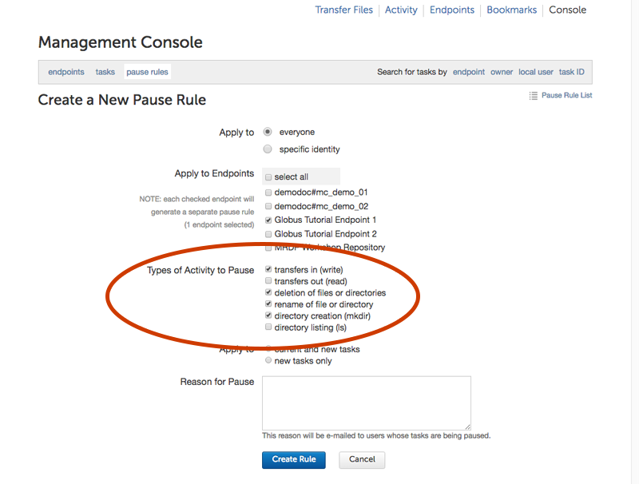

To delete a pause rule, click on the X next to the rule, or click on the Delete Rule button.

.Delete Pause Rule
[role="img-responsive center-block"]

When a pause rule is deleted all tasks that meet the conditions set on the rule will be resumed. If a task has been explicitly paused by directly pausing the task, such a task will not be resumed unless the task is explicitly resumed. If a task is paused by the administrator of the other endpoint, such tasks also will not be resumed until all both source and administrators have resumed the task.

=== Cancel
Cancelling a task terminates the user’s task and notifies the user that their task has been cancelled with the message provided by the administrator.  An administrator may cancel a single task, or bulk cancel a set of tasks identified using the console’s search capability.

To cancel a single task, simply click the cancel button for that task.

.Cancel Task
[role="img-responsive center-block"]
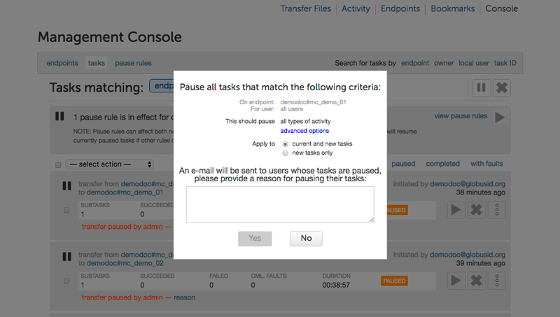

The admin will be prompted to give a reason that the task is being canceled. This reason will be sent to users in an email message explaining why their job has been canceled.

.Cancel Reason
[role="img-responsive center-block"]
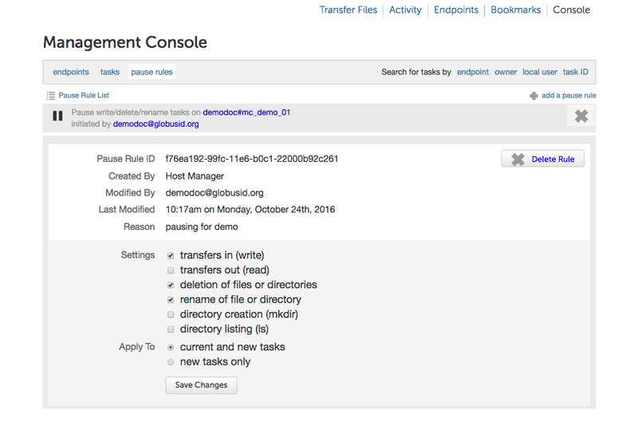

Once canceled, the user is sent an email that the task has been canceled by an administrator of the endpoint. 

To cancel multiple tasks, the admin should click the checkbox for the task for each task they wish to cancel.

.Cancel Multiple Tasks
[role="img-responsive center-block"]

Once all of the desired tasks have been selected, pick "cancel selected tasks" from the "- select action -" drop down menu.

.Cancel Selected Tasks
[role="img-responsive center-block"]
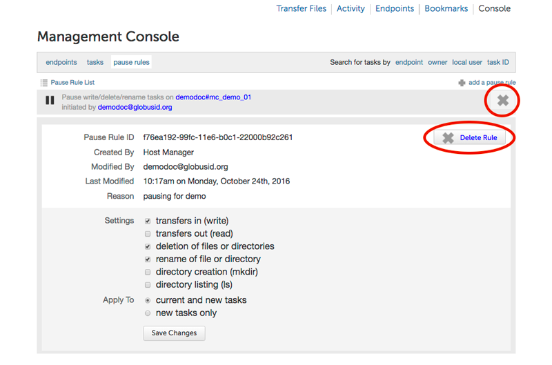

As before, the admin will be prompted to supply a reason that the tasks are being canceled, and this reason will be sent out in a message to those users whose jobs are affected by the cancel operation.

== Globus Support
Please submit any questions on the management console to support@globus.org. 
