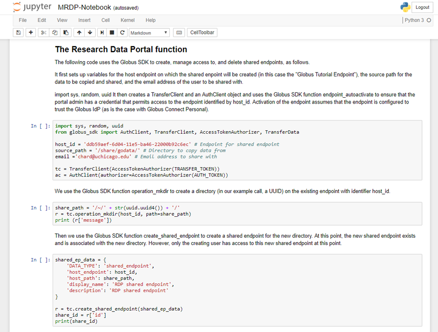
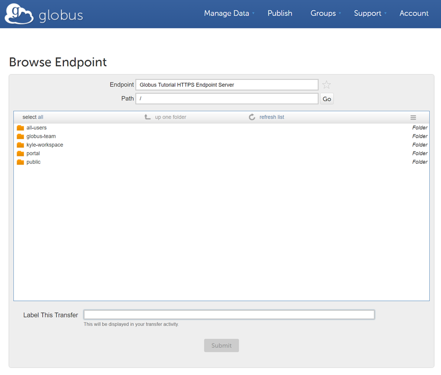

= The Modern Research Data Portal: A Design Pattern for Networked, Data-Intensive Science
:revdate: August 12, 2017
:source-highlighter: pygments
:pygments-style: manni
:pygments-linenums-mode: inline

[doc-info]*Last Updated: {revdate}*

This page describes a new design pattern, the modern research data portal (MRDP), that disaggregates the traditional monolithic web portal to achieve orders-of-magnitude increases in data transfer performance, support new deployment architectures that decouple control logic from data storage, and reduce development and operations costs. 

To demonstrate how easily such a portal can be developed we have developed a https://github.com/globus/globus-sample-data-portal[sample data portal] that we describe in the following. 

=== Prerequisites
In order to run the example code that follows you will need to install several software dependencies and clone the MRDP GitHub repository. 

==== Supported Distributions

- Windows
- Linux
- MacOS

==== Required Software:

- Python 2.x or 3.x
- Globus SDK 
- (Optional) Jupyter Notebook 

== Basic Research Data Portal functionality

At the heart of the research data portal is a simple module that provides scalable and secure access to data. To illustrate this basic pattern we include a simple https://github.com/globus/globus-sample-data-portal/tree/master/notebook[Jupyter Notebook]. 

Here the research data portal code follows four simple steps: (1) create a shared endpoint; (2) copy
the requested data to that shared endpoint; (3) set permissions on the shared endpoint to enable access by the requesting user, and email the user a URL that they can use to retrieve data from the shared endpoint; and ultimately (perhaps after several days or weeks), (4) delete the new shared endpoint.

To run this code you will need to first install Jupyter Notebook using Anaconda or pip. Instructions are available http://jupyter.org/install.html[here].
 
You can then open the notebook using Jupyter as follows and execute the cells in the notebook. 

[source,python,linenums]
----
jupyter notebook
----

.A screenshot of the MRDP Jupyter Notebook.
[role="img-responsive center-block"]

== Sample research data portal.

We now turn our attention to assembling a simple RDP portal server
that allows users to sign up, log in, select datasets from a set of temperature record datasets,
and then either download or request the creation of graphs for the selected datasets.
This complete implementation is some 700 lines of code, plus 500 lines for an example service
that we discuss in the next section. We do not include the entire code in this document,
but we do discuss its major features. Complete source code is available in GitHub:
https://github.com/globus/globus-sample-data-portal[https://github.com/globus/globus-sample-data-portal] and a running
instance of the portal is accessible online: https://mrdp.globus.org/[https://mrdp.globus.org/]

Before deploying the code, we must first register an Globus Auth client or "`app`"
definition via the Globus Auth management interface (https://developers.globus.org[https://developers.globus.org]). 
An app is required to enable RDP service to complete the OAuth2 workflow
to obtain access tokens. The registration process requires a name, requested
scopes for accessing Globus Auth managed services (e.g., "`urn:globus:auth:scope:transfer.api.globus.org:all`" for access to Globus transfer 
capabilities), valid redirect URLs, and associated policies. 
Globus Auth creates a unique client ID and secret through which 
a service can prove its identity when requesting tokens from Globus Auth.

The RDP portal server implementation uses the Flask micro web framework which makes it easy to create
simple web servers. 
Flask allows us to define via `@`-prefixed _decorators_
what actions should be performed when
a user accesses specific URLs.
For example, in the following code the decorator
specifies that a `GET` on the URL with the suffix `'/'`
should result in a call to the `home()` function.
Thus if the RDP web server's URL prefix is `http://localhost:5000`, 
then accessing suffix `'/'` (i.e., `http://localhost:5000/`)
will result in a call to `render_template('home.jinja2')`,
which uses the Jinja2 templating language
to render the server's home page, as defined by the template `home.jinja2`.

----
@app.route('/', methods=['GET'])
def home():
    """Home page - play with it if you must!"""
    return render_template('home.jinja2')
----

The following code specifies that when a
user visits `http://localhost:5000/login`, 
the user should be redirected to the `authcallback` URL suffix.

----
@app.route('/login', methods=['GET'])
def login():
    """Send the user to Globus Auth."""
    return redirect(url_for('authcallback'))
----

The URL `http://localhost:5000/authcallback` in turn calls the 
`authcallback` function, shown below, which uses the OAuth2 protocol to obtain access
tokens that the portal can
subsequently use to interact with Globus Auth or dependent services (e.g., Globus Transfer or the graph service.)
The basic idea is as follows.
First, the web server redirects the user to authenticate using Globus Auth. 
The redirect URL includes the URL to return to (`http://localhost:5000/authcallback`) 
after the user has authenticated.  The response includes an _auth code_ parameter 
which is unpacked and then swapped for access tokens by contacting Globus Auth
and specifying the scopes needed by the portal. 
Finally, the resulting access tokens are returned to the portal in a JSON object which also includes
information about the user's identity. 

----
@app.route('/authcallback', methods=['GET'])
def authcallback():
  """Handles the interaction with Globus Auth."""
  # Set up our Globus Auth/OAuth2 state
  redirect_uri = url_for('authcallback', 
                         _external=True)
												
  client = load_portal_client() 
  client.oauth2_start_flow_authorization_code(
                              redirect_uri,
                              refresh_tokens=True)
															
  # If no "code" parameter, we're starting 
  # the Globus Auth login flow
  if 'code' not in request.args:
    auth_uri = client.oauth2_get_authorize_url()
    return redirect(auth_uri)
  else: 
    # If we have a "code" param, we're coming 
    # back from Globus Auth and can exchange 
    # the auth code for access tokens.
    code = request.args.get('code')
    tokens = client.
           oauth2_exchange_code_for_tokens(code)

    id_token = tokens.decode_id_token(client)
    session.update(
      tokens=tokens.by_resource_server,
      is_authenticated=True,
      name=id_token.get('name', ''),
      email=id_token.get('email', ''),
      project=id_token.get('project', ''),
      primary_username=id_token.get(
                     'preferred_username'),
      primary_identity=id_token.get('sub'),
    )

    return redirect(url_for('transfer'))
----

The last line returns, redirecting the web browser to the portal's transfer page, 
as shown below. 

.A portion of the RDP sample portal, showing the five user options at top (each mapped to a 'route' in the code) and two of the available datasets.
[role="img-responsive center-block"]

A request to transfer files requires that the user first select the dataset(s) to be transferred
and then specify the destination endpoint and location for the dataset(s).
The code below implements these behaviors.
It first checks that the user has selected datasets on the transfer web page. 
It then redirects the user to `https://www.globus.org/app/browse-endpoint`,
one of the _web helper pages_ (see Figure below) 
that Globus operates to simplify RDP implementation.
The browse endpoint helper page returns the endpoint ID and path
to which the user wants to transfer the selected dataset(s). 
The `submit_transfer` function (not shown here) 
uses the endpoint ID and path to execute a Globus transfer request
using code similar to the RDP code above.

----
@app.route('/transfer', methods=['GET', 'POST'])
@authenticated
def transfer():
  """
  - Save the submitted form to the session.
  - Send to Globus to select a destination endpoint using 
	  the Browse Endpoint helper page.
  """
  if request.method == 'GET':
    return render_template('transfer.jinja2', 
                           datasets=datasets)

  if request.method == 'POST': 
    if not request.form.get('dataset'): --latexlabel
      flash('Please select at least one dataset.')
      return redirect(url_for('transfer'))

    params = {
      'method': 'POST',
      'action': url_for('submit_transfer', 
                        _external=True,
                        _scheme='https'),
      'filelimit': 0,
      'folderlimit': 1
    }

    browse_endpoint = 
      'https://www.globus.org/app/browse-endpoint?{}' \ 
      .format(urlencode(params))

    session['form'] = {
      'datasets': request.form.getlist('dataset')
    }

    return redirect(browse_endpoint)
----

.The browse endpoint Web helper page that an RDP can use to select an endpoint and location for a transfer.
[role="img-responsive center-block"]

== Invoking other services

The final element of the RDP design pattern that we discuss here 
is the invocation of other services.
Such calls might be used in an RDP for several reasons.
You might want to organize your portal as a lightweight front end (e.g., pure Javascript)
that interacts with one or more remote backend (micro)services.
You might want to provide services that perform subsetting, quality control, data cleansing,
or other lightweight analyses before serving data. 
Another reason is that you might want to provide a public REST API for the main portal machinery,
so that other app and service developers can integrate with and build on your portal.

Our RDP skeleton illustrates this capability.
When a user selects the *Graph* option to request that datasets be graphed,
the portal does not perform those graphing operations itself but instead sends a request 
to a separate _Graph service_. 
The request provides the names of the datasets to be graphed.
The Graph service retrieves these datasets from a specified location,
runs the graphing program, and uploads the resulting
graphs to a dynamically created shared endpoint for subsequent retrieval.
We describe in the following both the portal server and Graph server code used to
implement this behavior.

The portal server logic is in the function `graph()` in file `portal/view.py`,
from which we extract the following code which sets up and sends the graph request.
The code extracts the access token for the graph service
from the access tokens retrieved during authentication (note: the graph service scope is requested during 
this flow)
It then assembles the URL, header (containing the Graph service access token), and data for the REST call,
which is dispatched.
Note how information about the requesting user is extracted and passed to the graph service.

----
 tokens = get_portal_tokens()
  
	# Get access tokens for the Graph service
  service_token = tokens.get(
    'GlobusWorld Resource Server')['token']
    service_url = '{}/{}'.format(
        app.config['SERVICE_URL_BASE'], 'api/doit') 

  # Assemble the request headers/data
  req_headers = dict(Authorization=
                 'Bearer {}'.format(service_token))
  req_data = dict(datasets=selected_ids,
    year=selected_year,
    user_identity_id=session.get('primary_identity'),
    user_identity_name=session.get('primary_username')) 

  # Post request to the Graph serivce
  resp = requests.post(service_url, 
                       headers=req_headers, 
                       data=req_data, --latexlabel 
                       verify=False)
----

The Graph service then receives a HTTPS request with a header containing the access token in the
form `Authorization: Bearer <request-access-token>`.
It uses the following code to call out to Globus Auth to introspect the request access token.
(Including packaging the service's `client_id` and `client_secret` for authorization.)
Globus Auth returns a set of information about the token, including
its validity, client, scope, and effective identity. 
The Graph service can then verify the token information 
and authorize the request (in our example, this is a no-op: every request is accepted).

----
  # Get the access token from the request
  token = get_token(request.headers['Authorization'])

  # Call token introspect
  client = load_auth_client() 
  token_meta = client.oauth2_token_introspect(token)

  # Verify that the token is active
  if not token_meta.get('active'):
    raise ForbiddenError()

  # Verify that the "audience" for this token is 
  # our service
  if 'GlobusWorld Resource Server' not in 
                        token_meta.get('aud', []):
    raise ForbiddenError()

  # Verify that identities_set in token includes 
  # portal client identity
  if app.config['PORTAL_CLIENT_ID'] != 
                             token_meta.get('sub'):
    raise ForbiddenError()

  # Token has passed verification so stash in request 
  # global object
  g.req_token = token
----

As the Graph service needs to act as a client to the data service on which the datasets as located,
it next requests dependent tokens from Globus Auth: 

----
  client = load_auth_client()
  dependent_tokens = 
          client.oauth2_get_dependent_tokens(token)
----

from which it extracts the two access tokens that allow it to itself act as a client to 
the Globus Transfer service and an HTTP endpoint service from which it will retrieve datasets:

When a resource server receives a request from a client, after validating the access token included in the request (`<request access token>`) via token introspection (`POST /v2/oauth2/token/introspect`), the resource server may need to retrieve dependent access tokens that allow this resource server to act as a client to other resource servers on behalf of the client. The resource server does so by performing a Globus Auth _Dependent Token Grant_, which is an OAuth2 Extension Grant.

----
  transfer_token = dependent_tokens.by_resource_server[
    'transfer.api.globus.org']['access_token']
  http_token = dependent_tokens.by_resource_server[
    'tutorial-https-endpoint.globus.org']['access_token']
----
      
The service also extracts from the request the names and year
of the datasets to be graphed, and the identity of the requesting user for use
when configuring the shared endpoint: 

----
request.form.getlist('datasets')
  selected_year = request.form.get('year')
  user_identity_id = request.form.get('user_identity_id')
----

The Graph service next fetches each `dataset` via an HTTP request to the data server,
using code like the following. 
The `http_token` previously obtained from Globus Auth provides the credentials
required to authenticate to the data server.  

----
  response = requests.get(dataset, 
      headers=dict(Authorization='Bearer ' + 
			  http_token))
----

A graph is generated for each dataset. 
Then, the Globus SDK functions `operation_mkdir` and `add_endpoint_acl_rule`
are used to request that Globus Transfer 
create a new shared endpoint accessible by the user identity that was
previously extracted from the request header,  `user_identity_id`.
(The `transfer_token` previously obtained from Globus Auth provides the credentials
required to authenticate to Globus Transfer.)
Finally, the graph files are transferred to the newly created directory via HTTP, 
using the same `http_token` as previously, 
and the Graph server sends a response to the portal server specifying the number and location
of the graph files. 

On the portal server side, 
the `graph()` function in `portal/rules.py`  
extracts the number and location of the newly created graph files from the response
and then directs the user to a Globus transfer browser to access the files. 

== Summary
This example shows how Globus allows a service developer 
to outsource all identity management and authentication functions.
Identities are provided by federated identity providers, such as InCommon and Google.
All REST API security functions, including consent and token issuance, validation, and revocation,
are provided by Globus Auth.
The service needs simply to provide service-specific authorization,
which can be performed on the basis of identity or group membership.
And because all interactions are compliant with OAuth2 and OpenID Connect standards, 
any application that speaks these protocols can use your service like they would any other;
your service can seamlessly leverage other services; and
other services can leverage your service.
Thus, for example, our Graph service could, if we wished, 
be made available to others as part of the national cyberinfrastructure;
equally, we could adapt our service to dispatch requests to other elements of that cyberinfrastructure.
