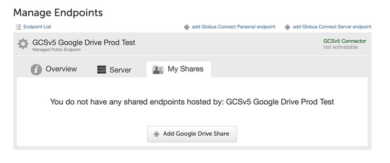
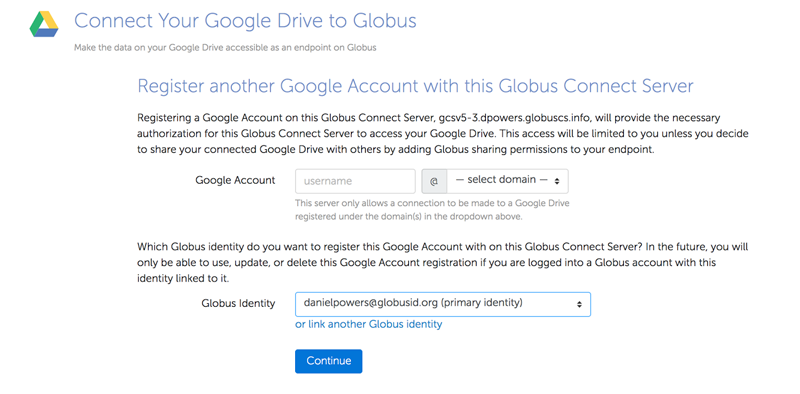
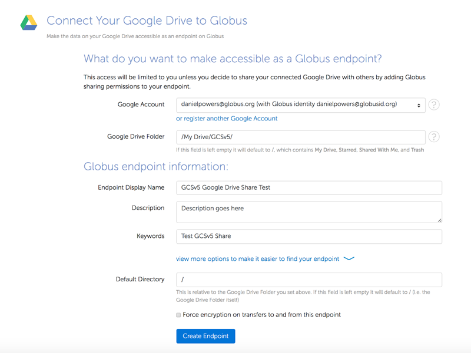
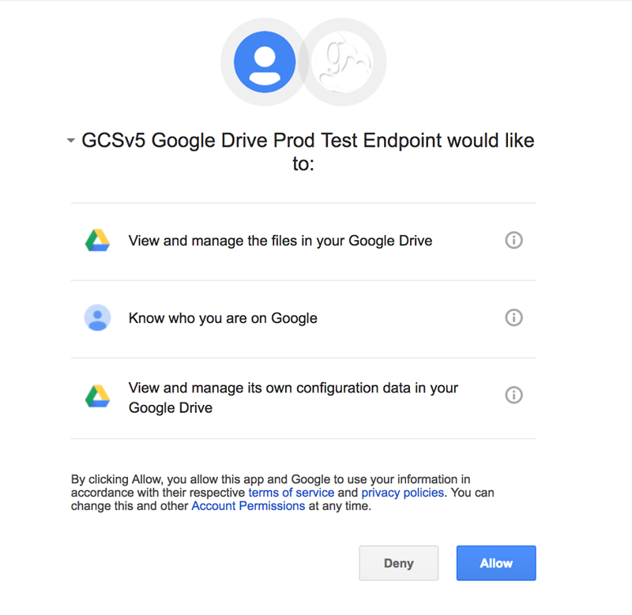
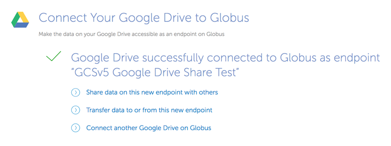

= Google Drive Connector (beta)
:toc:
:revdate: April 4, 2017

== Prerequisites
This connector requires a fully functional Globus Connect Server Version 5 (GCSv5) endpoint. See link:../../globus-connect-server-v5-installation-guide[GCSv5 Install instructions].

In addition, a Google Account is required. It will be used to register the GCSv5 endpoint manager as a Google OAuth client.

IMPORTANT: Please be sure to verify your GCSv5 endpoint is functional before you move on to configure the Google Drive Connector.

== Prepare a Google project for use with Globus
You must have a Google account to complete this step. 

. Go to the following URL:
** https://console.developers.google.com/iam-admin/projects
. Click "Create Project" button
. After creating the project, Click on the "Credentials" menu, then click on the "Create Credentials" button and select the "OAuth client ID" option.
. Configure the Consent screen
. When prompted, choose "Web application" as the Application type.
** Make very careful note of the Google Client ID and Google Client Secret you get in this step.
. Configure an entry for "Authorized redirect URIs" as follows:
** +++https://YOUR_SERVER_FQDN_HOSTNAME/api/v1/authcallback_google+++
** The "YOUR_SERVER_FQDN_HOSTNAME" value must be:
*** Resolvable in public DNS
*** The value that the [GCS Manager].ServerName option is / will be set to in the globus-connect-server.conf file
. You must now enable the Drive API for your project before it can be used. Click on the "Library" menu for your project, and then click on the "Drive API" link. After that, press the "Enable" button to enable the DriveAPI for your project.

== Configure your GCSv5 endpoint to use the Google Drive Connector 
This section requires that a Globus Connect Server v5 endpoint has been setup and is functional. The basic installation of GCSv5 sets it up for POSIX file systems so basic testing of the installation can be done. 

The following instructions will remove the default endpoint definition, and reconfigure it for use with Google Drive Connector. 

Run the cleanup command to remove the default configuration:

    globus-connect-server-cleanup -d

Edit globus-connect-server.conf to set the following parameters:

. set [Endpoint].StorageType = Google Drive 
. set [Security].IdentityMethod = None
. set [Security].AuthorizationMethod = Gridmap
. set [GridFTP].Sharing = True
. set [GridFTP].ServiceCredentialSource = Globus
. set [GridFTP].CertificateFile = %(ROOT)s/var/lib/globus-connect-server/grid-security/gridftp-hostcert.pem
. set [GridFTP].KeyFile = %(ROOT)s/var/lib/globus-connect-server/grid-security/gridftp-hostkey.pem
. comment out [MyProxy].ServerName
. comment out [MyProxy].ServerHost
. comment out [OAuth].ServerName
. comment out [OAuth].ServerHost
. set [GCS Manager].Domains = comma separated list of identity domains you wish to be able to create shares on this endpoint.
. In globus-connect-server.conf, set [GCS Manager].ServiceCredentialSource = LetsEncrypt
. set [GCS Manager].CertificateFile = %(ROOT)s/var/lib/globus-connect-server/grid-security/gcsmanager-hostcert.pem
. set [GCS Manager].KeyFile = %(ROOT)s/var/lib/globus-connect-server/grid-security/gcsmanager-hostkey.pem
. set [Google Drive].ClientId = the Google Client ID obtained in Section 2.5
. set [Google Drive].ClientSecret = the Google Client Secret obtained in Section 2.5
. set [LetsEncrypt].Email = admin email address
. set [LetsEncrypt].AgreeToS = True
. [GridFTP].ServerName and [GCS Manager].ServerName must both be set to the same publicly resolvable DNS name. On an aws ec2 instance, that name must also NOT be the aws public DNS name (e.g. gcs.mydomain.com and not ec2-w-x-y-z.us-west-2.compute.amazonaws.com)
. Run `globus-connect-server-setup` to create the endpoint definition and configure the GCS services locally
. Find endpoint by searching for Display Name of endpoint here: 
+
https://www.globus.org/app/endpoints?scope=all
+
. Make note of the endpoint's UUID on the Overview tab
. Contact Globus support to make your new endpoint managed. Be sure to send support the UUID of your endpoint from Step 22.
. After the base endpoint has been made managed, permitted users can then create shares hosted by the endpoint that will be backed by their Google Drives. See separate instructions for process to create shares on Google Drive backed endpoint.

== Share a Google Drive folder using Globus
This section describes creating a shared endpoint to access your files and folders on Google Drive using the Globus interface.

. Find the GCSv5 Connector endpoint that you"ll use to create your Google Drive share on the "Manage Endpoints" page, by searching in the "all" scope. Note that the endpoint must support the Google Drive Premium Connector. Choose the endpoint and select the "My Shares" tab. Then click the "Add Google Drive Share" button.
+
[role="img-responsive center-block"]

+
. If this is your first time creating a share on this endpoint, you may be prompted to associate a Google Account with your Globus Identity, so that Globus knows which Google Drive you wish to share.
+
[role="img-responsive center-block"]

+
. Configure the details for your share. Click the "Create Endpoint" button when done.
+
[role="img-responsive center-block"]

+
. Grant the endpoint access to your Google drive.
+
[role="img-responsive center-block"]

+
. Your share has now been created.
+
[role="img-responsive center-block"]
