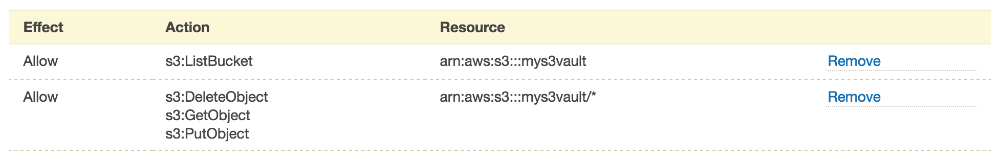

= Amazon Web Services S3 Connector (Legacy)
:revdate: March 8, 2017

[doc-info]*Last Updated: {revdate}*

The following instructions for creating a Globus endpoint on an Amazon S3 bucket assume that you are familiar with Amazon Web Services in general, and in particular with IAM and S3. You will be granting Globus access to your S3 bucket, using an IAM role. This setup will allow you to use Globus endpoint permissions to grant access to folders within the S3 bucket to other Globus users and groups.

NOTE: A link:https://www.globus.org/subscriptions[Globus subscription] is required to create an S3 endpoint. If your institution is not a subscriber please link:https://www.globus.org/configure-subscription[complete this form to start your free trial].

== Prerequisites
* In order to transfer files to/from an AWS S3 endpoint, you must be running the latest version of link:https://www.globus.org/globus-connect-server[Globus Connect Server] or link:https://www.globus.org/globus-connect-personal[Globus Connect Personal] on the other endpoint. If transfers are failing, check the event log; if you see "type": "FTPServerError", the other endpoint is most likely running a dated version of Globus Connect Server (or GridFTP server).
* Your S3 bucket must contain at least one folder or object in order for it to display correctly on the Globus link:https://www.globus.org/app/transfer[Transfer Files page]. Failure to include at least one folder or object in the S3 bucket will prevent an endpoint backed by the bucket from being accessible in Globus, with "Directory Not Found" errors being generated when access is attempted.

== Part A: Amazon Web Services Account Configuration

You must configure your AWS account with a role that can be assumed by Globus, and that has access to the AWS S3 bucket.

1. Log into the link:https://console.aws.amazon.com/iam[AWS IAM console] using the AWS account that owns the S3 bucket (or as a sufficiently privileged IAM user in that account).
2. Add a new IAM policy by clicking on "Policies" in the left side bar, and then the "Create Policy" button at the top.
3. Click "Select" next to the "Policy Generator" option to create a policy that grants the Globus service access to your S3 bucket.
4. You will be adding two statements to the policy that, collectively, allow Globus to list the contents of an S3 bucket and to read and write files (objects) in an S3 bucket. On the "Edit Permissions" page:
* Set "Effect" to "Allow".
* For "AWS Service", select "Amazon S3".
* For "Actions", check the "ListBucket" box.
* In the "Amazon Resource Name (ARN)" field enter "arn:aws:s3:::<s3-bucket-name>" (e.g., if your S3 bucket name is "bar", then enter an ARN of "arn:aws:s3:::bar").
* Click Add Statement.
* Repeat the above five steps, _this time changing the "Actions" and the ARN as below_:
* Set "Effect" to "Allow".
* For "AWS Service", select "Amazon S3".
* For "Actions", check the following boxes, depending on the types of access you wish to grant to the Globus service (_Note: The actions below only grant the Globus service bucket-wide permissions. Using the Globus sharing functionality, you can set more fine-grained permissions for individual Globus users and groups to control access to specific directories within the bucket._):
** Check "GetObject" to allow Globus to download files/directories from the S3 bucket
** Check "PutObject" to allow Globus to upload files/directories to the S3 bucket
** Check "DeleteObject" to allow Globus to delete files/directories in the S3 bucket
* In the "Amazon Resource Name (ARN)" field enter "arn:aws:s3:::<s3-bucket-name>/+++*" (e.g., if your S3 bucket name is "bar", then enter an ARN of "arn:aws:s3:::bar/*"). Note: this ARN includes a "/*+++" at the end.
* Click Add Statement. You should now see two lines listed in the permissions table (see figure below for an example).
+
[role="img-responsive center-block"]

+
5. Click "Next Step" to review the policy document. You may optionally edit the Policy Name, but do not change the policy document.
6. Click "Create Policy" to save the new policy.
7. Add a role by clicking on "Roles" in the left side bar, and then the "Create New Role" button at the top.
8. Enter a role name. This can be anything, but we recommend using "globus". Click "Next Step".
9. Select "Role for Cross-Account Access", and then select "Allows IAM users from a 3rd party AWS account to access this account".
10. Enter an Account ID of "328067584297", and an External ID of "user:<globus-username>" (e.g., if your Globus username is "foo", then the External ID must be "user:foo"). Leave "Require MFA" unchecked. This will allow the Globus service to assume this role.
11. Click "Next Step" to associate an IAM policy with the role.
12. On the "Attach Policy" page, select the policy you created above and click "Next Step".
13. On the "Review" page note the Role ARN. You will need this later when setting up the endpoint. Click "Create Role" to save the new role and its associated policy.

== Part B: Creating and Configuring a Globus Endpoint for the S3 Bucket
You can currently only create a Globus S3 endpoint using the Globus command line interface (CLI). See the link:../../cli/[instructions on configuring your Globus account for CLI access].

1. Log into the Globus CLI (e.g., +ssh myglobusname@cli.globusonline.org+)
2. To create the endpoint, run: +endpoint-add --s3 --managed-endpoint -n "<endpoint_name>"+. For example, if you want the endpoint called "My S3 Endpoint", run +endpoint-add --s3 --managed-endpoint -n "My S3 Endpoint"+. Note: This command will fail if you do not have a Globus subscription so please link:https://www.globus.org/configure-subscription[contact us] to set up your free trial before adding S3 endpoints.
* When prompted to "Select Activation Option", enter option "1": 1 Endpoint owner (you) activates the endpoint for all users.
3. To configure the security for the endpoint, make a note of the Endpoint ID returned by the `endpoint-add` command above, and then run `endpoint-activate --s3 <endpoint_id>`.
* Select Activation Type of "2 Assume Role".
* When prompted to Enter the role ARN, enter the Role ARN that you noted in the last step of Part A above.
4. To make the endpoint public, so that it is visible to other users (e.g., those who you give permissions to access the endpoint), run `endpoint-modify --public <endpoint_id>` (once again, use the Endpoint ID returned by the `endpoint-add` command in step 2 above).

== Sharing files on an S3 Endpoint
Files on an S3 endpoint can be shared with other Globus users in a similar fashion as files on non-S3 endpoints. On the Globus link:https://www.globus.org/app/transfer/[Transfer Files page], select a folder on the S3 endpoint, select "permissions" from the menu in the upper right corner of the file browser windows, and then grant access to a user or group in the "Permissions" panel.

The user(s) you share with will receive a notification that you have shared files, and can click on the link in the notification email to access them.

_Note: You must set the S3 endpoint's visibility to "public" using the command in step 4 above, otherwise users will not be able to access shared files on the endpoint._

== Limitations and Unsupported Operations
* Transfers between two S3 endpoints are not supported. Either the source or the destination endpoint must be a non-S3 endpoint.
* The +rename+ operation is not currently supported on S3 endpoints.
* The following Globus transfer options are not currently supported and will be ignored, if set: +verify-size+, +--perf-p+, and +--perf-pp+.
* The following Globus transfer options are not currently supported and _will cause the file transfer to fail_, if set: +-s 0+ (sync), +-s 1+ (sync-delete), and +--preserve-mtime+.
* AWS S3 only supports utf-8 encoded unicode paths, so systems that send filenames improperly (not UTF-8), like  Globus Connect Personal for Windows, will fail when uploading non-ascii file names.
* AWS S3 supports non-unix compatible file names such as '.', '..', and embedded '//'.
* When uploading to S3, directory markers and, in particular, empty directories, are not explicitly created in the S3 bucket.
* When downloading from S3, all objects are downloaded, except for objects whose path name ends with a slash (/). The latter are assumed to be directory markers and will be created as directories (not files) on the destination endpoint.
* The S3 bucket configured as a Globus endpoint must not be a "requester pays for bandwidth" bucket. If it is, all operations will fail, because Globus will not indicate (via HTTP headers) that it is willing to pay for bandwidth charges.
* AWS S3 is an eventually-consistent system by design and Globus cannot guarantee stronger levels of consistency.

== Notes
* If you de-activate an S3 endpoint, you will need to re-run the command in step #3 in Part B.
* You will be able to see the S3 endpoint on the link:https://www.globus.org/app/endpoints/[Manage Endpoints page], but please do not change anything there.
* Globus will continually retry on error, which will result in additional S3 API and bandwidth costs being incurred.
* Incomplete uploads to S3 will not be removed and will incur additional S3 storage costs.
* Large files are uploaded to S3 using the S3 multi-part upload API. Globus does checksum of each part when uploading. On download Globus does not do any explicit checksum, other than what you get by using SSL for S3 buckets that use HTTPS.
* Server-side-encryption using AES-256 is automatically requested for all uploads to S3.
