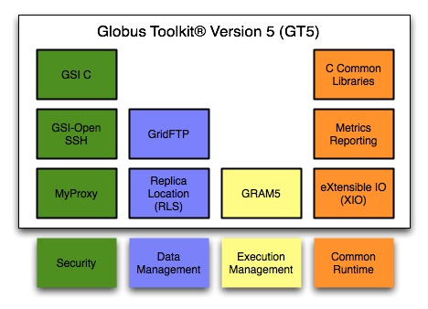

= Globus Toolkit
:imagesdir: .

[red]#(CONTENT NEEDS REVIEW)#

[role="img-responsive center-block"]

The open source Globus® Toolkit is a fundamental enabling technology for the "Grid," letting people share computing power, databases, and other tools securely online across corporate, institutional, and geographic boundaries without sacrificing local autonomy. The toolkit includes software services and libraries for resource monitoring, discovery, and management, plus security and file management. In addition to being a central part of science and engineering projects that total nearly a half-billion dollars internationally, the Globus Toolkit is a substrate on which leading IT companies are building significant commercial Grid products.

The toolkit includes software for security, information infrastructure, resource management, data management, communication, fault detection, and portability. It is packaged as a set of components that can be used either independently or together to develop applications. Every organization has unique modes of operation, and collaboration between multiple organizations is hindered by incompatibility of resources such as data archives, computers, and networks. The Globus Toolkit was conceived to remove obstacles that prevent seamless collaboration. Its core services, interfaces and protocols allow users to access remote resources as if they were located within their own machine room while simultaneously preserving local control over who can use resources and when.

The Globus Toolkit has grown through an open-source strategy similar to the Linux operating system's, and distinct from proprietary attempts at resource-sharing software. This encourages broader, more rapid adoption and leads to greater technical innovation, as the open-source community provides continual enhancements to the product.

Essential background is contained in the papers "link:https://globus.org/publications/toolkit#overview2[Anatomy of the Grid]" by Foster, Kesselman and Tuecke and "link:https://globus.org/publications/toolkit#web-services11[Physiology of the Grid]" by Foster, Kesselman, Nick and Tuecke.

== Acclaim for the Globus Toolkit

[role="img-responsive right"]

From version 1.0 in 1998 to the 2.0 release in 2002 and now the latest 4.0 version based on new open-standard Grid services, the Globus Toolkit has evolved rapidly into what The New York Times called "the de facto  standard" for Grid computing. In 2002 the project earned a prestigious R&amp;D 100 award, given by R&amp;D Magazine in a ceremony where the Globus Toolkit was named "Most Promising New Technology" among the year's top 100 innovations. Other honors include project leaders Ian Foster of Argonne National Laboratory and the University of Chicago, Carl Kesselman of the University of Southern California's Information Sciences Institute (ISI), and Steve Tuecke of Argonne being named among 2003's top ten innovators by InfoWorld magazine, and a similar honor from MIT Technology Review, which named Globus Toolkit-based Grid computing one of "Ten Technologies That Will Change the World." The Globus Toolkit also won the 2003 Federal Laboratory Consortium award for excellence in technology transfer, in recognition of its widespread adoption by industry.

== Genesis of the Globus Project
In late 1994 Rick Stevens, director of the mathematics and computer science division at Argonne National Laboratory, and Tom DeFanti, director of the Electronic Visualization Laboratory at the University of Illinois at Chicago, proposed establishing temporary links among 11 high-speed research networks to create a national grid (the "I-WAY") for two weeks before and during the Supercomputing \'95 conference. A small team led by Ian Foster at Argonne created new protocols that allowed I-WAY users to run applications on computers across the country. This successful experiment led to funding from the Defense Advanced Research Projects Agency (DARPA, and 1997 saw the first version of the Globus Toolkit, which was soon deployed across 80 sites worldwide. The U.S. Department of Energy (DOE) pioneered the application of grids to science research, the National Science Foundation (NSF) funded creation of the National Technology Grid to connect university scientists with high-end computers, and NASA started similar work on its Information Power Grid.

== Widespread Adoption of the Globus Toolkit
Grids first emerged in the use of supercomputers, as scientists and engineers across the U.S. sought access to scarce high-performance computing resources that were concentrated at a few sites. Begun in 1996, the Globus Project was initially based at Argonne, ISI, and the University of Chicago (U of C). What is now called the Globus Alliance has expanded to include the University of Edinburgh, the Royal Institute of Technology in Sweden, the National Center for Supercomputing Applications, and Univa Corporation. Project participants conduct fundamental research and development related to the Grid. Sponsors include federal agencies such as DOE, NSF, DARPA, and NASA, along with commercial partners such as IBM and Microsoft.

The project has spurred a revolution in the way science is conducted. High-energy physicists designing the Large Hadron Collider at CERN are developing Globus-based technologies through the European Data Grid, and the U.S. efforts like the Grid Physics Network (GriPhyN) and Particle Physics Data Grid. Other large-scale e-science projects relying on the Globus Toolkit include the Network for Earthquake Engineering and Simulation (NEES), FusionGrid, the Earth System Grid (ESG),the NSF Middleware Initiative and its GRIDS Center, and the National Virtual Observatory. In addition, many universities have deployed campus Grids, and deployments in industry are growing rapidly.

Much as the World Wide Web brought Internet computing onto the average user's desktop, the Globus Toolkit is helping to bridge the gap for commercial applications of Grid computing. Since 2000, companies like Avaki, DataSynapse, Entropia, Fujitsu, Hewlett-Packard, IBM, NEC, Oracle, Platform, Sun and United Devices have pursued Grid strategies based on the Globus Toolkit. This widespread industry adoption has brought a new set of objectives, with the cardinal purpose being to preserve the open-source, non-profit community in which the Globus Project has thrived, while seeding commercial grids based on open standards.

2004 saw the formation of link:http://www.univa.com/[Univa Corporation], a company devoted to providing commercial support for Globus software, and 2005 the creation of the Globus Consortium by a group of companies with an interest in supporting Globus Toolkit enhancements for enterprise use.

For more information, see this PowerPoint link:files/GThistory2.ppt[timeline].

== Usage Statistics
Beginning with GT 3.9.5, the Globus Toolkit has the capability to send usage statistics back to the Globus team. Check out more information link:usage[here].

== Software Archive
Click link:downloads/archive[here] for a downloadable list of archived versions of the Globus Toolkit.

== Issue Tracking
If you do not see an update and think you have found a bug in the Toolkit, do a quick search in the link:https://github.com/globus/globus-toolkit-documentation/issues[GitHub issues] for your bug. If it is not already there, then create a new issue.

Before submitting a bug, you might find link:http://www.chiark.greenend.org.uk/~sgtatham/bugs.html[How to Report Bugs Effectively] helpful in expediting your bugs resolution.

== Mailing Lists
For general discussion or specific questions you cannot find the answers to in the documentation, try asking your question on one of the mailing lists below:

[cols=",s,", role="table-borderless"]
|========
|Developer discussion:	|[nowrap]#link:https://lists.globus.org/mailman/listinfo/gt-dev[gt-dev@globus.org]#	|The purpose of the gt-dev list is for discussions pertaining to any _development_ of the toolkit components or using the toolkit components.
|User discussion:	|[nowrap]#link:https://lists.globus.org/mailman/listinfo/gt-user[gt-user@globus.org]#	|The purpose of the gt-user list is for discussion pertaining to installation, configuration, administration, usage, and your own development of Grid services based on GT, and just about anything else related to the Globus Tookit in general.
|Announcements:	|[nowrap]#link:https://lists.globus.org/mailman/listinfo/gt-announce[gt-announce@globus.org]#	|The purpose of the gt-announce list is to receive communications about the toolkit (in particular announcements of releases and other major milestones). This list is not intended for discussion.
|========

Please report any potential security issues by sending mail to support@globus.org. Please include information about the component, version number, platform and a description of the vulnerability. All reports will be kept private. We will review all issues and notify users via the link:https://lists.globus.org/mailman/listinfo/gt-user[gt-user mailing list].