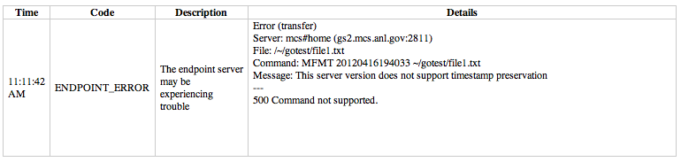

= Troubleshooting
:toc:
:toclevels: 1
:toc-title:

== My transfer status is listed as “Active” but I don’t see any events related to it (when running the “events” and “details” commands). Is my transfer really active?
This may be related to multiple transfers running simultaneously. If you issue multiple transfer requests, note that only three requests will be running simultaneously at any one time. The remaining transfers will be queued and start moving data as soon as another active transfer completes.

== I’m trying to activate an endpoint using GSI SSH but it’s failing with error “-g was specified but you do not appear to be using gsi-ssh.” What’s causing this?
This error happens when your Globus account is not configured for use with GSI SSH, and only has SSH keys. Please see the link:../../faq/command-line-interface/#how_do_i_set_up_globus_so_i_can_connect_to_cli_globusonline_org_using_gsi_ssh[FAQ on configuring your account to use GSI SSH].

== When I run "ssh username@cli.globusonline.org" see the following error: Permission denied (publickey,gssapi-keyex,gssapi-with-mic). What am I doing wrong?
This is usually the result of missing information in your Globus profile. In order to use the CLI interface you will need to add your SSH public key to your Globus account. Please see the FAQ entry for information on link:faq/command-line-interface/#how_do_i_add_an_ssh_key_to_my_globus_account[how to add your key].

== I started a transfer but it seems to be stalled. What do I do now?
There are several reasons a transfer may stall. You may want to start by seeing what Globus is doing with the request.

- On the web, go to the “View Activity” page
- Click on ID of specific transfer (probably the one at the top of the list)
- Click “View Event Log”.
- Look through the progress messages and see if any of them indicate an error, such as an expired credential or quota exceeded.

In the CLI, the +status+ command will give you a high level overview of the progress of the task. If you run +status+ and find the task is not progressing, run the +events+ command. The following will show the most recent 5 events for the specified task:

----terminal
$ [input]#events -l 5 <TaskID>#
----terminal

If the +status+ command shows the task is inactive, you may need to renew your credentials. See the link:#i_issued_a_transfer_but_my_job_halted_and_i_got_an_email_saying_the_tasks_had_become_inactive_and_need_credentials_what_do_i_do[next troubleshooting item] for information on credential renewal.

== I issued a transfer but my job halted and I got an email saying the tasks had become inactive and need credentials. What do I do?
There are three straightforward ways to refresh your credentials in Globus:

=== Option 1
Go to the link:https://www.globus.org/xfer/StartTransfer[Start Transfer page], and enter the endpoints you need. This should prompt you for your MyProxy logins to those machines in order to do the file listings. If you had already begun a transfer when you discovered the need to renew credentials, you do not need to start a new transfer. The file listings will be sufficient to refresh your credentials.

=== Option 2
Go to the link:https://www.globus.org/xfer/ManageEndpoints[Manage Endpoints page], browse to the endpoint on which you need to renew credentials. Select the endpoint, go to the Activate menu, and follow on-screen instructions to reactivate the endpoint.

=== Option 3
Login to command line interface (+ssh cli.globusonline.org+) and use the endpoint-activate command to refresh your credentials. For example, "ssh cli.globusonline.org endpoint-activate -U xsede#\*", and it should prompt you for your XSEDE login and password.

== I used the transfer command in the CLI but it failed with a message “Credentials are Needed”. What do I need to do?
In order to access your files on an endpoint, Globus needs credentials to pass to the endpoint. Please see link:../../faq/transfer-sharing/#how_do_i_refresh_my_credentials_or_activate_an_endpoint[this FAQ] for more information on activating (or re-activating) an endpoint. Note that Globus uses only temporary credentials to act on your behalf, but never keeps your password or long-term credentials to access a site.

If you are using GSI SSH to access Globus, you may just need to run the +transfer+ command with the +-g+ argument. The same credentials which were used to authenticate to Globus will then be used to access your files on the endpoint (of course, the endpoint must be configured to map this credential to you local account). If you have used Globus in the past to access this endpoint successfully, the credentials used at that time have probably expired. Credential management can sometimes be fairly complex. We continue to find ways in Globus to simplify this process as much as possible, while maintaining the level of security these credentials provide.

== When I try to open my endpoint on Windows I get "Directory contents cannot be found"
Globus Connect Personal for Windows may have a problem automatically locating your user directory. Try manually entering "/" (just forward slash, no quotes) as the directory, and then you should be able to browse. Your c: drive would be "/cygdrive/c", and your user directory would be either "/cygdrive/c/users/<username>" or "/cygdrive/c/documents" and "settings/<username>".

== My transfer task "expired". What happened?
Globus will make every attempt to complete a Transfer request but sometimes may be unable to do so, based on factors outside of our control. For example, occasionally, an endpoint may stop responding (due to server failure, network issues, etc.). In this case, you will receive notifications about the error and should follow up with your system administrator.

A more common cause is "credential expiration". This means that Globus is no longer authorized to access the endpoint on your behalf to execute/manage your transfer. When this happens, Globus will send you an e-mail notification and suspend the transfer task until you renew your credentials for the endpoint. If the credentials are not renewed (i.e. the endpoint is not reactivated) within 3 days of the notification being sent, the transfer task will automatically expire.

Instructions for renewing your credentials link:../../faq/transfer-sharing/#how_do_i_refresh_my_credentials_or_activate_an_endpoint[are available here].

== ENDPOINT_ERR This server version does not support timestamp preservation
In the event that you see an error like this - *Message: This server version does not support timestamp preservation -*

[role="img-responsive center-block"]

below are the steps you will want to take.

. Cancel your job and restart it without the timestamp preservation option.
. Also, restart with the Transfer Setting option:

[role="img-responsive center-block"]

NOTE: If you think this is a necessary capability, please feel free to contact the appropriate endpoint admin and request that they upgrade the GridFTP server to 5.0.5 or 5.2.1 or later versions.

== I want to resubmit my failed transfer
If your transfer task has failed you should first look at the last few events in the event log to identify any problems needing human intervention (quota exceeded, out-of-disk space, etc.)

After fixing problems you can resubmit your task as follows:
. Using the Web GUI, go to the Start Transfer page, select the "more options" link at the bottom, and select the "only transfer new or changed files where the checksum is different" *and* "verify file integrity after transfer" checkboxes.
. Using the CLI, rerun the transfer command with the +--verify-checksum+ *and* +-s 3+ options

== I am getting the error message: "The filename, directory name, or volume label syntax is incorrect"
On different filesystems, directory names and filenames may be restricted to certain characters. For instance, following character are reserved on ext2, ext3, ext4, hfs, FAT, NTFS:

++++

	

		<table class="table table-bordered"><th colspan="2">ext2, ext3, ext4 (Linux)</th>
			<tr><td>NULL</td><td></tr>
			<tr><td>/</td><td>forward slash</td></tr>
		</table>
	

	

		<table class="table table-bordered"><th colspan="2">hfs (Mac OS X)</th>
			<tr><td>:</td><td>colon</td></tr>
			<tr><td>/</td><td>forward slash</td></tr>
		</table>
	

	

		<table class="table table-bordered"><th colspan="2">FAT, NTFS (MS Windows)</th>
			<tr><td>&lt;</td><td>less than</td></tr>
			<tr><td>&gt;</td><td>greater than</td></tr>
			<tr><td>:</td><td>colon</td></tr>
			<tr><td>"</td><td>double quote</td></tr>
			<tr><td>/</td><td>forward slash</td></tr>
			<tr><td>\</td><td>backslash</td></tr>
			<tr><td>|</td><td>vertical bar or pipe</td></tr>
			<tr><td>?</td><td>question mark</td></tr>
			<tr><td>*</td><td>asterisk</td></tr>
		</table>
	

++++

If a file or a directory with one of the characters <>:"\|?* is copied from Linux to MS Windows, then MS Windows will return the error message "The filename, directory name, or volume label syntax is incorrect" and refuse to create the file or the directory.

Also the filesystems FAT, NTFS, hfs are not case sensitive. It means that if two files on ext2, ext3, ext4 are different by case and they are transferred to a non-case sensitive filesystem they will be copied into one file.

== I am unable to connect to relay.globusonline.org on port 2223 using Globus Connect Personal
=== Cannot Reach relay.globusonline.org on Port 2223
If you are running Globus Connect Personal on a Linux or Mac machine, you may see the following error message:

----terminal
[output]#Error: Could not connect to server 
--- 
ssh: connect to host relay.globusonline.org port 2223: Connection refused#
----terminal

There is an equivalent message on Windows systems:

----terminal
[output]#Could not communicate with server

ssh: connect to host relay.globusonline.org port 2223: A connection attempt failed because the connected party did not properly respond after a period of time, or established connection failed because connected host has failed to respond.#
----terminal

These errors indicate that you are having trouble reaching Globus through your network.

Throughout this article, we will use the common notation of relay.globusonline.org:2223 to refer to port 2223 on the server relay.globusonline.org.

==== Confirming the Source of the Error 
To confirm that you are unable to reach our server, and that the Globus Connect Personal is not suffering from some other error that it cannot distinguish, you can use the telnet tool to test your ability to connect to relay.globusonline.org.

On Mac or Linux, open the Terminal program or your preferred terminal emulator. On Windows, open the Command program (cmd.exe). At the prompt, type "telnet relay.globusonline.org 2223" followed by the Enter key. This will attempt to establish a connection to the server on port 2223. If everything is working properly, you should receive a message similar to the following:

----terminal
[output]#Trying 184.73.255.160...
Connected to relay.globusonline.org.
Escape character is \'^]'.
SSH-2.0-OpenSSH_5.9p1-hpn13v11 GSI_GSSAPI_GPT_5.4 GSI#
----terminal

You may then exit the telnet program by typing `Ctrl+]` and closing the terminal.
This confirms that you are able to connect to our server, even though Globus Connect Personal reports that it is unable to do so. At this stage, we recommend opening a support ticket.

It may take some time, and then fail with an error message,

----terminal
[output]#Trying 184.73.255.160...
telnet: Unable to connect to remote host: Connection timed out#
----terminal

if this is the case, you are not able to connect to the Globus service, and the error reported by Globus Connect Personal is accurate.

==== Troubleshooting the Error
A failure to connect to relay.globusonline.org:2223 most commonly indicates the presence of firewall rules that restrict access to a specific set of ports.

This most often arises on a publicly accessible network like a University or Hospital network. Firewall rules restrict connections on specific port numbers in order to protect users on the network. Unfortunately, the ports used by Globus are not among the standard set used for connections to webservers or for remote logins, so they are typically not listed as being allowed.

You can confirm that this is the problem by attempting to run Globus Connect Personal from a home network or other location that does not have these firewall rules in place. If you are able to use Globus Connect Personal from another network successfully, it means that it is almost certainly a matter of firewall restrictions on the network that you are attempting to use.

==== Resolving the Error in the Case that there is a Firewall
If you have confirmed that there are firewall rules or similar restrictions preventing you from reaching Globus, you will need to contact your network administrators to have these restrictions lifted or exceptions added.

You should supply your network administrators with the set of ports that will be used by the Globus Connect Personal software. These are:

- an outbound connection on 2223 in order to register the endpoint with our relay server
- connections on ports 50000-51000 for your Globus Connect Personal endpoint to move data to and from other endpoints

It is worth noting that the data ports 50000-51000 can be altered to other values, although these defaults are the common case. If the endpoint that you are attempting to transfer with has specified a different port range, you will need to obtain that set of ports from the endpoint's administrator.

Some network administrators maintain automated systems or sets of forms that can be submitted in order to request firewall exceptions. If you able to find these resources, it may greatly expedite this process.

==== Checking iptables on Linux Systems
A very common source of trouble for Globus Connect Personal Linux users is a restrictive configuration of the iptables firewall rules. We will not provide a guide to reading and editing iptables here, but if you are comfortable adding, removing, and modifying rules in iptables, you may want to attempt to troubleshoot the problem yourself.

Simply make sure that inbound and outbound TCP connections are allowed on ports 50000-51000, and outbound connections are allowed on port 2223. It is possible to configure an endpoint to use UDT for file transfers. If you are performing transfers with an endpoint that uses UDP, you must ensure that the data ports 50000-51000 are accessible over UDP as well as (or instead of) TCP.

=== If All Else Fails, Open a Support Ticket
If you are unable to resolve the problem yourself, or have confirmed that there are no firewall restrictions preventing your Globus Connect Personal endpoint from reaching Globus, please open a support ticket with us. A member of our team will contact you as soon as possible to help you get your Globus Connect Personal endpoint working.

Please include, in as much detail as you are able, the following pieces of information

- The platform you are using (Mac, Windows, Linux)
- The troubleshooting steps you have attempted thusfar. Please detail the exact actions that you have taken
- The full error message, as presented to you by Globus Connect Personal
- The network(s) on which you are experience the error

As an example, an ideal ticket might have the following content:

----
Hi,

I'm trying to set up Globus Connect Personal on my laptop running Windows XP, Service Pack 3. Whenever I start the program, I am presented with the error message

Could not communicate with server

ssh: connect to host relay.globusonline.org port 2223: A connection attempt failed because the connected party did not properly respond after a period of time, or established connection failed because connected host has failed to respond.

I have included a screenshot of the error message below.

I have experienced this error both on my home network, and on the University of Chicago Hospital network. I have confirmed with the university's technical staff, ITS, that there are no firewall rules in place that should prevent me from reaching relay.globusonline.org, and have successfully connected to the server from both networks using the command 'telnet relay.globusonline.org 2223' from both networks.

I do not believe that my laptop has any firewall rules or security restrictions in place, but I don't know how to check this.

Thanks,

Jane Doe
----

We always attempt to provide quick response time, but the more information you provide, the more likely we will be able to resolve your issue promptly, and the less likely you are to be asked to provide more information before your problem can be solved.

== Globus Connect Personal says "Your user profile is on a network share", and "you must map this location to a local drive"
If you have a home directory on a network share, you may see an error message of the form

*"Your user profile is on a network share, at location "<path>". To use Globus Connect Personal, you must map this location to a local drive. Please contact support@globus.org for more information."*

This issue arises when your home directory is stored on a server, and "*<path>*" takes the form of "*\\example.com\share\Users\ExampleUsername*".

To resolve this problem, you must use Windows' capability to create a shortcut to a network share, or "Map" it to a drive letter. Microsoft provides official documentation for this for link:http://windows.microsoft.com/en-us/windows/create-shortcut-map-network-drive[Windows 7 and Windows Vista], link:https://www.microsoft.com/resources/documentation/windows/xp/all/proddocs/en-us/windows_fcab_connect_drive.mspx[Windows XP], and link:http://windows.microsoft.com/en-us/windows-8/create-shortcut-to-map-network-drive[Windows 8]. Follow these instructions to assign a drive letter of your choosing to the network share containing your home directory, and then restart Globus Connect Personal.

== “Couldn’t find an appropriate update in the downloaded package” when upgrading Globus Connect Personal on Mac OS X
When upgrading from older versions of the Globus Connect Personal client on OS X, you may encounter a message that reads:

----
Alert.
Couldn’t find an appropriate update in the downloaded package.
----

This indicates that the version you are running is affected by a known bug in our update process.
 
=== Confirming the Bug
To confirm that you are running an affected version, go to your Applications folder, and look for an app named Globus Connect. This is the old name for Globus Connect Personal, and it indicates that your version of the software is affected by this bug.
 
=== What to Do
Fortunately, there is a quick and easy resolution to this problem.

Please follow the instructions at our link:../../faq/globus-connect-endpoints/#mac[How do I update to the latest version of Globus Connect Personal].